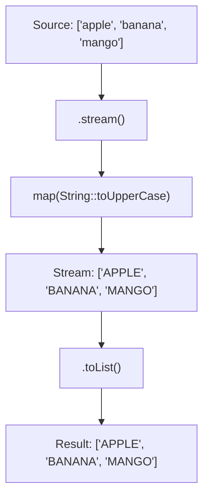

# 📘 Stream map() Method — Hands-On Example

---

## 📌 Introduction

### 🧠 What is this about?
Now that we understand what `map()` does conceptually, let's get our hands dirty with code. We'll transform lists using `map()` — converting strings to uppercase, extracting lengths, and chaining `map()` with other operations.

### 🌍 Real-World Problem First
A reporting system receives names in mixed case ("ramesh", "SANJAY", "Bob"). For consistency, all names must be uppercase in the report. Instead of looping and manually converting each one, `map(String::toUpperCase)` handles it in one line.

### ❓ Why does it matter?
- Seeing `map()` in working code solidifies the concept
- Real-world transformations are rarely just one step — you chain multiple operations
- Understanding the stream pipeline execution order is critical for debugging

### 🗺️ What we'll learn
- Using `map()` to convert strings to uppercase
- Using `map()` to extract string lengths
- Chaining `map()` with `filter()` and `collect()`

---

## 🧩 Concept 1: Practical map() Transformations

### 🧠 Layer 1: The Simple Version
We're going to take a list of fruit names and run them through different "conversion machines" — one that makes everything UPPERCASE, one that counts letters, and one that combines transformations.

### 🔍 Layer 2: The Developer Version
Each example demonstrates a different `Function<T, R>`:
- `String → String` (case conversion)
- `String → Integer` (length extraction)
- Chaining `filter()` + `map()` (select then transform)

### ⚙️ Layer 4: How It Works



### 💻 Layer 5: Code — Prove It!

**🔍 Example 1: Convert to uppercase**
```java
List<String> fruits = Arrays.asList("apple", "banana", "mango");

List<String> upperFruits = fruits.stream()
        .map(String::toUpperCase)  // Each string → UPPERCASE version
        .toList();

System.out.println(upperFruits);
// Output: [APPLE, BANANA, MANGO]
```

**🔍 Example 2: Extract string lengths**
```java
List<String> fruits = Arrays.asList("apple", "banana", "mango");

List<Integer> lengths = fruits.stream()
        .map(String::length)  // Each string → its length
        .toList();

System.out.println(lengths);
// Output: [5, 6, 5]
```

**🔍 Example 3: Chain filter() + map()**
```java
List<String> fruits = Arrays.asList("apple", "banana", "mango", "avocado", "apricot");

// Get uppercase names of fruits starting with 'a'
List<String> result = fruits.stream()
        .filter(f -> f.startsWith("a"))       // Select: apple, avocado, apricot
        .map(String::toUpperCase)              // Transform: APPLE, AVOCADO, APRICOT
        .toList();

System.out.println(result);
// Output: [APPLE, AVOCADO, APRICOT]
```

> 💡 **The Aha Moment:** Notice the order matters! `filter()` first narrows the stream (3 out of 5 pass), then `map()` transforms only those 3. If you reversed the order — `map()` first, then `filter()` — you'd transform all 5 to uppercase, then check `startsWith("a")` which would fail because "APPLE" starts with "A" (uppercase), not "a". The pipeline order directly affects results!

**❌ Order matters — uppercase then filter on lowercase fails:**
```java
// ❌ Wrong order: map first converts to UPPERCASE
List<String> wrong = fruits.stream()
        .map(String::toUpperCase)              // All become UPPERCASE
        .filter(f -> f.startsWith("a"))        // "a" != "A" → nothing passes!
        .toList();

System.out.println(wrong);
// Output: [] — empty! Because "APPLE".startsWith("a") is false
```

**✅ Fix: Filter on the original data first, then transform:**
```java
List<String> correct = fruits.stream()
        .filter(f -> f.startsWith("a"))        // Filter on original lowercase
        .map(String::toUpperCase)              // Then transform
        .toList();
// Output: [APPLE, AVOCADO, APRICOT]
```

---

### ⚠️ Pitfalls & Mistakes

**Mistake 1: Ignoring that map() changes the stream type**
- 👤 What devs do: Call `.map(String::length)` then try to call `.toUpperCase()` on the result
- 💥 Why it breaks: After `map(String::length)`, the stream is `Stream<Integer>`, not `Stream<String>`. Integers don't have `.toUpperCase()`
- ✅ Fix: Track the type mentally through the pipeline. After `map(String::length)`, you're working with integers.

---

### 💡 Pro Tips

**Tip 1:** You can chain multiple `map()` calls for multi-step transformations
```java
List<String> result = names.stream()
        .map(String::trim)          // Step 1: Remove whitespace
        .map(String::toLowerCase)   // Step 2: Normalize case
        .map(s -> s.replace(" ", "-"))  // Step 3: Replace spaces with hyphens
        .toList();
```
- Why it works: Each `map()` returns a new stream, ready for the next transformation
- When to use: When you have multiple independent transformation steps

---

### ✅ Key Takeaways

→ `map(String::toUpperCase)` transforms every string to uppercase — clean and readable
→ `map(String::length)` changes the stream type from `Stream<String>` to `Stream<Integer>`
→ The order of `filter()` and `map()` matters — filter on original data before transforming
→ Chain multiple `map()` calls for multi-step transformations

---

## 🎯 Final Summary

### ✅ Master Takeaways
→ `map()` is your go-to for 1-to-1 element transformations
→ Method references (`String::toUpperCase`, `String::length`) make `map()` calls concise
→ Think about the **stream type** at each step — `map()` can change it
→ Order matters: filter first on the original shape, then transform

### 🔗 What's Next?
We've seen `map()` with simple strings. Next, let's tackle a **real-world use case** — extracting email addresses from a list of `User` objects using `map()`.
