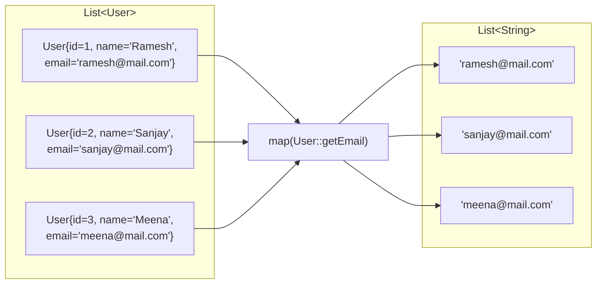

# 📘 Real-World Use Case — Retrieve Emails from List of Users using map()

---

## 📌 Introduction

### 🧠 What is this about?
This note tackles a **production-level pattern**: extracting a single field from a list of objects. Specifically, we'll retrieve email addresses from a list of `User` objects using `map()`. This pattern appears in virtually every Java backend.

### 🌍 Real-World Problem First
You're building a notification service. You have a `List<User>`, but the email sender only needs `List<String>` of email addresses. How do you extract just the emails without writing a manual loop?

### ❓ Why does it matter?
- This is the #1 most common use of `map()` in real projects
- Entity-to-field extraction appears in REST APIs, email systems, reporting, and data exports
- It teaches you the pattern: `List<Object>` → `List<FieldType>` via `map(Object::getField)`

### 🗺️ What we'll learn
- Creating a User class with multiple fields
- Extracting a single field (email) from each User using `map()`
- The complete pipeline: stream → map → collect

---

## 🧩 Concept 1: Extracting Emails with map()

### 🧠 Layer 1: The Simple Version
You have a box of employee ID cards. You don't need the whole card — just the email address printed on each one. `map()` is the operation that "reads" the email from each card and gives you a list of just emails.

### 🔍 Layer 2: The Developer Version
Given `List<User>`, we call `.stream().map(User::getEmail).toList()` to produce `List<String>`. The `Function<User, String>` inside `map()` extracts the email field from each User object.

```java
// The transformation: User → String (email)
List<String> emails = users.stream()
        .map(User::getEmail)    // Function<User, String>
        .toList();
```

### 🌍 Layer 3: The Real-World Analogy

| Notification Service | Stream Pipeline |
|---------------------|----------------|
| User database with full profiles | `List<User>` |
| "I only need email addresses" | `.map(User::getEmail)` |
| Email list ready for sending | `List<String>` of emails |
| Sending bulk notification | Terminal operation consuming the list |

### ⚙️ Layer 4: How It Works



### 💻 Layer 5: Code — Prove It!

**🔍 Setup: The User class**
```java
class User {
    private int id;
    private String name;
    private String email;

    public User(int id, String name, String email) {
        this.id = id;
        this.name = name;
        this.email = email;
    }

    public int getId() { return id; }
    public String getName() { return name; }
    public String getEmail() { return email; }

    @Override
    public String toString() {
        return "User{id=" + id + ", name='" + name + "', email='" + email + "'}";
    }
}
```

**🔍 Extract emails from users:**
```java
List<User> users = Arrays.asList(
    new User(1, "Ramesh", "ramesh@gmail.com"),
    new User(2, "Sanjay", "sanjay@gmail.com"),
    new User(3, "Meena", "meena@gmail.com")
);

// Extract just the email addresses
List<String> emails = users.stream()
        .map(User::getEmail)  // User → String (email)
        .toList();

System.out.println(emails);
// Output: [ramesh@gmail.com, sanjay@gmail.com, meena@gmail.com]
```

**🔍 Extract names instead:**
```java
List<String> names = users.stream()
        .map(User::getName)  // User → String (name)
        .toList();

System.out.println(names);
// Output: [Ramesh, Sanjay, Meena]
```

**🔍 Combine filter() + map(): Get emails of users with ID > 1**
```java
List<String> filteredEmails = users.stream()
        .filter(user -> user.getId() > 1)  // Keep users with ID > 1
        .map(User::getEmail)               // Extract their emails
        .toList();

System.out.println(filteredEmails);
// Output: [sanjay@gmail.com, meena@gmail.com]
```

---

### ⚠️ Pitfalls & Mistakes

**Mistake 1: NullPointerException when a field is null**
- 👤 What devs do: `map(User::getEmail)` when some users have `null` email
- 💥 Why it breaks: The email is `null`, and if you later call `.toLowerCase()` on it → NPE
- ✅ Fix: Filter out null values first:
```java
List<String> safeEmails = users.stream()
        .map(User::getEmail)
        .filter(Objects::nonNull)  // Remove null emails
        .toList();
```

---

### 💡 Pro Tips

**Tip 1:** Use `map()` + `distinct()` to get unique values
```java
List<String> uniqueDomains = users.stream()
        .map(User::getEmail)
        .map(email -> email.substring(email.indexOf("@") + 1))  // Extract domain
        .distinct()  // Remove duplicates
        .toList();
// If all emails are @gmail.com → Output: [gmail.com]
```
- Why it works: `distinct()` uses `.equals()` to remove duplicates from the stream
- When to use: When you need unique field values (unique departments, unique cities, etc.)

---

### ✅ Key Takeaways

→ `map(Object::getField)` is THE pattern for extracting a single field from a list of objects
→ The result type changes: `Stream<User>` → `Stream<String>` after `map(User::getEmail)`
→ Combine with `filter()` to extract fields only from matching objects
→ Guard against `null` fields using `filter(Objects::nonNull)` after `map()`

---

> Now that we can extract single fields, what about converting an entire object into a different object? That's Entity-to-DTO conversion — and it's one of the most important `map()` patterns in enterprise Java.

---

## 🎯 Final Summary

### ✅ Master Takeaways
→ `users.stream().map(User::getEmail).toList()` — the most common `map()` pattern in production
→ Method references make field extraction clean and readable
→ This pattern works for any field: email, name, ID, department, etc.
→ Always think about null safety when extracting fields

### 🔗 What's Next?
Next, we'll explore the most important real-world use case of `map()` — **converting Entity objects into DTO objects** (Data Transfer Objects). This is a pattern you'll use in every REST API you build.
