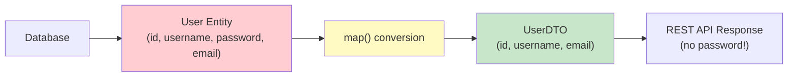
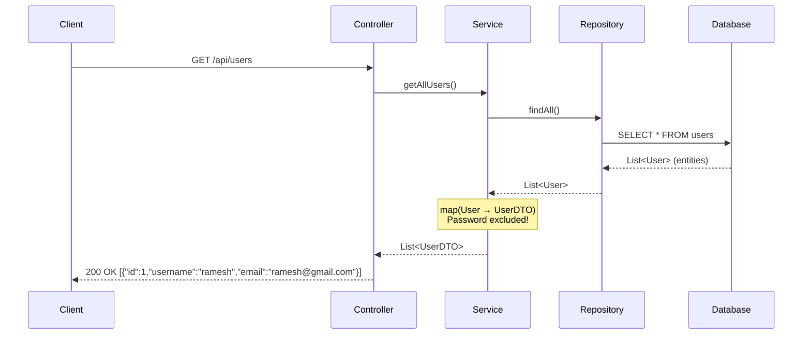
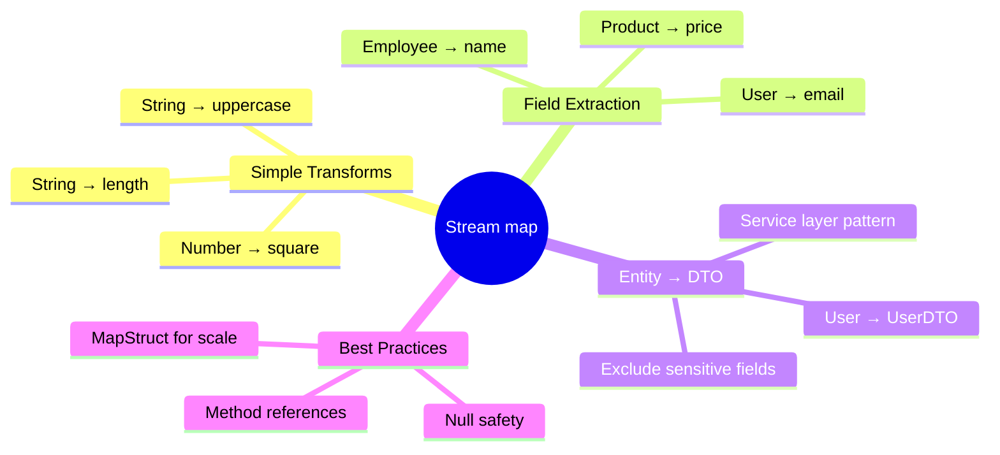

# 📘 Real-World Use Case — Convert Entity to DTO using map()

---

## 📌 Introduction

### 🧠 What is this about?
In every REST API you build, there's a golden rule: **never expose your database entity directly to the client**. Instead, you convert it to a **DTO (Data Transfer Object)** — a stripped-down version that hides sensitive fields like passwords. The `map()` method is the perfect tool for this conversion.

### 🌍 Real-World Problem First
Your `User` entity in the database has fields: `id`, `username`, `password`, `email`. When a client calls `GET /users`, you absolutely must NOT send the `password` field. You need to convert each `User` entity into a `UserDTO` that only contains `id`, `username`, and `email`.

### ❓ Why does it matter?
- **Security**: Exposing entity objects can leak sensitive data (passwords, internal IDs, audit fields)
- **API contract**: DTOs give you control over what the client sees — decouple your database schema from your API
- **This is a daily task**: Entity → DTO conversion happens in virtually every service method in Spring Boot applications

### 🗺️ What we'll learn
- What DTOs are and why they exist
- Using `map()` to convert `User` → `UserDTO`
- The complete Entity → DTO pipeline with streams

---

## 🧩 Concept 1: What is a DTO and Why Do We Need It?

### 🧠 Layer 1: The Simple Version
A **DTO** (Data Transfer Object) is a simplified version of your database object that you share with the outside world. It's like giving someone your business card (name, email, phone) instead of your entire personal file (SSN, bank details, medical records).

### 🔍 Layer 2: The Developer Version
- **Entity** = the full object stored in the database, managed by JPA/Hibernate
- **DTO** = a plain Java object (POJO) that contains only the fields safe and relevant for the API response
- The conversion happens in the **service layer** before returning data to the controller



### 🌍 Layer 3: The Real-World Analogy

| Hospital Analogy | Entity → DTO Conversion |
|-----------------|------------------------|
| Full patient file (name, SSN, blood type, medical history) | `User` entity (all fields including password) |
| Summary card for the front desk (name, appointment time) | `UserDTO` (only safe fields: id, username, email) |
| Nurse copies relevant info onto the summary card | `map()` creates a new DTO from each entity |
| Full file stays locked in the records room | Entity stays in the service layer, never sent to client |

### 💻 Layer 5: Code — Prove It!

**🔍 Step 1: The Entity class (full database object)**
```java
class User {
    private int id;
    private String username;
    private String password;  // 🔒 Sensitive! Never expose this!
    private String email;

    public User(int id, String username, String password, String email) {
        this.id = id;
        this.username = username;
        this.password = password;
        this.email = email;
    }

    // Getters
    public int getId() { return id; }
    public String getUsername() { return username; }
    public String getPassword() { return password; }
    public String getEmail() { return email; }
}
```

**🔍 Step 2: The DTO class (safe for API response)**
```java
class UserDTO {
    private int id;
    private String username;
    private String email;
    // ✅ No password field! Intentionally excluded.

    public UserDTO(int id, String username, String email) {
        this.id = id;
        this.username = username;
        this.email = email;
    }

    // Getters and toString()
    public int getId() { return id; }
    public String getUsername() { return username; }
    public String getEmail() { return email; }

    @Override
    public String toString() {
        return "UserDTO{id=" + id + ", username='" + username + "', email='" + email + "'}";
    }
}
```

**🔍 Step 3: Convert List\<User\> → List\<UserDTO\> using map()**
```java
List<User> users = Arrays.asList(
    new User(1, "ramesh", "secret123", "ramesh@gmail.com"),
    new User(2, "sanjay", "pass456", "sanjay@gmail.com"),
    new User(3, "meena", "mypass789", "meena@gmail.com")
);

// Convert Entity → DTO using map()
List<UserDTO> userDTOs = users.stream()
        .map(user -> new UserDTO(
                user.getId(),
                user.getUsername(),
                user.getEmail()      // ✅ Password excluded!
        ))
        .toList();

userDTOs.forEach(System.out::println);
// Output:
// UserDTO{id=1, username='ramesh', email='ramesh@gmail.com'}
// UserDTO{id=2, username='sanjay', email='sanjay@gmail.com'}
// UserDTO{id=3, username='meena', email='meena@gmail.com'}
// ✅ No passwords exposed!
```

> 💡 **The Aha Moment:** The `map()` lambda creates a **new object** for each element. The `Function<User, UserDTO>` takes the full entity and constructs a DTO from selected fields. The password field is simply never copied — it's excluded by design, not by accident.

---

## 🧩 Concept 2: How This Looks in a Spring Boot Application

### 🧠 Layer 1: The Simple Version
In a real Spring Boot app, this conversion happens in the service layer. The controller calls the service, the service fetches entities from the database, converts them to DTOs, and returns the DTOs.

### 🔍 Layer 2: The Developer Version



### 💻 Layer 5: Code — How it looks in Spring Boot

```java
// Service layer — where the conversion happens
@Service
public class UserService {

    @Autowired
    private UserRepository userRepository;

    public List<UserDTO> getAllUsers() {
        List<User> users = userRepository.findAll(); // Fetch entities from DB

        return users.stream()
                .map(user -> new UserDTO(            // Convert Entity → DTO
                        user.getId(),
                        user.getUsername(),
                        user.getEmail()
                ))
                .toList();
    }
}
```

**❌ Mistake: Returning entities directly from the controller**
```java
// ❌ WRONG: Exposes password to the client!
@GetMapping("/users")
public List<User> getUsers() {
    return userRepository.findAll();  // Password goes straight to the client!
}
```

**✅ Fix: Always convert to DTO in the service layer**
```java
// ✅ CORRECT: Return DTOs, never entities
@GetMapping("/users")
public List<UserDTO> getUsers() {
    return userService.getAllUsers();  // Returns DTOs — no password
}
```

---

### ⚠️ Pitfalls & Mistakes

**Mistake 1: Forgetting to exclude sensitive fields**
- 👤 What devs do: Create a DTO that mirrors the entity exactly, including password
- 💥 Why it breaks: The whole point of DTOs is defeated — sensitive data leaks to the client
- ✅ Fix: Review every DTO field. Ask: "Should the client see this?" If no → exclude it.

**Mistake 2: Using `@JsonIgnore` instead of DTOs**
- 👤 What devs do: Add `@JsonIgnore` on the password field in the entity
- 💥 Why it's fragile: Works for JSON serialization, but the entity still travels through layers. A future developer might serialize it differently, or use it in a log statement, exposing the password.
- ✅ Fix: Use proper DTOs. `@JsonIgnore` is a band-aid, not a solution.

---

### 💡 Pro Tips

**Tip 1:** In production, use a mapping library like MapStruct for Entity ↔ DTO conversion
```java
// MapStruct generates the conversion code at compile time
@Mapper
public interface UserMapper {
    UserDTO toDTO(User user);
    List<UserDTO> toDTOList(List<User> users);
}
```
- Why it works: MapStruct generates zero-overhead, type-safe mapping code at compile time — no runtime reflection
- When to use: When you have many entity-DTO conversions (10+ in a project)

---

### ✅ Key Takeaways

→ **Never expose entity objects directly in API responses** — always convert to DTOs
→ `map(entity -> new DTO(...))` is the standard pattern for Entity → DTO conversion
→ DTOs protect sensitive fields (passwords, internal IDs) from reaching the client
→ In Spring Boot, this conversion happens in the **service layer**
→ For large projects, consider mapping libraries like MapStruct

---

## 🎯 Final Summary

### 🧠 The Big Picture



### ✅ Master Takeaways
→ `map()` is a **1-to-1 transformation** — same count, different shape
→ Entity → DTO via `map()` is a production pattern you'll use daily
→ `filter()` selects, `map()` transforms — together they're the most powerful stream combo
→ Always think about security: what fields should the client NOT see?

### 🔗 What's Next?
We've seen `map()` which transforms each element **one-to-one**. But what if each element contains a **nested collection** (like a list of lists)? That's where `flatMap()` comes in — it flattens nested structures into a single stream. Let's explore it next.
