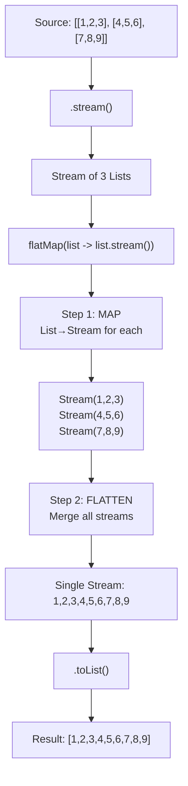

# 📘 Understanding Stream flatMap() Method

---

## 📌 Introduction

### 🧠 What is this about?
`flatMap()` is the big brother of `map()`. While `map()` does a 1-to-1 transformation, `flatMap()` handles the case where each element itself contains a collection — and you want to **flatten** everything into a single stream. It performs **mapping + flattening** in one operation.

### 🌍 Real-World Problem First
You have a list of students, and each student has a list of courses they're enrolled in. You want a single flat list of ALL courses across ALL students. With `map()`, you'd get a `Stream<List<String>>` — a stream of lists. With `flatMap()`, you get a `Stream<String>` — a flat stream of course names.

### ❓ Why does it matter?
- Nested data structures are everywhere: list of lists, array of arrays, object with collection fields
- `map()` alone can't flatten — it preserves the nesting
- `flatMap()` = `map()` + `flatten` — it's the tool for "unwrapping" nested collections

### 🗺️ What we'll learn
- The difference between `map()` and `flatMap()`
- What "flattening" means visually
- How `flatMap()` works step by step (mapping then flattening)

---

## 🧩 Concept 1: map() vs flatMap() — The Core Difference

### 🧠 Layer 1: The Simple Version
Imagine you have 3 shopping bags, each containing several items. `map()` opens each bag and shows you what's inside — but keeps them in separate bags. `flatMap()` opens all bags and dumps everything into one big pile.

### 🔍 Layer 2: The Developer Version

| Operation | What it does | Input → Output |
|-----------|-------------|----------------|
| `map()` | Transforms each element 1-to-1 | `Stream<T>` → `Stream<R>` |
| `flatMap()` | Transforms each element to a stream, then **flattens** all streams into one | `Stream<T>` → `Stream<R>` (where each T produces multiple R's) |

The key insight: `map()` preserves nesting, `flatMap()` removes it.

```java
// map() preserves nesting:
// Stream<List<String>> → still Stream<List<String>>

// flatMap() removes nesting:
// Stream<List<String>> → Stream<String>
```

### 🌍 Layer 3: The Real-World Analogy

| Analogy | map() | flatMap() |
|---------|-------|-----------|
| 3 envelopes, each with 3 letters | Opens each envelope, shows letters **still in envelope** | Opens all envelopes, puts all 9 letters in **one pile** |
| 3 classrooms, each with students | Lists students **per classroom** | Lists **all students** across all classrooms |
| 3 folders, each with files | Shows files **per folder** | Shows **all files** in a single list |

### ⚙️ Layer 4: How flatMap() Works (Step-by-Step)

**Step 1 — Start with nested structure:** `[[1, 2, 3], [4, 5, 6], [7, 8, 9]]`
**Step 2 — Create a stream:** Stream of 3 lists
**Step 3 — flatMap() MAPS:** Each list → its own stream: `Stream(1,2,3)`, `Stream(4,5,6)`, `Stream(7,8,9)`
**Step 4 — flatMap() FLATTENS:** Merges all 3 streams → one single stream: `Stream(1,2,3,4,5,6,7,8,9)`
**Step 5 — Collect:** Convert to list: `[1, 2, 3, 4, 5, 6, 7, 8, 9]`



📊 DIAGRAM PROMPT:
────────────────────────────────────────────────────────────
"Draw a visual comparison of map vs flatMap. On the left, show map(): 3 boxes (lists) each containing 3 numbers, with arrows pointing to 3 output boxes still containing 3 numbers each (nested structure preserved). On the right, show flatMap(): same 3 input boxes, but arrows point to a single flat row of 9 numbers (flattened). Label map() result as 'Stream of Lists' and flatMap() result as 'Stream of elements'. Use blue for input, red for map() output, green for flatMap() output. Clean whiteboard style."
────────────────────────────────────────────────────────────

### 💻 Layer 5: Code — See the Difference

**❌ Using map() on nested lists — nesting preserved:**
```java
List<List<Integer>> listOfLists = Arrays.asList(
    Arrays.asList(1, 2, 3),
    Arrays.asList(4, 5, 6),
    Arrays.asList(7, 8, 9)
);

// map() preserves the nesting
List<Stream<Integer>> mapped = listOfLists.stream()
        .map(list -> list.stream())  // Each list → its own stream
        .toList();
// Result: [Stream, Stream, Stream] — still nested! Not useful.
```

**✅ Using flatMap() — nesting removed:**
```java
List<Integer> flat = listOfLists.stream()
        .flatMap(list -> list.stream())  // Map each list to stream, then flatten
        .toList();

System.out.println(flat);
// Output: [1, 2, 3, 4, 5, 6, 7, 8, 9] — one flat list!
```

> 💡 **The Aha Moment:** The lambda inside `flatMap()` must return a `Stream`, not a regular value. `flatMap()` takes each of those individual streams and merges them into one. That's why it's called flat-MAP: it maps to streams, then flattens them.

---

### 📊 Comparison: map() vs flatMap()

| Feature | `map()` | `flatMap()` |
|---------|---------|-------------|
| What it does | 1-to-1 transformation | 1-to-many transformation + flatten |
| Lambda returns | A single value `R` | A `Stream<R>` |
| Nesting | Preserves | Removes |
| Use when | Each element → one result | Each element → multiple results (nested) |
| Example | `User → email` | `Student → list of courses` |

**Why does flatMap() need the lambda to return a Stream?** Because the flattening step works by merging streams. If you returned a list, Java wouldn't know how to merge lists into a stream. By requiring a `Stream` return type, flatMap can simply concatenate all the returned streams into one.

---

### ✅ Key Takeaways

→ `map()` = 1-to-1 (preserves nesting), `flatMap()` = 1-to-many + flatten (removes nesting)
→ The lambda inside `flatMap()` **must return a Stream** — not a list, not a value
→ flatMap = MAP each element to a stream + FLATTEN all those streams into one
→ Use `flatMap()` whenever you have nested collections: `List<List<T>>`, `Stream<Stream<T>>`, arrays of arrays

---

> Now that we understand the concept, let's see `flatMap()` in action with complete coding examples.

---

## 🎯 Final Summary

### ✅ Master Takeaways
→ `flatMap()` solves the "nested collections" problem that `map()` can't handle
→ It performs two operations: mapping (element → stream) + flattening (merge all streams)
→ Think: "If my data is nested and I want it flat → flatMap()"

### 🔗 What's Next?
Next, we'll implement `flatMap()` with real code — flattening a list of lists and an array of arrays into single collections.
