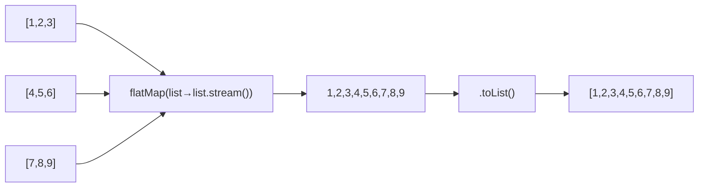

# 📘 Stream flatMap() Method — Hands-On Example

---

## 📌 Introduction

### 🧠 What is this about?
We know `flatMap()` maps + flattens. Now let's code it — flattening a **list of lists** of integers and an **array of arrays** of strings into single, flat collections.

### 🌍 Real-World Problem First
A teacher has 3 classes. Each class has a list of student names. She needs ONE combined list of all students across all classes. The data structure is `List<List<String>>` — a nested structure that needs flattening.

### ❓ Why does it matter?
- Nested collections are common in real data: departments with employees, orders with items, categories with products
- Knowing how to flatten them is essential for reporting, searching, and aggregation

### 🗺️ What we'll learn
- Flattening `List<List<Integer>>` into `List<Integer>`
- Flattening nested `String[][]` into `List<String>`
- The exact mechanics of the flatMap lambda

---

## 🧩 Concept 1: Flattening a List of Lists

### 🧠 Layer 1: The Simple Version
We have 3 lists packed inside one big list. We want to "unpack" them into one flat list containing all the numbers.

### ⚙️ Layer 4: Step-by-Step Walkthrough

```
Source: [[1, 2, 3], [4, 5, 6], [7, 8, 9]]
         ^^^^^^^^   ^^^^^^^^   ^^^^^^^^
         List 1     List 2     List 3

Step 1: .stream()     → Stream of 3 Lists
Step 2: .flatMap()    → MAP: List(1,2,3) → Stream(1,2,3)
                        MAP: List(4,5,6) → Stream(4,5,6)
                        MAP: List(7,8,9) → Stream(7,8,9)
                      → FLATTEN: merge into Stream(1,2,3,4,5,6,7,8,9)
Step 3: .toList()     → [1, 2, 3, 4, 5, 6, 7, 8, 9]
```



### 💻 Layer 5: Code — Prove It!

**🔍 Flatten List of Lists:**
```java
List<List<Integer>> listOfLists = Arrays.asList(
    Arrays.asList(1, 2, 3),
    Arrays.asList(4, 5, 6),
    Arrays.asList(7, 8, 9)
);

// Step 1: Stream the outer list → Stream<List<Integer>>
Stream<List<Integer>> stream = listOfLists.stream();

// Step 2: flatMap each inner list to a stream → Stream<Integer>
// Step 3: Collect to a flat list
List<Integer> result = stream
        .flatMap(list -> list.stream())  // List<Integer> → Stream<Integer>
        .toList();

System.out.println(result);
// Output: [1, 2, 3, 4, 5, 6, 7, 8, 9]
```

**🔍 Breaking down the lambda:**
```java
// The lambda receives each inner list
.flatMap(list -> list.stream())
//       ^^^^    ^^^^^^^^^^^^^^^
//       Input:  Output: a Stream
//       List<Integer>   Stream<Integer>

// flatMap then merges all these individual streams into one
```

---

## 🧩 Concept 2: Flattening Nested Arrays

### 🧠 Layer 1: The Simple Version
Same idea, but with arrays instead of lists. We have an array that contains other arrays. We want to flatten it all into one list.

### 💻 Layer 5: Code — Prove It!

**🔍 Flatten String[][] into List\<String\>:**
```java
String[][] data = {
    {"a", "b", "c"},
    {"d", "e", "f"},
    {"g", "h", "i"}
};

// Step 1: Create a stream of String arrays
Stream<String[]> streamArray = Arrays.stream(data);

// Step 2: flatMap each String[] to a stream
// Step 3: Collect to a flat list
List<String> result = streamArray
        .flatMap(arr -> Arrays.stream(arr))  // String[] → Stream<String>
        .toList();

System.out.println(result);
// Output: [a, b, c, d, e, f, g, h, i]
```

**🔍 Note the difference in the flatMap lambda:**
```java
// For List<List<T>>: each element IS a List → call .stream() on it
.flatMap(list -> list.stream())

// For T[][]: each element IS an array → use Arrays.stream() utility
.flatMap(arr -> Arrays.stream(arr))
```

> 💡 **The Aha Moment:** The lambda inside `flatMap()` always returns a `Stream`. The difference is just HOW you create that stream — `.stream()` for collections, `Arrays.stream()` for arrays. The flattening works the same way regardless.

---

## 🧩 Concept 3: Compact One-Liner with Method Chaining

### 💻 Layer 5: Code

```java
// The complete pipeline as a single chain:
List<Integer> flat = Arrays.asList(
        Arrays.asList(1, 2, 3),
        Arrays.asList(4, 5, 6),
        Arrays.asList(7, 8, 9)
    ).stream()
     .flatMap(Collection::stream)  // Method reference — cleaner!
     .toList();

System.out.println(flat);
// Output: [1, 2, 3, 4, 5, 6, 7, 8, 9]
```

Note: `Collection::stream` is a method reference equivalent to `list -> list.stream()`.

---

### ⚠️ Pitfalls & Mistakes

**Mistake 1: Using map() when you need flatMap()**
- 👤 What devs do: `listOfLists.stream().map(list -> list.stream()).toList()`
- 💥 What happens: You get `List<Stream<Integer>>` — a list of streams, not a flat list of integers. Completely useless.
- ✅ Fix: Use `flatMap()` instead of `map()` when you want to flatten

**Mistake 2: Lambda not returning a Stream**
- 👤 What devs do: `.flatMap(list -> list)` — returning the list itself
- 💥 What happens: Compilation error — flatMap expects `Function<T, Stream<R>>`, not `Function<T, List<R>>`
- ✅ Fix: Always call `.stream()` in the lambda: `.flatMap(list -> list.stream())`

---

### 💡 Pro Tips

**Tip 1:** Use `flatMap()` + `distinct()` to get unique elements from nested collections
```java
List<List<String>> departments = Arrays.asList(
    Arrays.asList("Java", "Python", "Java"),
    Arrays.asList("Python", "JavaScript", "Go")
);

List<String> uniqueSkills = departments.stream()
        .flatMap(Collection::stream)
        .distinct()
        .toList();

System.out.println(uniqueSkills);
// Output: [Java, Python, JavaScript, Go] — duplicates removed!
```

---

### ✅ Key Takeaways

→ `flatMap(list -> list.stream())` flattens `List<List<T>>` into `Stream<T>`
→ `flatMap(arr -> Arrays.stream(arr))` flattens arrays of arrays
→ Use `Collection::stream` as a method reference for cleaner code
→ The lambda MUST return a `Stream` — that's what flatMap merges
→ `map()` preserves nesting, `flatMap()` removes it — choose based on your need

---

## 🎯 Final Summary

### 🧠 The Big Picture

```mermaid
mindmap
  root((flatMap))
    What it does
      Maps each element to a Stream
      Flattens all Streams into one
    When to use
      List of Lists
      Array of Arrays
      Objects with collection fields
    Key Rule
      Lambda must return Stream
    vs map
      map preserves nesting
      flatMap removes nesting
```



### ✅ Master Takeaways
→ `flatMap()` = map to streams + merge into one flat stream
→ Works on any nested structure: `List<List<T>>`, `T[][]`, `Stream<Stream<T>>`
→ The pattern is always: `.flatMap(element -> convertToStream(element))`

### 🔗 What's Next?
We've covered `filter()` (select), `map()` (transform), and `flatMap()` (flatten). Next up is `sorted()` — the stream operation that lets you **order** your data. We'll learn how to sort by natural order, custom comparators, and multiple fields.
