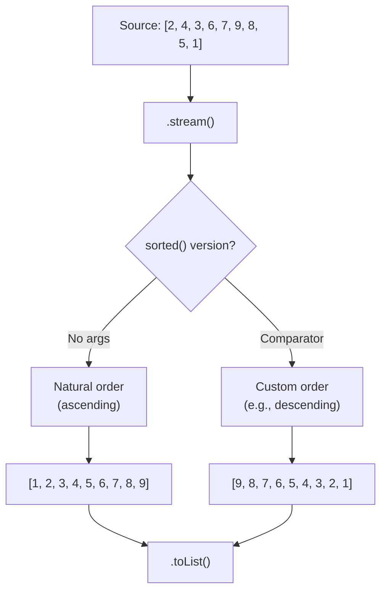

# 📘 Understanding Stream sorted() Method

---

## 📌 Introduction

### 🧠 What is this about?
The `sorted()` method lets you **order** the elements of a stream. By default, it sorts in **natural order** (alphabetical for strings, ascending for numbers). For custom sorting — like sorting users by age — you pass a `Comparator`.

### 🌍 Real-World Problem First
An e-commerce site needs to display products sorted by price (lowest first). The data comes from the database unsorted. Without `sorted()`, you'd write a manual comparator, create a copy of the list, and call `Collections.sort()`. With streams, you chain `.sorted()` right in the pipeline.

### ❓ Why does it matter?
- Sorting is one of the most common data operations in any application
- `sorted()` integrates seamlessly into stream pipelines — no need for separate sorting steps
- It supports both natural order and custom comparators
- Combined with `Comparator.comparing()` and `.reversed()`, it handles any sorting requirement

### 🗺️ What we'll learn
- Natural order sorting (no arguments)
- Reverse order sorting with `Comparator.reverseOrder()`
- Sorting integers and strings
- Understanding the two overloaded `sorted()` methods

---

## 🧩 Concept 1: The Two Flavors of sorted()

### 🧠 Layer 1: The Simple Version
There are two versions of `sorted()`:
1. **No arguments** — sorts in natural order (A→Z for strings, 1→9 for numbers)
2. **With a Comparator** — sorts in whatever custom order you define

### 🔍 Layer 2: The Developer Version

```java
// Version 1: Natural order (no args)
Stream<T> sorted()

// Version 2: Custom order (with Comparator)
Stream<T> sorted(Comparator<? super T> comparator)
```

Key characteristics:
- **Intermediate operation** — returns a new stream with sorted elements
- **Lazy** — doesn't execute until a terminal operation is called
- **Stable** — equal elements maintain their relative order from the original stream

### 🌍 Layer 3: The Real-World Analogy

| Library Analogy | sorted() |
|----------------|----------|
| A pile of unsorted books | The input stream |
| "Sort alphabetically by title" | `.sorted()` — natural order |
| "Sort by publication year, newest first" | `.sorted(Comparator.comparing(Book::getYear).reversed())` — custom order |
| Books now on the shelf in order | The output stream with sorted elements |
| The original pile is untouched | The source collection is never modified |

### ⚙️ Layer 4: How It Works



### 💻 Layer 5: Code — Prove It!

**🔍 Sort integers in ascending order (natural order):**
```java
List<Integer> numbers = Arrays.asList(2, 4, 3, 6, 7, 9, 8, 5, 1);

List<Integer> sorted = numbers.stream()
        .sorted()  // No args → natural order (ascending)
        .toList();

System.out.println(sorted);
// Output: [1, 2, 3, 4, 5, 6, 7, 8, 9]
```

**🔍 Sort integers in descending order (reverse):**
```java
List<Integer> descending = numbers.stream()
        .sorted(Comparator.reverseOrder())  // Descending order
        .toList();

System.out.println(descending);
// Output: [9, 8, 7, 6, 5, 4, 3, 2, 1]
```

> 💡 **The Aha Moment:** `Comparator.reverseOrder()` is a factory method that returns a pre-built `Comparator` which reverses the natural order. You don't need to implement any comparison logic yourself — Java provides it for you. Internally, it simply calls `Collections.reverseOrder()` which flips the sign of every comparison.

**🔍 What about the original list?**
```java
System.out.println(numbers);
// Output: [2, 4, 3, 6, 7, 9, 8, 5, 1] — UNCHANGED!
// Streams never modify the source.
```

---

### ⚠️ Pitfalls & Mistakes

**Mistake 1: Trying to sort objects that don't implement Comparable**
- 👤 What devs do: `.sorted()` on a stream of custom objects without Comparable
- 💥 Why it breaks: `ClassCastException` — Java doesn't know how to compare your objects in natural order
- ✅ Fix: Either implement `Comparable` in your class, or pass a `Comparator` to `sorted()`

```java
// ❌ Fails: User doesn't implement Comparable
users.stream().sorted().toList(); // ClassCastException!

// ✅ Works: Provide a Comparator
users.stream().sorted(Comparator.comparing(User::getAge)).toList();
```

---

### ✅ Key Takeaways for This Concept

→ `sorted()` with no args = natural order (ascending numbers, alphabetical strings)
→ `sorted(Comparator.reverseOrder())` = descending / reverse order
→ It's an intermediate operation — returns a new stream, original unchanged
→ For custom objects, you MUST provide a `Comparator` (or implement `Comparable`)

---

> Now let's apply `sorted()` to strings — sorting fruit names in alphabetical and reverse order.

---

## 🎯 Final Summary

### ✅ Master Takeaways
→ Two overloaded versions: no-arg (natural) and with-Comparator (custom)
→ Natural order: strings → alphabetical, numbers → ascending
→ `Comparator.reverseOrder()` flips any natural order to descending
→ Source collection is never modified — streams produce new results

### 🔗 What's Next?
In the next note, we'll sort **strings** in alphabetical and reverse order — then move on to sorting custom objects by specific fields.
