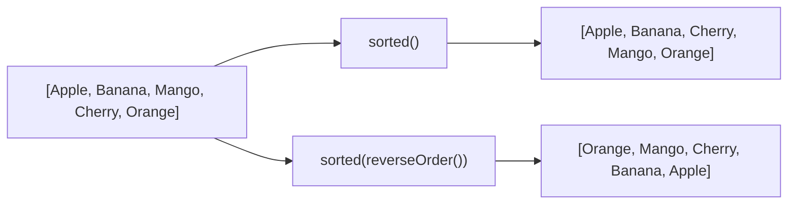

# 📘 Stream sorted() — Sort Strings in Ascending and Descending Order

---

## 📌 Introduction

### 🧠 What is this about?
A quick, focused example of sorting a list of strings using `sorted()`. We'll sort fruit names in **alphabetical order** (A→Z) and **reverse alphabetical order** (Z→A).

### 🌍 Real-World Problem First
A dropdown menu in a UI needs to display country names sorted A→Z. The backend list comes in random order. One line of stream code fixes it.

### 🗺️ What we'll learn
- Sorting strings in natural order (alphabetical)
- Sorting strings in reverse order
- How Java defines "natural order" for strings

---

## 🧩 Concept 1: Sorting Strings Alphabetically

### 🧠 Layer 1: The Simple Version
For strings, "natural order" means **alphabetical order** — A comes before B, B before C, and so on. Java uses Unicode values to determine this.

### 🔍 Layer 2: The Developer Version
Strings implement `Comparable<String>`. Their `compareTo()` method compares characters lexicographically (by Unicode value). This is what `sorted()` uses when called with no arguments.

### 💻 Layer 5: Code — Prove It!

**🔍 Sort fruits alphabetically:**
```java
List<String> fruits = Arrays.asList("Apple", "Banana", "Mango", "Cherry", "Orange");

List<String> sorted = fruits.stream()
        .sorted()  // Natural order for String = alphabetical
        .toList();

System.out.println(sorted);
// Output: [Apple, Banana, Cherry, Mango, Orange]
// First letters: A, B, C, M, O ← alphabetical ✅
```

**🔍 Sort fruits in reverse alphabetical order:**
```java
List<String> reversed = fruits.stream()
        .sorted(Comparator.reverseOrder())  // Z → A
        .toList();

System.out.println(reversed);
// Output: [Orange, Mango, Cherry, Banana, Apple]
// First letters: O, M, C, B, A ← reverse alphabetical ✅
```



---

### ⚠️ Pitfalls & Mistakes

**Mistake 1: Case sensitivity in string sorting**
- 👤 What devs do: Sort a list with mixed case: `["banana", "Apple", "cherry"]`
- 💥 What happens: Uppercase letters come before lowercase in Unicode. So `"Apple"` (A=65) comes before `"banana"` (b=98). Result: `[Apple, banana, cherry]` — which looks wrong to users expecting case-insensitive alphabetical order.
- ✅ Fix: Use `String.CASE_INSENSITIVE_ORDER`:

```java
List<String> mixed = Arrays.asList("banana", "Apple", "cherry");

// ❌ Default: case-sensitive (uppercase first)
List<String> wrong = mixed.stream().sorted().toList();
System.out.println(wrong);
// Output: [Apple, banana, cherry] — A(65) < b(98)

// ✅ Case-insensitive sort
List<String> correct = mixed.stream()
        .sorted(String.CASE_INSENSITIVE_ORDER)
        .toList();
System.out.println(correct);
// Output: [Apple, banana, cherry] — treats A and a as equal
```

---

### ✅ Key Takeaways

→ `sorted()` on strings = alphabetical (lexicographic) order by default
→ `sorted(Comparator.reverseOrder())` = reverse alphabetical
→ Watch out for **case sensitivity** — uppercase letters sort before lowercase by default
→ Use `String.CASE_INSENSITIVE_ORDER` for case-insensitive sorting

---

## 🎯 Final Summary

### ✅ Master Takeaways
→ String natural order = Unicode-based alphabetical comparison
→ `Comparator.reverseOrder()` flips it to Z→A
→ Case sensitivity is the #1 gotcha — always consider it when sorting user-facing strings

### 🔗 What's Next?
Sorting primitives and strings is straightforward. The real power of `sorted()` shows when sorting **custom objects** — like users by age. That's exactly what we'll do next.
