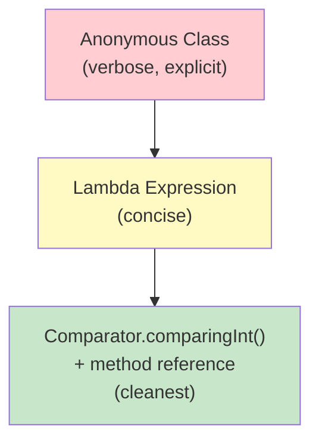
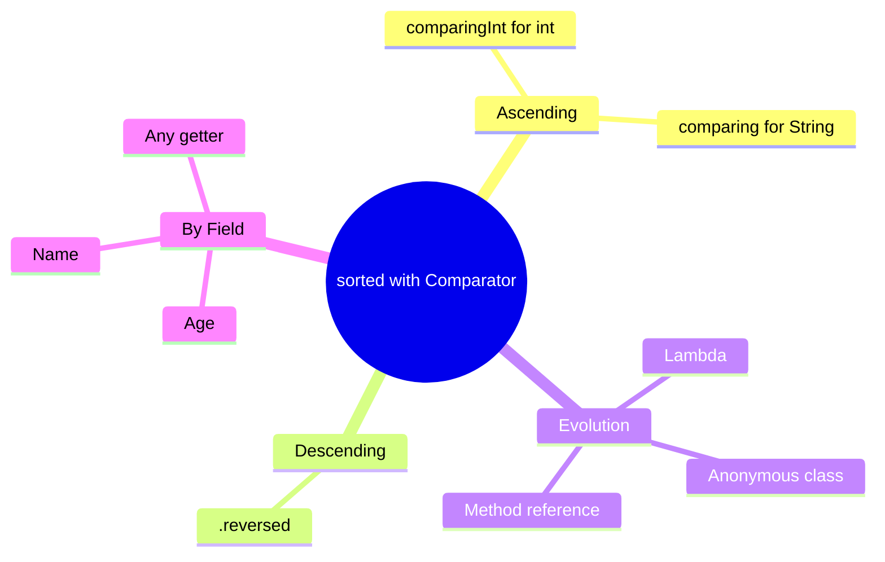

# 📘 Stream sorted() — Sort User by Age in Ascending and Descending Order

---

## 📌 Introduction

### 🧠 What is this about?
Sorting a list of custom objects by a specific field is one of the most common operations in Java. In this note, we'll sort `User` objects by `age` — first ascending, then descending — using `sorted()` with `Comparator`.

### 🌍 Real-World Problem First
A social media app shows "People You May Know" sorted by age — youngest first. The user list comes from a database in no particular order. You need to sort by the `age` field dynamically.

### ❓ Why does it matter?
- Custom objects don't have a "natural order" unless they implement `Comparable`
- You need to tell Java HOW to compare: by which field? ascending or descending?
- `Comparator.comparing()` and `Comparator.comparingInt()` make this clean and readable

### 🗺️ What we'll learn
- Sorting objects using anonymous `Comparator` class
- Simplifying with lambda expressions
- Further simplifying with `Comparator.comparingInt()` and method references
- Reversing the sort with `.reversed()`
- Sorting by different fields (age, name)

---

## 🧩 Concept 1: Three Ways to Sort Custom Objects

### 🧠 Layer 1: The Simple Version
Java doesn't know how to compare your `User` objects — it doesn't know if you want to sort by name, age, or email. You need to provide a **Comparator** — a set of instructions that says: "Compare users by their age."

### 🔍 Layer 2: The Developer Version
There are three progressively cleaner ways to write the comparator:

1. **Anonymous class** — verbose but explicit
2. **Lambda expression** — concise
3. **Comparator.comparingInt() + method reference** — cleanest

### ⚙️ Layer 4: Evolution of the Comparator



### 💻 Layer 5: Code — All Three Approaches

**🔍 Setup: The User class**
```java
class User {
    private String name;
    private int age;

    public User(String name, int age) {
        this.name = name;
        this.age = age;
    }

    public String getName() { return name; }
    public int getAge() { return age; }

    @Override
    public String toString() {
        return "User{name='" + name + "', age=" + age + "}";
    }
}
```

**🔍 Create the list:**
```java
List<User> users = Arrays.asList(
    new User("Ramesh", 30),
    new User("Umesh", 28),
    new User("Sanjay", 35),
    new User("Pramod", 32),
    new User("Meena", 25)
);
```

**Approach 1: Anonymous Comparator class (old-school)**
```java
Comparator<User> userComparator = new Comparator<User>() {
    @Override
    public int compare(User o1, User o2) {
        return o1.getAge() - o2.getAge();  // Ascending by age
    }
};

List<User> sorted = users.stream()
        .sorted(userComparator)
        .toList();
// Output: Meena(25), Umesh(28), Ramesh(30), Pramod(32), Sanjay(35)
```

**Approach 2: Lambda expression (cleaner)**
```java
List<User> sorted = users.stream()
        .sorted((o1, o2) -> o1.getAge() - o2.getAge())  // Lambda replaces anonymous class
        .toList();
// Output: Meena(25), Umesh(28), Ramesh(30), Pramod(32), Sanjay(35)
```

**Approach 3: Comparator.comparingInt() + method reference (cleanest)**
```java
List<User> sorted = users.stream()
        .sorted(Comparator.comparingInt(User::getAge))  // ✅ Best practice
        .toList();
// Output: Meena(25), Umesh(28), Ramesh(30), Pramod(32), Sanjay(35)
```

> 💡 **The Aha Moment:** `Comparator.comparingInt(User::getAge)` reads almost like English: "Compare by user's age." It extracts the `int` field and builds a comparator automatically. No manual subtraction, no risk of integer overflow bugs.

---

## 🧩 Concept 2: Sorting in Descending Order with .reversed()

### 🧠 Layer 1: The Simple Version
To flip the sort order from ascending to descending, just add `.reversed()` at the end. That's it.

### 🔍 Layer 2: The Developer Version
`Comparator.comparingInt()` returns a `Comparator`. The `Comparator` interface has a `.reversed()` method that wraps the original comparator and flips the comparison result.

### 💻 Layer 5: Code — Prove It!

```java
// Sort by age DESCENDING — just add .reversed()
List<User> descending = users.stream()
        .sorted(Comparator.comparingInt(User::getAge).reversed())
        .toList();

descending.forEach(System.out::println);
// Output:
// User{name='Sanjay', age=35}
// User{name='Pramod', age=32}
// User{name='Ramesh', age=30}
// User{name='Umesh', age=28}
// User{name='Meena', age=25}
```

---

## 🧩 Concept 3: Sorting by a String Field (Name)

### 🧠 Layer 1: The Simple Version
For `int` fields, we used `comparingInt()`. For `String` or object fields, we use `comparing()` (without the "Int").

### 💻 Layer 5: Code — Prove It!

**🔍 Sort by name ascending:**
```java
List<User> sortedByName = users.stream()
        .sorted(Comparator.comparing(User::getName))  // Alphabetical by name
        .toList();

sortedByName.forEach(System.out::println);
// Output: Meena, Pramod, Ramesh, Sanjay, Umesh
// First letters: M, P, R, S, U ← alphabetical ✅
```

**🔍 Sort by name descending:**
```java
List<User> sortedByNameDesc = users.stream()
        .sorted(Comparator.comparing(User::getName).reversed())
        .toList();

sortedByNameDesc.forEach(System.out::println);
// Output: Umesh, Sanjay, Ramesh, Pramod, Meena
// First letters: U, S, R, P, M ← reverse alphabetical ✅
```

### 📊 Comparator Methods Summary

| Method | Use for | Example |
|--------|---------|---------|
| `Comparator.comparingInt()` | `int` fields | `comparingInt(User::getAge)` |
| `Comparator.comparingLong()` | `long` fields | `comparingLong(User::getId)` |
| `Comparator.comparingDouble()` | `double` fields | `comparingDouble(Product::getPrice)` |
| `Comparator.comparing()` | Object fields (String, etc.) | `comparing(User::getName)` |
| `.reversed()` | Flip to descending | `comparing(...).reversed()` |

**Why separate methods for primitives?** `comparingInt()`, `comparingLong()`, `comparingDouble()` avoid autoboxing overhead. `comparing()` works with `Comparable` objects (like `String`) but requires boxing for primitives. In performance-critical code with millions of elements, the primitive-specific methods save significant CPU cycles.

---

### ⚠️ Pitfalls & Mistakes

**Mistake 1: Integer overflow in manual comparators**
- 👤 What devs do: `(o1, o2) -> o1.getAge() - o2.getAge()`
- 💥 Why it can break: If ages were near `Integer.MAX_VALUE`, subtraction could overflow and give wrong results. E.g., `Integer.MAX_VALUE - (-1)` overflows.
- ✅ Fix: Use `Comparator.comparingInt()` — it uses `Integer.compare()` internally, which handles all edge cases.

---

### 💡 Pro Tips

**Tip 1:** Use `Comparator.comparing()` — never write subtraction-based comparators
```java
// ❌ Risk of overflow, hard to read
.sorted((a, b) -> a.getAge() - b.getAge())

// ✅ Safe, readable, intentional
.sorted(Comparator.comparingInt(User::getAge))
```

---

### ✅ Key Takeaways

→ Use `Comparator.comparingInt(User::getAge)` for int fields — safe and readable
→ Use `Comparator.comparing(User::getName)` for String/Object fields
→ Add `.reversed()` at the end for descending order — no rewriting logic
→ Avoid manual subtraction in comparators — use `comparingInt/Long/Double` instead

---

## 🎯 Final Summary

### 🧠 The Big Picture



### ✅ Master Takeaways
→ `Comparator.comparingInt(User::getAge)` = sort by int field ascending
→ `.reversed()` = flip to descending — always chainable
→ `Comparator.comparing(User::getName)` = sort by String/Object field
→ Method references (`User::getAge`) make sorting code read like English

### 🔗 What's Next?
Let's apply this to a more realistic scenario — sorting **Products by price** in ascending and descending order, like an e-commerce product listing.
