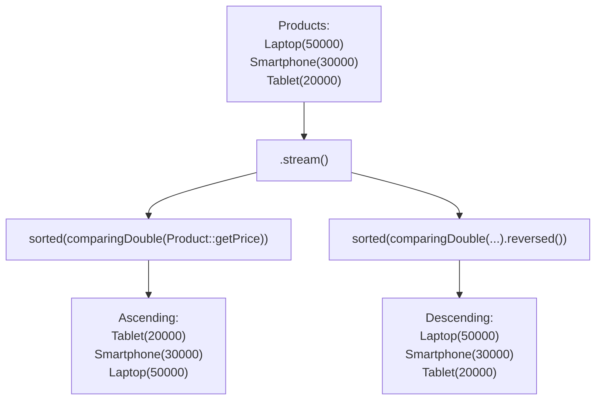

# 📘 Stream sorted() — Sort Products by Price in Ascending & Descending Order

---

## 📌 Introduction

### 🧠 What is this about?
A real-world e-commerce scenario: sorting products by price. We'll use `Comparator.comparing()` with `Double::compare` and the cleaner `Comparator.comparingDouble()` to sort a product list by price — both ascending and descending.

### 🌍 Real-World Problem First
An online store displays products. The user clicks "Sort by: Price (Low to High)." Your backend needs to return the product list sorted by the `price` field. This is the most common sorting requirement in e-commerce.

### 🗺️ What we'll learn
- Creating a Product class with `id`, `name`, `price`
- Sorting products by price ascending (cheapest first)
- Sorting products by price descending (most expensive first)
- Using lambda vs `Comparator.comparingDouble()` vs `Comparator.comparing()`

---

## 🧩 Concept 1: Sorting Products by Price

### 🧠 Layer 1: The Simple Version
We have 3 products with different prices. We want to arrange them from cheapest to most expensive, and then flip it to most expensive first.

### ⚙️ Layer 4: Step-by-Step



### 💻 Layer 5: Code — Prove It!

**🔍 Setup: The Product class**
```java
class Product {
    private int id;
    private String name;
    private double price;

    public Product(int id, String name, double price) {
        this.id = id;
        this.name = name;
        this.price = price;
    }

    public int getId() { return id; }
    public String getName() { return name; }
    public double getPrice() { return price; }

    @Override
    public String toString() {
        return "Product{id=" + id + ", name='" + name + "', price=" + price + "}";
    }
}
```

**🔍 Create the product list:**
```java
List<Product> products = Arrays.asList(
    new Product(1, "Laptop", 50000),
    new Product(2, "Smartphone", 30000),
    new Product(3, "Tablet", 20000)
);
```

**🔍 Sort by price ascending (cheapest first):**
```java
// Using lambda with Double.compare
List<Product> ascending = products.stream()
        .sorted((p1, p2) -> Double.compare(p1.getPrice(), p2.getPrice()))
        .toList();

ascending.forEach(System.out::println);
// Output:
// Product{id=3, name='Tablet', price=20000.0}
// Product{id=2, name='Smartphone', price=30000.0}
// Product{id=1, name='Laptop', price=50000.0}
```

**🔍 Cleaner version with Comparator.comparing():**
```java
// Using Comparator.comparing() with method reference
List<Product> ascending = products.stream()
        .sorted(Comparator.comparing(Product::getPrice))  // ✅ Clean
        .toList();
// Same output: Tablet(20000), Smartphone(30000), Laptop(50000)
```

> 💡 **Why `Double.compare()` instead of subtraction?** For doubles, subtraction can produce rounding errors. `Double.compare(a, b)` handles `NaN`, `-0.0`, and `+0.0` correctly. `Comparator.comparingDouble()` uses this internally.

**🔍 Sort by price descending (most expensive first):**
```java
List<Product> descending = products.stream()
        .sorted(Comparator.comparing(Product::getPrice).reversed())
        .toList();

descending.forEach(System.out::println);
// Output:
// Product{id=1, name='Laptop', price=50000.0}
// Product{id=2, name='Smartphone', price=30000.0}
// Product{id=3, name='Tablet', price=20000.0}
```

### 📊 Three Ways to Sort by Price

| Approach | Code | Readability | Safety |
|----------|------|-------------|--------|
| Lambda + Double.compare | `(p1, p2) -> Double.compare(p1.getPrice(), p2.getPrice())` | Medium | ✅ Safe |
| Comparator.comparing | `Comparator.comparing(Product::getPrice)` | ✅ Best | ✅ Safe |
| Comparator.comparingDouble | `Comparator.comparingDouble(Product::getPrice)` | ✅ Best | ✅ Best (no autoboxing) |

**Why `comparingDouble` is best for `double` fields:** `Comparator.comparing()` autoboxes the `double` to `Double` for every comparison. With thousands of products, this creates thousands of unnecessary `Double` objects. `comparingDouble()` avoids this by working directly with primitive `double` values.

---

### ⚠️ Pitfalls & Mistakes

**Mistake 1: Subtracting doubles in a comparator**
- 👤 What devs do: `(p1, p2) -> (int)(p1.getPrice() - p2.getPrice())`
- 💥 Why it breaks: Casting `double` difference to `int` truncates. If prices are 10.5 and 10.3, the difference is 0.2, which truncates to 0 — Java thinks they're equal! Also, large doubles can overflow `int`.
- ✅ Fix: Use `Double.compare()` or `Comparator.comparingDouble()`

---

### ✅ Key Takeaways

→ Use `Comparator.comparing(Product::getPrice)` for clean, readable price sorting
→ Use `Comparator.comparingDouble()` for primitive `double` fields to avoid autoboxing
→ Never subtract doubles and cast to int for comparison — use `Double.compare()`
→ Add `.reversed()` for descending order — it's always just one method call away

---

## 🎯 Final Summary

### ✅ Master Takeaways
→ Sorting products by price = `Comparator.comparing(Product::getPrice)` (ascending) + `.reversed()` (descending)
→ For `double` fields, prefer `comparingDouble()` over `comparing()` to avoid autoboxing
→ `.reversed()` flips the sort direction without rewriting comparison logic

### 🔗 What's Next?
What if two products have the **same price**? How do you break the tie? Next, we'll learn about **multi-field sorting** — sorting by price AND name using `thenComparing()`.
