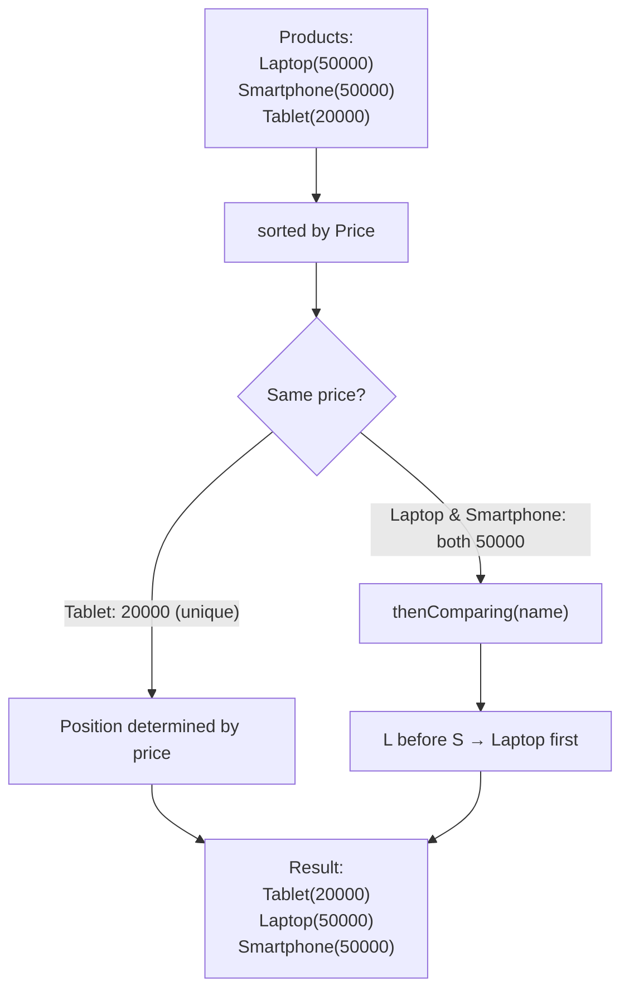
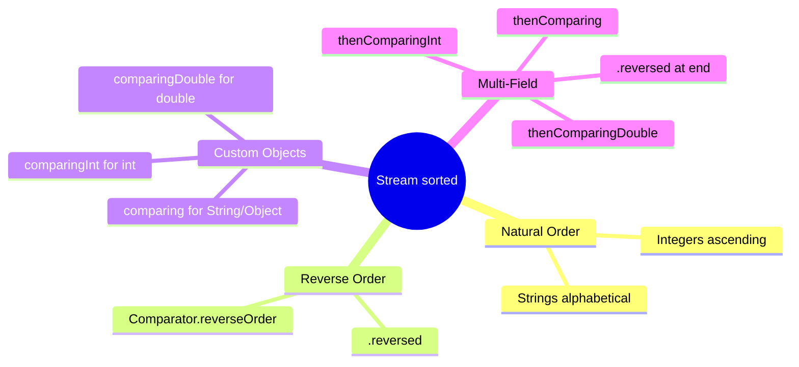

# 📘 Stream sorted() — Sort Products by Price and Name (Multi-Field Sorting)

---

## 📌 Introduction

### 🧠 What is this about?
What happens when two products have the **same price**? You need a tiebreaker — a second field to sort by. This note covers **multi-field sorting** using `thenComparing()`, one of the most powerful features of the Comparator API.

### 🌍 Real-World Problem First
An e-commerce listing has two laptops both priced at ₹50,000. How should they appear? You can't leave them in random order — so you sort first by price, then alphabetically by name as a tiebreaker. This is multi-field sorting.

### ❓ Why does it matter?
- Single-field sorting breaks down when values are equal
- Multi-field sorting ensures a **deterministic order** — same input always produces same output
- SQL has `ORDER BY price, name` — `thenComparing()` is the Java equivalent

### 🗺️ What we'll learn
- Using `thenComparing()` for multi-field sorting
- Ascending and descending multi-field sorting
- How `thenComparing()` only kicks in for ties

---

## 🧩 Concept 1: Multi-Field Sorting with thenComparing()

### 🧠 Layer 1: The Simple Version
Think of it like a spelling bee. If two contestants both spell the same number of words correctly (tied on score), you break the tie by who was faster (second criterion). In our case: tied on price → break tie by name.

### 🔍 Layer 2: The Developer Version
`Comparator.comparing()` returns a `Comparator`. This comparator has a `.thenComparing()` method that appends a secondary sort criterion. The secondary criterion is **only evaluated when the primary comparison results in a tie (returns 0)**.

```java
Comparator.comparing(Product::getPrice)        // Primary: sort by price
          .thenComparing(Product::getName)       // Secondary: if prices equal, sort by name
```

### 🌍 Layer 3: The Real-World Analogy

| Olympic Ranking | Multi-Field Sorting |
|----------------|---------------------|
| Primary: gold medal count | `Comparator.comparing(Product::getPrice)` |
| Tiebreaker: silver medal count | `.thenComparing(Product::getName)` |
| Only check silver if gold counts are equal | `thenComparing` only runs when primary returns 0 |

### ⚙️ Layer 4: How It Works



### 💻 Layer 5: Code — Prove It!

**🔍 Setup: Products with same prices**
```java
List<Product> products = Arrays.asList(
    new Product(1, "Laptop", 50000),
    new Product(2, "Smartphone", 50000),  // Same price as Laptop!
    new Product(3, "Tablet", 20000)
);
```

**🔍 Sort by price, then by name (ascending):**
```java
List<Product> sorted = products.stream()
        .sorted(Comparator.comparing(Product::getPrice)
                           .thenComparing(Product::getName))
        .toList();

sorted.forEach(System.out::println);
// Output:
// Product{id=3, name='Tablet', price=20000.0}
// Product{id=1, name='Laptop', price=50000.0}      ← L before S
// Product{id=2, name='Smartphone', price=50000.0}   ← same price, sorted by name
```

> 💡 **The Aha Moment:** Laptop and Smartphone both cost 50,000. The price comparator returns 0 (tie). So `thenComparing(Product::getName)` kicks in and sorts alphabetically: "Laptop" (L) comes before "Smartphone" (S). Without `thenComparing()`, their order would be unpredictable.

**🔍 Sort by price and name (descending):**
```java
List<Product> descending = products.stream()
        .sorted(Comparator.comparing(Product::getPrice)
                           .thenComparing(Product::getName)
                           .reversed())  // Reverses the ENTIRE comparator
        .toList();

descending.forEach(System.out::println);
// Output:
// Product{id=2, name='Smartphone', price=50000.0}   ← S before L (reversed)
// Product{id=1, name='Laptop', price=50000.0}
// Product{id=3, name='Tablet', price=20000.0}
```

---

### ⚠️ Pitfalls & Mistakes

**Mistake 1: Placing `.reversed()` on only the first comparator**
- 👤 What devs do: `Comparator.comparing(Product::getPrice).reversed().thenComparing(Product::getName)`
- 💥 What happens: Price is descending, but name is ascending. This might not be what you want — you get a confusing mix of directions.
- ✅ Fix: Place `.reversed()` at the **end** to reverse the entire chain, or apply `.reversed()` individually:

```java
// Reverse everything:
.sorted(Comparator.comparing(Product::getPrice)
                   .thenComparing(Product::getName)
                   .reversed())

// Or reverse individually:
.sorted(Comparator.comparing(Product::getPrice, Comparator.reverseOrder())
                   .thenComparing(Product::getName, Comparator.reverseOrder()))
```

---

### 💡 Pro Tips

**Tip 1:** You can chain multiple `thenComparing()` calls for 3+ sort fields
```java
// Sort by department → then salary → then name
employees.stream()
    .sorted(Comparator.comparing(Employee::getDepartment)
                       .thenComparingDouble(Employee::getSalary)
                       .thenComparing(Employee::getName))
    .toList();
```
- Why it works: Each `thenComparing()` adds another tiebreaker level
- When to use: Complex reports, export features, admin dashboards

---

### ✅ Key Takeaways

→ `thenComparing()` adds a secondary sort criterion — only evaluated when the primary is a tie
→ Place `.reversed()` at the end to reverse the entire sort chain
→ This is the Java equivalent of SQL's `ORDER BY price, name`
→ Chain multiple `thenComparing()` for 3+ sort fields

---

## 🎯 Final Summary

### 🧠 The Big Picture



### ✅ Master Takeaways
→ `sorted()` handles natural, custom, and multi-field sorting — all as intermediate operations
→ `Comparator.comparing()` + `.thenComparing()` = SQL-like multi-column sorting
→ `.reversed()` at the end flips the entire sort chain
→ Always use `comparingInt/Double/Long` for primitive fields to avoid autoboxing

### 🔗 What's Next?
We've covered selecting (`filter`), transforming (`map`, `flatMap`), and ordering (`sorted`). Next, we'll learn how to **collect** stream results — `collect()` with `Collectors` is the terminal operation that gathers your processed data into lists, sets, maps, and more.
