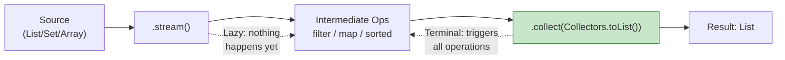
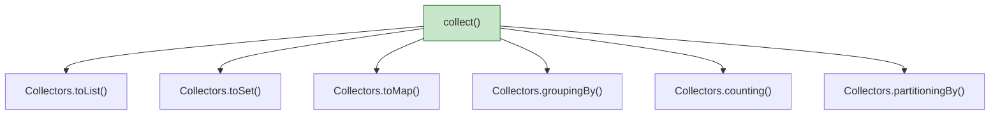

# 📘 Understanding Stream collect() Method

---

## 📌 Introduction

### 🧠 What is this about?
The `collect()` method is the most important **terminal operation** in Java Streams. It gathers all the elements of a stream into a concrete data structure — a `List`, `Set`, `Map`, or any custom container. It's the "finish line" of every stream pipeline.

### 🌍 Real-World Problem First
You've filtered, mapped, sorted your data through a stream pipeline. But a stream is temporary — you can't iterate over it twice or return it from a method. You need to **materialize** it into a collection you can store, return, or pass around. That's `collect()`.

### ❓ Why does it matter?
- Streams are **consumed once** — without `collect()`, your processed data vanishes
- `collect()` + `Collectors` can produce lists, sets, maps, grouped results, counts, and more
- It's the terminal operation you'll use most frequently — virtually every stream pipeline ends with it

### 🗺️ What we'll learn
- What `collect()` does and why it's terminal
- The `Collectors` utility class and its key methods
- How collect() fits in the stream pipeline
- `toList()`, `toSet()`, `toMap()`, `groupingBy()`, `counting()`

---

## 🧩 Concept 1: What is collect()?

### 🧠 Layer 1: The Simple Version
`collect()` is the **harvesting step**. Think of a stream pipeline as a factory assembly line — `filter()` removes defects, `map()` transforms parts, `sorted()` arranges them. But at the end of the line, you need a box to **collect** the finished products. That box is `collect()`.

### 🔍 Layer 2: The Developer Version
`collect()` is a **terminal operation** — it:
1. **Triggers** all lazy intermediate operations (filter, map, sorted)
2. **Consumes** the stream (can't be reused after)
3. **Returns** a concrete result (List, Set, Map, etc.)

```java
// The most common form:
.collect(Collectors.toList())   // Stream → List
.collect(Collectors.toSet())    // Stream → Set
.collect(Collectors.toMap(...)) // Stream → Map
```

### 🌍 Layer 3: The Real-World Analogy

| Assembly Line | Stream Pipeline |
|--------------|----------------|
| Conveyor belt with parts | Stream of elements |
| Quality control (remove bad parts) | `filter()` |
| Machine that shapes parts | `map()` |
| Sorter that arranges parts | `sorted()` |
| **Box at the end collecting finished products** | **`collect()`** |
| Box is sealed — conveyor stops | Stream is consumed — can't reuse |

### ⚙️ Layer 4: How It Works



### 💻 Layer 5: Code — Prove It!

**🔍 collect() triggers the pipeline:**
```java
List<String> names = Arrays.asList("Alice", "Bob", "Charlie");

// Without terminal operation — NOTHING happens
names.stream()
     .filter(n -> {
         System.out.println("Filtering: " + n);  // Never prints!
         return n.length() > 3;
     });

// With collect() — everything executes
List<String> result = names.stream()
     .filter(n -> {
         System.out.println("Filtering: " + n);  // Now prints!
         return n.length() > 3;
     })
     .collect(Collectors.toList());  // Terminal → triggers filter

// Output:
// Filtering: Alice
// Filtering: Bob
// Filtering: Charlie
// result = [Alice, Charlie]
```

---

## 🧩 Concept 2: The Collectors Utility Class

### 🧠 Layer 1: The Simple Version
`Collectors` is a toolbox of pre-built "box types" for `collect()`. Want a list? `Collectors.toList()`. Want a set? `Collectors.toSet()`. Want a map? `Collectors.toMap()`. Want grouped data? `Collectors.groupingBy()`.

### 🔍 Layer 2: The Developer Version

| Collector | What it produces | Example |
|-----------|-----------------|---------|
| `Collectors.toList()` | `List<T>` | Collect names into a list |
| `Collectors.toSet()` | `Set<T>` | Collect unique emails into a set |
| `Collectors.toMap(keyFn, valueFn)` | `Map<K, V>` | Collect name→length pairs |
| `Collectors.groupingBy(classifier)` | `Map<K, List<V>>` | Group products by category |
| `Collectors.counting()` | `Long` | Count elements in a stream |
| `Collectors.partitioningBy(predicate)` | `Map<Boolean, List<T>>` | Split into two groups |

**Why does Java use `Collectors` instead of built-in methods?** It's a strategy pattern — `collect()` is the generic framework, and `Collectors` provides interchangeable strategies. This makes the system extensible: you can even create your own custom `Collector` for specialized needs.

### 💻 Layer 5: Quick Examples

```java
// toList(): Stream → List
List<String> list = stream.collect(Collectors.toList());

// toSet(): Stream → Set (duplicates removed)
Set<String> set = stream.collect(Collectors.toSet());

// toMap(): Stream → Map (name as key, length as value)
Map<String, Integer> map = stream.collect(
    Collectors.toMap(fruit -> fruit, fruit -> fruit.length())
);

// groupingBy(): Group products by category
Map<String, List<Product>> grouped = products.stream()
    .collect(Collectors.groupingBy(Product::getCategory));

// counting(): Count elements
long count = stream.collect(Collectors.counting());
```

---

### ⚠️ Pitfalls & Mistakes

**Mistake 1: Reusing a stream after collect()**
- 👤 What devs do: Call `collect()` on a stream, then try to call `filter()` on the same stream
- 💥 Why it breaks: `IllegalStateException: stream has already been operated upon or closed` — a stream is consumed after a terminal operation
- ✅ Fix: Create a new stream from the original source each time

```java
Stream<String> stream = names.stream();
List<String> list = stream.collect(Collectors.toList());

// ❌ FAILS: stream already consumed
// List<String> filtered = stream.filter(...).collect(Collectors.toList());

// ✅ Create a new stream
List<String> filtered = names.stream().filter(...).collect(Collectors.toList());
```

---

### ✅ Key Takeaways

→ `collect()` is a **terminal operation** — it triggers the entire pipeline and produces a concrete result
→ `Collectors` provides pre-built strategies: `toList()`, `toSet()`, `toMap()`, `groupingBy()`, `counting()`
→ A stream can only be consumed ONCE — always create a fresh stream for each operation
→ `collect()` is the most common way to end a stream pipeline

---

## 🎯 Final Summary

### 🧠 The Big Picture



### ✅ Master Takeaways
→ `collect()` = "put the stream results into a container"
→ The `Collectors` utility class has all the common container types ready to use
→ `collect()` ends the stream — no more operations possible on that stream instance
→ Combined with `filter()`, `map()`, and `sorted()`, `collect()` completes the stream pipeline

### 🔗 What's Next?
Let's put `collect()` to work with concrete examples — collecting to lists, sets, and maps in the next note.
