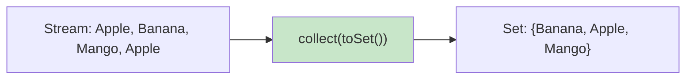
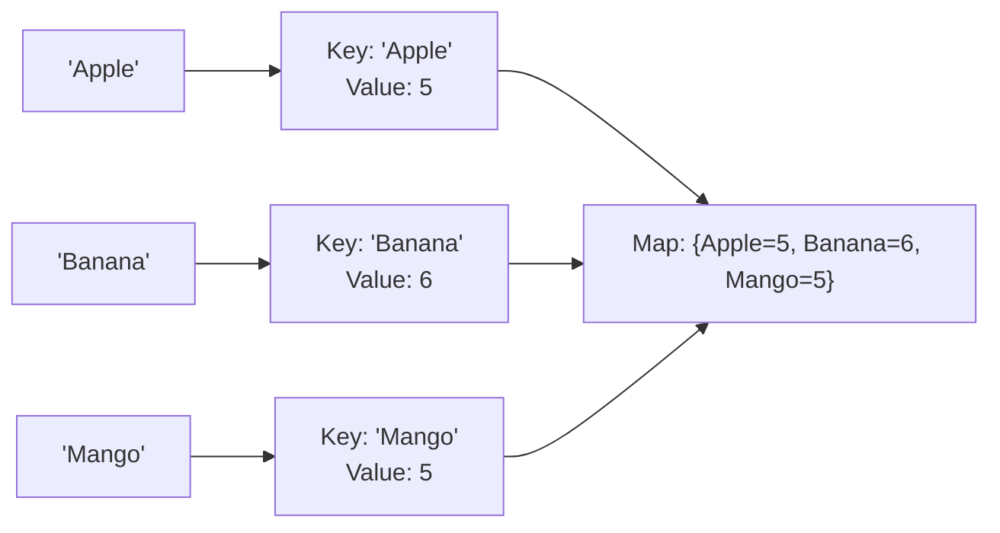

# 📘 Stream collect() Method — Collecting to List, Set, and Map

---

## 📌 Introduction

### 🧠 What is this about?
Hands-on with `collect()` — we'll gather stream elements into three different data structures: `List`, `Set`, and `Map`. Each serves a different purpose: lists preserve order, sets ensure uniqueness, maps store key-value pairs.

### 🌍 Real-World Problem First
You process a stream of fruit names. Sometimes you need an ordered list (for display). Sometimes you need unique values (for a dropdown). Sometimes you need a lookup table (fruit name → length). `collect()` handles all three.

### 🗺️ What we'll learn
- `Collectors.toList()` — collect to a List
- `Collectors.toSet()` — collect to a Set (removes duplicates)
- `Collectors.toMap()` — collect to a Map (key-value pairs)

---

## 🧩 Concept 1: Collect to List

### 🧠 Layer 1: The Simple Version
The most basic collection. Every element goes into a `List` in the order they appear.

### 💻 Layer 5: Code — Prove It!

```java
Stream<String> stream = Stream.of("Apple", "Banana", "Mango");

List<String> result = stream.collect(Collectors.toList());

System.out.println(result);
// Output: [Apple, Banana, Mango]
```

> **Note:** Since Java 16, you can also use `.toList()` directly on the stream — it's a shortcut for `collect(Collectors.toList())`. The difference: `.toList()` returns an **unmodifiable** list, while `Collectors.toList()` returns a mutable `ArrayList`.

---

## 🧩 Concept 2: Collect to Set

### 🧠 Layer 1: The Simple Version
A `Set` automatically removes duplicates. If your stream has repeated elements, collecting to a `Set` gives you only unique values.

### 💻 Layer 5: Code — Prove It!

```java
Stream<String> stream = Stream.of("Apple", "Banana", "Mango", "Apple");
//                                                            ^^^^^^ duplicate!

Set<String> result = stream.collect(Collectors.toSet());

System.out.println(result);
// Output: [Banana, Apple, Mango]
// Note: "Apple" appears only once! Set removes duplicates.
// Note: Order is NOT guaranteed in a HashSet.
```



> 💡 **Why is the order different?** `Collectors.toSet()` returns a `HashSet` by default. `HashSet` doesn't maintain insertion order — it organizes elements by their hash code for O(1) lookup speed. If you need ordered unique elements, use `Collectors.toCollection(LinkedHashSet::new)`.

---

## 🧩 Concept 3: Collect to Map

### 🧠 Layer 1: The Simple Version
A `Map` stores key-value pairs. You tell `toMap()` how to extract the key and value from each element.

### 🔍 Layer 2: The Developer Version
`Collectors.toMap()` takes two `Function` parameters:
1. **Key mapper** — extracts the key from each element
2. **Value mapper** — extracts the value from each element

```java
Collectors.toMap(
    fruit -> fruit,           // Key: the fruit name itself
    fruit -> fruit.length()   // Value: length of the name
)
```

### 💻 Layer 5: Code — Prove It!

```java
Stream<String> stream = Stream.of("Apple", "Banana", "Mango");

Map<String, Integer> result = stream.collect(
    Collectors.toMap(
        fruit -> fruit,           // Key: fruit name
        fruit -> fruit.length()   // Value: name length
    )
);

System.out.println(result);
// Output: {Apple=5, Mango=5, Banana=6}
```



---

### ⚠️ Pitfalls & Mistakes

**Mistake 1: Duplicate keys in toMap()**
- 👤 What devs do: `Collectors.toMap(fruit -> fruit.length(), fruit -> fruit)` — two fruits with the same length produce duplicate keys
- 💥 Why it breaks: `IllegalStateException: Duplicate key 5` — `toMap()` doesn't know what to do when two elements map to the same key
- ✅ Fix: Provide a merge function as the third parameter:

```java
// ❌ Fails: "Apple" and "Mango" both have length 5
Map<Integer, String> bad = Stream.of("Apple", "Banana", "Mango")
    .collect(Collectors.toMap(String::length, fruit -> fruit));
// Throws: IllegalStateException: Duplicate key 5

// ✅ Works: merge function handles duplicates
Map<Integer, String> good = Stream.of("Apple", "Banana", "Mango")
    .collect(Collectors.toMap(
        String::length,                  // Key: length
        fruit -> fruit,                  // Value: fruit name
        (existing, replacement) -> existing + ", " + replacement  // Merge duplicates
    ));
System.out.println(good);
// Output: {5=Apple, Mango, 6=Banana}
```

**Mistake 2: Expecting Set to maintain order**
- 👤 What devs do: Collect to `Set` and expect elements in insertion order
- 💥 What happens: `HashSet` doesn't guarantee order — elements appear in hash-based order
- ✅ Fix: Use `Collectors.toCollection(LinkedHashSet::new)` for ordered unique elements

---

### 📊 Comparison: toList() vs toSet() vs toMap()

| Collector | Result Type | Duplicates? | Order? | Use When |
|-----------|------------|------------|--------|----------|
| `toList()` | `List<T>` | Allowed | Preserved | Default choice, ordered data |
| `toSet()` | `Set<T>` | Removed | Not guaranteed | Need unique values |
| `toMap(k, v)` | `Map<K, V>` | Keys must be unique | Not guaranteed | Need key-value lookup |

---

### ✅ Key Takeaways

→ `Collectors.toList()` — preserves order, allows duplicates (most common)
→ `Collectors.toSet()` — removes duplicates, order not guaranteed
→ `Collectors.toMap(keyFn, valueFn)` — creates key-value pairs; duplicate keys throw exception unless you provide a merge function
→ Since Java 16, `.toList()` is a shortcut that returns an unmodifiable list

---

## 🎯 Final Summary

### ✅ Master Takeaways
→ Three core collectors: `toList()`, `toSet()`, `toMap()` — choose based on your data needs
→ `toMap()` requires unique keys — always handle potential duplicates with a merge function
→ `toSet()` for uniqueness, `toList()` for ordering, `toMap()` for lookup tables

### 🔗 What's Next?
Let's see a real-world example — collecting **employee names** from a list of Employee objects into a List using `collect()` with `map()`.
