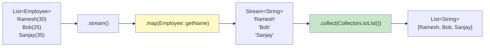

# 📘 Stream collect() — Collecting Employee Names to List

---

## 📌 Introduction

### 🧠 What is this about?
A practical example combining `map()` and `collect()` — extracting employee names from a list of Employee objects and collecting them into a `List<String>`. This is the classic "extract a field from each object" pattern.

### 🌍 Real-World Problem First
Your HR module has a `List<Employee>`. The UI autocomplete widget needs just the names — `List<String>`. You need to extract the `name` field from each Employee and collect them into a list.

### 🗺️ What we'll learn
- The `stream() → map() → collect()` pattern for field extraction
- Using method references with `map()` for clean code
- Complete working example with Employee class

---

## 🧩 Concept 1: Extracting Employee Names

### 🧠 Layer 1: The Simple Version
We have Employee objects with `name` and `age`. We want just the names. Three steps: stream the list → map each Employee to their name → collect into a list.

### ⚙️ Layer 4: The Pipeline



### 💻 Layer 5: Code — Prove It!

**🔍 Setup: The Employee class**
```java
class Employee {
    private String name;
    private int age;

    public Employee(String name, int age) {
        this.name = name;
        this.age = age;
    }

    public String getName() { return name; }
    public int getAge() { return age; }
}
```

**🔍 Extract employee names:**
```java
List<Employee> employees = Arrays.asList(
    new Employee("Ramesh", 30),
    new Employee("Bob", 25),
    new Employee("Sanjay", 35)
);

// Step 1: Stream the list
Stream<Employee> stream = employees.stream();

// Step 2: Map each Employee to their name
// Step 3: Collect into a List<String>
List<String> names = stream
        .map(Employee::getName)              // Employee → String
        .collect(Collectors.toList());       // Stream<String> → List<String>

System.out.println(names);
// Output: [Ramesh, Bob, Sanjay]
```

**🔍 Compact version (single chain):**
```java
List<String> names = employees.stream()
        .map(Employee::getName)
        .collect(Collectors.toList());
// Output: [Ramesh, Bob, Sanjay]
```

> 💡 **The Aha Moment:** The lambda equivalent of `Employee::getName` is `employee -> employee.getName()`. When a lambda simply calls a single method, the method reference form is shorter and more readable. This is a pattern you'll use hundreds of times.

**🔍 Breaking down what happens at each step:**
```java
// employees = [Employee{Ramesh,30}, Employee{Bob,25}, Employee{Sanjay,35}]

employees.stream()               // Stream<Employee>: Ramesh(30), Bob(25), Sanjay(35)
         .map(Employee::getName)  // Stream<String>: "Ramesh", "Bob", "Sanjay"
         .collect(Collectors.toList())  // List<String>: ["Ramesh", "Bob", "Sanjay"]
```

---

### ⚠️ Pitfalls & Mistakes

**Mistake 1: Forgetting to use map() and trying to collect Employee objects as Strings**
- 👤 What devs do: `employees.stream().collect(Collectors.toList())` — expects `List<String>` but gets `List<Employee>`
- 💥 Why it breaks: Without `map()`, the stream still contains `Employee` objects, not strings
- ✅ Fix: Always use `map()` to extract the field before collecting

```java
// ❌ Wrong: collecting Employee objects, not names
List<Employee> whoops = employees.stream().collect(Collectors.toList());
// This gives you a List<Employee>, not List<String>!

// ✅ Correct: map first, then collect
List<String> names = employees.stream()
        .map(Employee::getName)         // Transform Employee → String
        .collect(Collectors.toList());  // Collect String → List<String>
```

---

### 💡 Pro Tips

**Tip 1:** Use `.toList()` shorthand (Java 16+)
```java
// Long form (works in Java 8+):
List<String> names = employees.stream()
        .map(Employee::getName)
        .collect(Collectors.toList());

// Short form (Java 16+):
List<String> names = employees.stream()
        .map(Employee::getName)
        .toList();  // Shorter! But returns unmodifiable list.
```

---

### ✅ Key Takeaways

→ The `stream() → map(getter) → collect(toList())` pattern is the standard way to extract a field from a list of objects
→ `Employee::getName` is a method reference — cleaner than `employee -> employee.getName()`
→ The type transformation: `Stream<Employee>` → `map()` → `Stream<String>` → `collect()` → `List<String>`
→ This three-step pattern works for ANY field: name, email, department, salary, etc.

---

## 🎯 Final Summary

### ✅ Master Takeaways
→ `employees.stream().map(Employee::getName).collect(Collectors.toList())` — memorize this pattern
→ `map()` changes the stream type, `collect()` materializes it into a collection
→ Method references make this pattern clean and readable

### 🔗 What's Next?
Beyond collecting to lists, `collect()` can perform aggregations. Next, we'll count the elements in a stream using `Collectors.counting()`.
