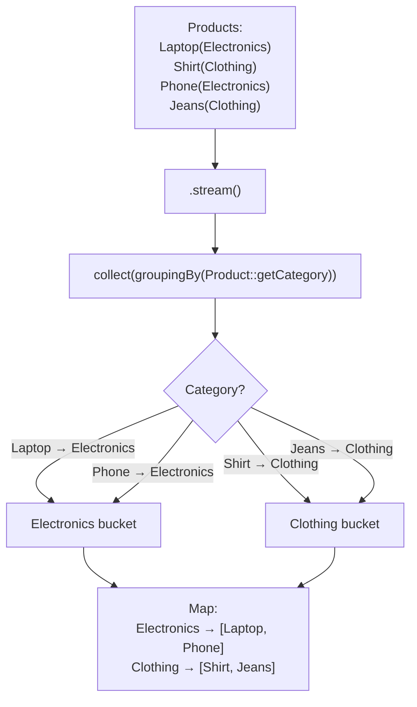
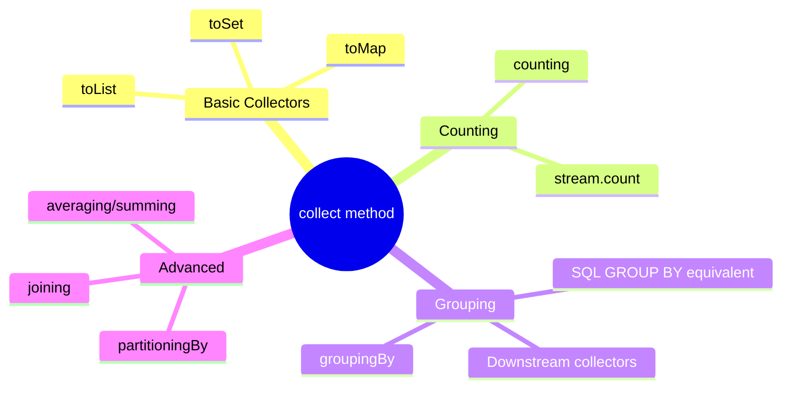

# 📘 Group Products by Category using Collectors.groupingBy()

---

## 📌 Introduction

### 🧠 What is this about?
`Collectors.groupingBy()` is one of the most powerful collectors. It groups stream elements by a classification function — like SQL's `GROUP BY`. In this note, we group products by their category, producing a `Map<String, List<Product>>`.

### 🌍 Real-World Problem First
An e-commerce admin dashboard shows products organized by category: "Electronics: Laptop, Phone" and "Clothing: Shirt, Jeans." The data comes as a flat `List<Product>`. You need to group them by the `category` field into a `Map`.

### ❓ Why does it matter?
- Grouping data by attributes is one of the most common operations in business applications
- `groupingBy()` is the Java Stream equivalent of SQL `GROUP BY`
- It produces `Map<Category, List<Items>>` — the exact structure needed for dashboards, reports, and APIs

### 🗺️ What we'll learn
- Using `Collectors.groupingBy()` to group products by category
- Understanding the resulting `Map<String, List<Product>>` structure
- How `groupingBy()` works step by step

---

## 🧩 Concept 1: Grouping Products by Category

### 🧠 Layer 1: The Simple Version
Imagine you have a pile of clothes and electronics mixed together on a table. `groupingBy()` sorts them into labeled boxes: one box for "Electronics" and one for "Clothing." Each box contains the products belonging to that category.

### 🔍 Layer 2: The Developer Version
`Collectors.groupingBy()` takes a **classifier function** — a function that extracts the grouping key from each element. It returns a `Map<K, List<V>>` where `K` is the key type and `V` is the element type.

```java
// Signature:
Collectors.groupingBy(Function<T, K> classifier)
// Returns: Map<K, List<T>>

// Example:
Collectors.groupingBy(Product::getCategory)
// Returns: Map<String, List<Product>>
```

### 🌍 Layer 3: The Real-World Analogy

| Mail Sorting | groupingBy() |
|-------------|-------------|
| Pile of unsorted mail | `List<Product>` |
| Sorting rule: "Group by zip code" | `Collectors.groupingBy(Product::getCategory)` |
| Separate bins, one per zip code | Map keys: "Electronics", "Clothing" |
| Letters in each bin | Map values: `List<Product>` per category |
| Each letter goes into exactly one bin | Each product maps to exactly one category |

### ⚙️ Layer 4: How It Works (Step-by-Step)



📊 DIAGRAM PROMPT:
────────────────────────────────────────────────────────────
"Draw a groupingBy diagram. On the left, show 4 product cards (Laptop-Electronics, Shirt-Clothing, Phone-Electronics, Jeans-Clothing) in a flat list. In the middle, show a funnel labeled 'groupingBy(category)'. On the right, show two labeled boxes: 'Electronics' containing Laptop and Phone, 'Clothing' containing Shirt and Jeans. Use blue for Electronics, green for Clothing. Clean whiteboard style."
────────────────────────────────────────────────────────────

### 💻 Layer 5: Code — Prove It!

**🔍 Setup: The Product class**
```java
class Product {
    private String name;
    private String category;

    public Product(String name, String category) {
        this.name = name;
        this.category = category;
    }

    public String getName() { return name; }
    public String getCategory() { return category; }

    @Override
    public String toString() {
        return "Product{name='" + name + "', category='" + category + "'}";
    }
}
```

**🔍 Group products by category:**
```java
List<Product> products = Arrays.asList(
    new Product("Laptop", "Electronics"),
    new Product("Shirt", "Clothing"),
    new Product("Phone", "Electronics"),
    new Product("Jeans", "Clothing")
);

// Group by category
Map<String, List<Product>> grouped = products.stream()
        .collect(Collectors.groupingBy(Product::getCategory));

System.out.println(grouped);
// Output:
// {
//   Clothing=[Product{name='Shirt'}, Product{name='Jeans'}],
//   Electronics=[Product{name='Laptop'}, Product{name='Phone'}]
// }
```

**🔍 Understanding the result structure:**
```java
// The Map has:
// Key: "Clothing"    → Value: [Shirt, Jeans]       (2 products)
// Key: "Electronics" → Value: [Laptop, Phone]      (2 products)

// Iterate the grouped map:
grouped.forEach((category, productList) -> {
    System.out.println(category + ": " + productList.size() + " products");
    productList.forEach(p -> System.out.println("  - " + p.getName()));
});
// Output:
// Clothing: 2 products
//   - Shirt
//   - Jeans
// Electronics: 2 products
//   - Laptop
//   - Phone
```

> 💡 **The Aha Moment:** `groupingBy()` works exactly like SQL's `GROUP BY`. The expression `SELECT category, products FROM products GROUP BY category` is equivalent to `products.stream().collect(Collectors.groupingBy(Product::getCategory))`. The map key is the GROUP BY column, and the map value is the list of rows in that group.

---

## 🧩 Concept 2: Combining groupingBy() with counting()

### 🧠 Layer 1: The Simple Version
Instead of getting the list of products per category, what if you just want the COUNT per category? Combine `groupingBy()` with `counting()`.

### 💻 Layer 5: Code

```java
Map<String, Long> countByCategory = products.stream()
        .collect(Collectors.groupingBy(
                Product::getCategory,    // Group by category
                Collectors.counting()     // Count items per group
        ));

System.out.println(countByCategory);
// Output: {Clothing=2, Electronics=2}
```

This is equivalent to SQL: `SELECT category, COUNT(*) FROM products GROUP BY category`

---

### ⚠️ Pitfalls & Mistakes

**Mistake 1: Expecting the Map to be ordered**
- 👤 What devs do: Assume `groupingBy()` returns groups in insertion order
- 💥 What happens: `groupingBy()` returns a `HashMap` by default — no guaranteed order
- ✅ Fix: Use a `TreeMap` for sorted keys or `LinkedHashMap` for insertion order:

```java
// Sorted by category name (alphabetical):
Map<String, List<Product>> sorted = products.stream()
    .collect(Collectors.groupingBy(
            Product::getCategory,
            TreeMap::new,              // Use TreeMap for sorted keys
            Collectors.toList()
    ));
```

---

### 💡 Pro Tips

**Tip 1:** Use `groupingBy()` with a downstream collector for powerful aggregations
```java
// Average price per category:
Map<String, Double> avgPrice = products.stream()
    .collect(Collectors.groupingBy(
            Product::getCategory,
            Collectors.averagingDouble(Product::getPrice)
    ));

// Sum of prices per category:
Map<String, Double> totalPrice = products.stream()
    .collect(Collectors.groupingBy(
            Product::getCategory,
            Collectors.summingDouble(Product::getPrice)
    ));
```

---

### ✅ Key Takeaways

→ `Collectors.groupingBy(classifier)` groups elements into `Map<K, List<V>>`
→ It's the Java equivalent of SQL's `GROUP BY`
→ Combine with `Collectors.counting()`, `averaging*()`, `summing*()` for aggregations
→ Default map type is `HashMap` — use `TreeMap::new` for sorted keys

---

## 🎯 Final Summary

### 🧠 The Big Picture



### ✅ Master Takeaways
→ `groupingBy(Product::getCategory)` = SQL `GROUP BY category`
→ The result is `Map<String, List<Product>>` — category as key, matching products as value
→ Add a downstream collector (`counting()`, `averaging()`) for per-group aggregations
→ `collect()` is the Swiss Army knife of stream terminal operations

### 🔗 What's Next?
We've covered all the core intermediate and terminal operations: `filter()`, `map()`, `flatMap()`, `sorted()`, and `collect()`. Next, let's look at `forEach()` — the simplest terminal operation for performing an action on each stream element.
