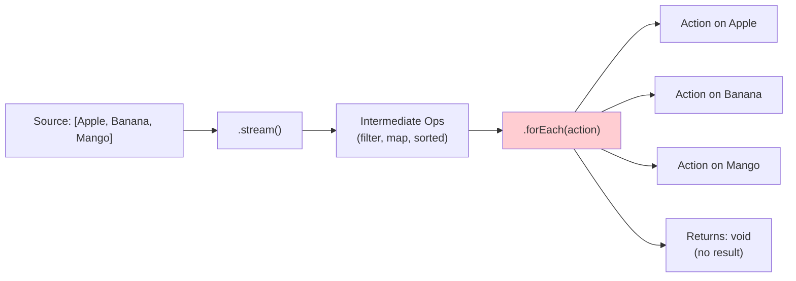
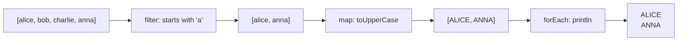
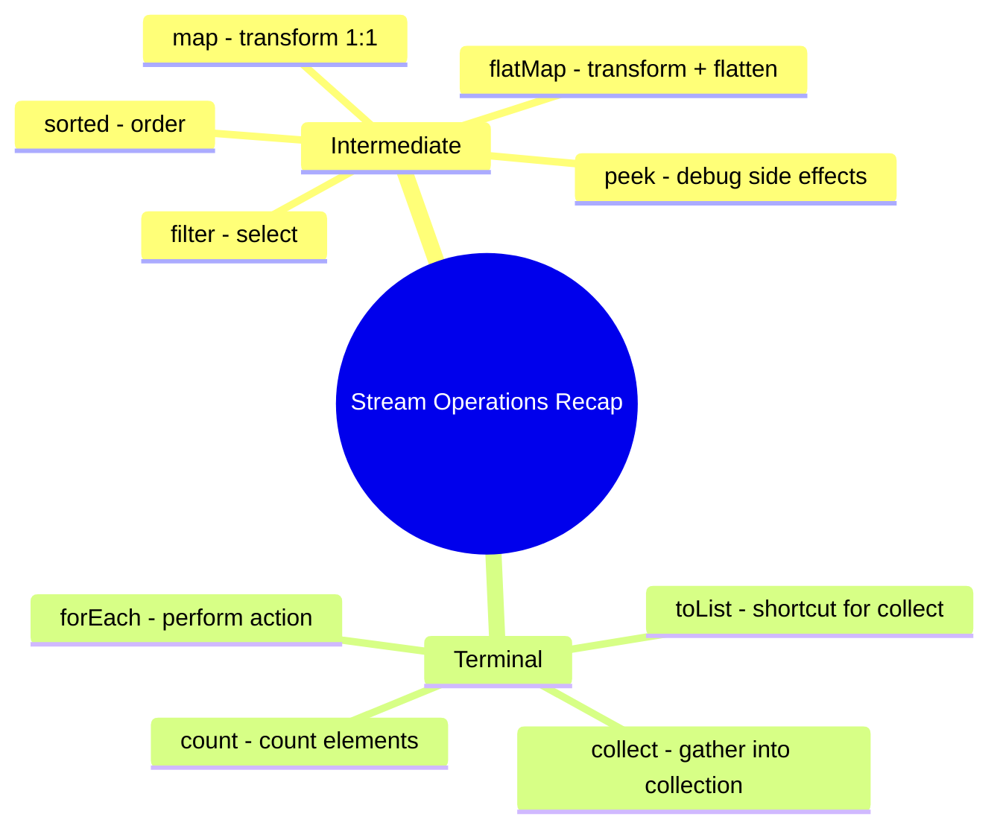

# 📘 Stream forEach() Method with Example

---

## 📌 Introduction

### 🧠 What is this about?
The `forEach()` method is the simplest terminal operation in Java Streams. It iterates over every element in the stream and performs an action — typically printing, logging, or sending each element somewhere. Unlike `collect()`, it doesn't return a result.

### 🌍 Real-World Problem First
You've filtered and sorted your data through a stream pipeline. Now you just want to print each result to the console for debugging, or log each item to a monitoring system. `forEach()` is the operation for "do something with each element."

### ❓ Why does it matter?
- `forEach()` is the go-to terminal operation for side effects (printing, logging, sending)
- It's a terminal operation — it triggers the entire lazy pipeline
- It returns `void` — use it when you want to **act**, not **collect**

### 🗺️ What we'll learn
- How `forEach()` works as a terminal operation
- The `Consumer` functional interface that powers it
- Using `forEach()` with intermediate operations
- When to use `forEach()` vs `collect()`

---

## 🧩 Concept 1: Understanding forEach()

### 🧠 Layer 1: The Simple Version
`forEach()` is like a conveyor belt inspector. Each item passes by, and the inspector does something with it — stamps it, scans it, writes it on a clipboard. The inspector doesn't produce a new item; they just **act** on each one.

### 🔍 Layer 2: The Developer Version
`forEach()` takes a `Consumer<T>` — a functional interface that accepts one argument and returns nothing (`void`). It's called once for every element in the stream.

```java
void forEach(Consumer<? super T> action)
```

Key characteristics:
- **Terminal operation** — triggers all lazy intermediate operations and consumes the stream
- **Returns void** — doesn't produce a result (unlike `collect()` which returns a collection)
- **Takes a Consumer** — a functional interface: one input, no output
- **Cannot be chained** — since it returns void, nothing can follow it

### 🌍 Layer 3: The Real-World Analogy

| Assembly Line | forEach() |
|--------------|----------|
| Products on conveyor belt | Elements in the stream |
| Inspector at the end of the line | `Consumer` lambda |
| Inspector stamps each product | Action performed on each element |
| No new product created | `void` return — no result |
| Belt stops after last product | Stream consumed — can't reuse |

### ⚙️ Layer 4: How It Works



### 💻 Layer 5: Code — Prove It!

**🔍 Basic forEach() — print each element:**
```java
List<String> fruits = Arrays.asList("Apple", "Banana", "Mango");

fruits.stream()
      .forEach(element -> System.out.println(element));
// Output:
// Apple
// Banana
// Mango
```

**🔍 With method reference (cleaner):**
```java
fruits.stream()
      .forEach(System.out::println);
// Output:
// Apple
// Banana
// Mango
```

> 💡 **The Aha Moment:** `System.out::println` is a method reference to `System.out.println(String)`. It's a `Consumer<String>` — takes a string, returns nothing, just prints. This is the most common usage of `forEach()`.

**🔍 forEach() with integers:**
```java
List<Integer> numbers = Arrays.asList(1, 2, 3, 4, 5);

numbers.stream()
       .forEach(n -> System.out.println(n));
// Output: 1 2 3 4 5 (each on a new line)
```

---

## 🧩 Concept 2: forEach() with Intermediate Operations

### 🧠 Layer 1: The Simple Version
`forEach()` is even more useful at the **end of a pipeline**. You can filter, sort, and transform data — then use `forEach()` to display the final results.

### 💻 Layer 5: Code — Prove It!

**🔍 Sort numbers in reverse order, then print:**
```java
List<Integer> numbers = Arrays.asList(1, 2, 3, 4, 5);

numbers.stream()
       .sorted(Comparator.reverseOrder())   // Sort descending
       .forEach(System.out::println);
// Output:
// 5
// 4
// 3
// 2
// 1
```

**🔍 Filter + Map + forEach pipeline:**
```java
List<String> names = Arrays.asList("alice", "bob", "charlie", "anna");

names.stream()
     .filter(name -> name.startsWith("a"))       // Keep names starting with 'a'
     .map(String::toUpperCase)                    // Convert to uppercase
     .forEach(System.out::println);               // Print each result
// Output:
// ALICE
// ANNA
```



---

## 🧩 Concept 3: forEach() vs collect() — When to Use Which

### 📊 Comparison

| Feature | `forEach()` | `collect()` |
|---------|------------|------------|
| Returns | `void` — nothing | A collection (List, Set, Map, etc.) |
| Purpose | **Perform action** on each element | **Gather** elements into a container |
| Use when | Printing, logging, sending | You need the results for further use |
| Chainable? | No (void return) | Yes (returns a collection) |
| Common usage | `forEach(System.out::println)` | `collect(Collectors.toList())` |

**When to use which?**
- Need to **display** results? → `forEach()`
- Need to **store** results for later use? → `collect()`
- Need to **return** results from a method? → `collect()`
- Need to **log** or **send** each item? → `forEach()`

---

### ⚠️ Pitfalls & Mistakes

**Mistake 1: Using forEach() to build a collection**
- 👤 What devs do:
```java
// ❌ Bad: Using forEach to build a list manually
List<String> result = new ArrayList<>();
names.stream()
     .filter(n -> n.length() > 3)
     .forEach(n -> result.add(n));  // Side effect!
```
- 💥 Why it's bad: This is **imperative** style disguised as functional. It uses a mutable external variable, which breaks the functional paradigm and can cause issues with parallel streams.
- ✅ Fix: Use `collect()` instead:
```java
// ✅ Good: Use collect for gathering results
List<String> result = names.stream()
     .filter(n -> n.length() > 3)
     .collect(Collectors.toList());
```

**Mistake 2: Trying to chain after forEach()**
- 👤 What devs do: `stream.forEach(...).collect(...)` — trying to chain after forEach
- 💥 Why it breaks: `forEach()` returns `void` — there's nothing to chain on
- ✅ Fix: Use `peek()` for mid-pipeline side effects, `forEach()` only at the end

---

### 💡 Pro Tips

**Tip 1:** Use `peek()` for debugging inside a pipeline (not `forEach()`)
```java
// peek() is the intermediate version of forEach()
List<String> result = names.stream()
    .filter(n -> n.length() > 3)
    .peek(n -> System.out.println("Passed filter: " + n))  // Debug: see what passes
    .map(String::toUpperCase)
    .peek(n -> System.out.println("After map: " + n))       // Debug: see after transform
    .collect(Collectors.toList());
```
- Why it works: `peek()` is an intermediate operation — it returns a stream, so you can continue the pipeline
- When to use: Debugging. Remove `peek()` before production!

---

### ✅ Key Takeaways

→ `forEach()` = terminal operation that performs an action on each element and returns `void`
→ It takes a `Consumer<T>` — one input, no output
→ Use `System.out::println` as the most common consumer
→ Use `forEach()` for printing/logging, `collect()` for gathering results
→ Never use `forEach()` to manually build collections — that's what `collect()` is for
→ Use `peek()` for mid-pipeline debugging, `forEach()` only at the end

---

## 🎯 Final Summary

### 🧠 The Big Picture



### ✅ Master Takeaways
→ `forEach()` is the simplest terminal operation — "do this to each element"
→ It returns `void` — use it for side effects like printing, not for collecting data
→ The `Consumer` interface: one input, no output — perfect for actions
→ Combined with intermediate operations, `forEach()` displays the final processed results

### 🔗 What's Next?
With `filter()`, `map()`, `flatMap()`, `sorted()`, `collect()`, and `forEach()`, you now have a complete toolkit for Java Stream operations. These six operations cover 90%+ of real-world stream usage. Practice combining them in different ways to build powerful, readable data pipelines!
