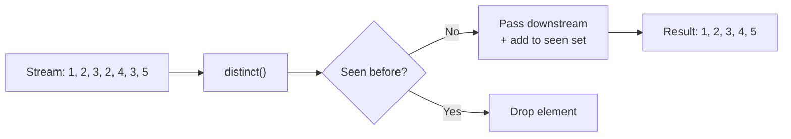

# 📘 Java Stream `distinct()` Method

---

## 📌 Introduction

### 🧠 What is this about?
The `distinct()` method in Java Streams removes duplicate elements from a stream. It works like a bouncer at a party — once you've entered, your clone can't get in again.

### 🌍 Real-World Problem First
Imagine you're building an e-commerce app. A user searches for "laptop" and your database returns results from multiple vendors — some products appear twice. You need to show only unique results. Before streams, you'd manually loop through, check a `Set`, and build a new list. Tedious, error-prone, and ugly.

### ❓ Why does it matter?
- Without `distinct()`, you'd need manual deduplication logic every time
- It integrates seamlessly into stream pipelines — no extra collections needed
- It relies on `equals()` and `hashCode()`, which means **you** control what "duplicate" means for custom objects

### 🗺️ What we'll learn
- How `distinct()` works on primitive wrapper streams
- How it determines duplicates (the `equals()` / `hashCode()` contract)
- How to use it in a stream pipeline with other operations
- Common pitfalls when using `distinct()` with custom objects

---

## 🧩 Concept 1: What `distinct()` Does

### 🧠 Layer 1: The Simple Version
`distinct()` removes duplicates from a stream — like removing repeated songs from a playlist so each song plays only once.

### 🔍 Layer 2: The Developer Version
`distinct()` is an **intermediate operation** that returns a new stream containing only unique elements. It uses `equals()` to compare elements. Since it's intermediate, it's lazy — it won't execute until a terminal operation (like `collect()` or `forEach()`) triggers the pipeline.

### 🌍 Layer 3: The Real-World Analogy

| Analogy Element | Technical Equivalent |
|----------------|---------------------|
| Guest list at a party | The original stream |
| Bouncer checking names | `distinct()` checking `equals()` |
| "Already inside" list | Internal `LinkedHashSet` tracking seen elements |
| Final party guests | The resulting deduplicated stream |

### ⚙️ Layer 4: How It Works Internally

**Step 1 — Element arrives:** Each element flows through the stream pipeline and reaches `distinct()`.

**Step 2 — Duplicate check:** `distinct()` internally maintains a `Set` (typically `LinkedHashSet`). It calls `equals()` on the incoming element against previously seen elements.

**Step 3 — Pass or block:** If the element is new (not in the set), it's added to the set and passed downstream. If it's already seen, it's silently dropped.

**Step 4 — Order preserved:** Because it uses a `LinkedHashSet`, the **encounter order** is preserved — the first occurrence survives, duplicates are removed.



### 💻 Layer 5: Code — Prove It!

**🔍 Basic Usage:**
```java
List<Integer> numbers = Arrays.asList(1, 2, 3, 2, 4, 3, 5, 1);

List<Integer> unique = numbers.stream()
    .distinct()
    .collect(Collectors.toList());

System.out.println(unique);  // Output: [1, 2, 3, 4, 5]
```

**🔍 With Strings:**
```java
List<String> names = Arrays.asList("Alice", "Bob", "Alice", "Charlie", "Bob");

List<String> uniqueNames = names.stream()
    .distinct()
    .collect(Collectors.toList());

System.out.println(uniqueNames);  // Output: [Alice, Bob, Charlie]
```

**🔍 Chaining with other operations:**
```java
List<String> fruits = Arrays.asList("apple", "banana", "apple", "mango", "banana", "cherry");

List<String> result = fruits.stream()
    .distinct()                      // Remove duplicates first
    .sorted()                        // Then sort alphabetically
    .collect(Collectors.toList());

System.out.println(result);  // Output: [apple, banana, cherry, mango]
```

---

### ⚠️ Pitfalls & Mistakes

**Mistake 1: Using `distinct()` on custom objects without overriding `equals()` and `hashCode()`**
- 👤 What devs do: Call `distinct()` on a stream of custom objects (like `User`) without overriding `equals()` and `hashCode()`
- 💥 Why it breaks: By default, `Object.equals()` compares **memory addresses**, not field values. Two `User` objects with the same name and email are still "different" because they're different objects in memory. `distinct()` won't remove any of them.
- ✅ Fix: Always override `equals()` and `hashCode()` in your custom class when using `distinct()`

**❌ This fails silently (no duplicates removed):**
```java
class User {
    String name;
    User(String name) { this.name = name; }
}

List<User> users = Arrays.asList(new User("Alice"), new User("Alice"), new User("Bob"));
long count = users.stream().distinct().count();
System.out.println(count);  // Output: 3 — still 3! No duplicates removed!
```

**✅ This works correctly:**
```java
class User {
    String name;
    User(String name) { this.name = name; }

    @Override
    public boolean equals(Object o) {
        if (this == o) return true;
        if (o == null || getClass() != o.getClass()) return false;
        User user = (User) o;
        return Objects.equals(name, user.name);
    }

    @Override
    public int hashCode() {
        return Objects.hash(name);
    }
}

List<User> users = Arrays.asList(new User("Alice"), new User("Alice"), new User("Bob"));
long count = users.stream().distinct().count();
System.out.println(count);  // Output: 2 ✅ — "Alice" duplicate removed!
```

---

### 💡 Pro Tips

**Tip 1:** `distinct()` preserves encounter order in ordered streams (like those from `List`). If order doesn't matter and you want better performance on parallel streams, consider collecting into a `Set` instead.
- Why it works: `Set` inherently removes duplicates and can be more efficient in parallel scenarios
- When to use: When you don't care about element order

**Tip 2:** Place `distinct()` **early** in the pipeline to reduce the number of elements that downstream operations process.
- Why it works: Fewer elements = less work for `filter()`, `map()`, `sorted()`, etc.
- When to use: When you know there are duplicates and the pipeline has expensive downstream operations

---

### ✅ Key Takeaways

→ `distinct()` removes duplicate elements from a stream using `equals()` for comparison
→ It's an **intermediate operation** — lazy until a terminal operation triggers it
→ For custom objects, you **must** override `equals()` and `hashCode()` — otherwise `distinct()` compares memory addresses and won't remove logical duplicates
→ Order is preserved — the first occurrence of each element survives

---

> Now that we understand how `distinct()` removes duplicates from simple types, let's tackle a real-world challenge: what happens when you need to remove duplicate **objects** based on specific fields like ID, name, or email? That's exactly what the next note covers.
