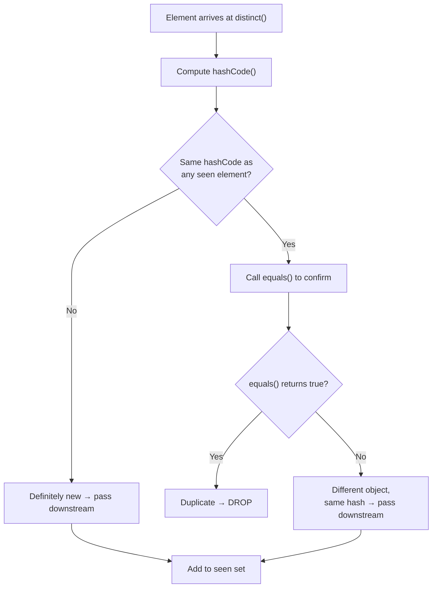
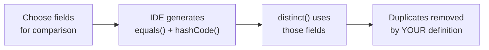

# 📘 Real-World Use Case of `distinct()` — Remove Duplicate User Objects

---

## 📌 Introduction

### 🧠 What is this about?
In real applications, you don't just deal with lists of strings or numbers — you deal with **objects** like `User`, `Product`, or `Order`. This note shows you how to use `distinct()` to remove duplicate objects by controlling **which fields** determine equality.

### 🌍 Real-World Problem First
Your user management system pulls data from multiple sources — an API, a database, and a CSV import. The same user (same ID, same email) appears in all three. You need to merge them into a single deduplicated list. But here's the catch: two `User` objects with identical field values are still "different" objects in Java's eyes unless you tell Java how to compare them.

### ❓ Why does it matter?
- Without proper `equals()` / `hashCode()`, `distinct()` is useless on custom objects
- You can control deduplication granularity: by ID only, by name, by email, or by a combination
- This pattern appears everywhere — merging data, cleaning imports, removing redundant API results

### 🗺️ What we'll learn
- How `distinct()` uses `equals()` and `hashCode()` internally
- How to override these methods for single-field comparison
- How to override them for multi-field comparison
- How IDEs like IntelliJ can generate these methods automatically

---

## 🧩 Concept 1: The `equals()` / `hashCode()` Contract

### 🧠 Layer 1: The Simple Version
`equals()` answers: "Are these two objects the **same thing**?" and `hashCode()` answers: "Which bucket should I look in to find this thing?"

### 🔍 Layer 2: The Developer Version
When `distinct()` checks for duplicates, it follows a two-step process:
1. **`hashCode()`** — computes a number from the object's fields. Objects with different hash codes are **definitely** different (fast rejection).
2. **`equals()`** — if hash codes match, it does a deeper field-by-field comparison to confirm equality.

This is the same mechanism `HashSet` and `HashMap` use internally.

### 🌍 Layer 3: The Real-World Analogy

| Analogy Element | Technical Equivalent |
|----------------|---------------------|
| Library card catalog | `hashCode()` — which drawer to look in |
| Reading the actual book title | `equals()` — confirming it's the same book |
| Drawer number | Hash bucket |
| Two books in the same drawer | Hash collision — need `equals()` to distinguish |

> Think of `hashCode()` as the **zip code** and `equals()` as the **full address**. The zip code narrows down the area quickly. The full address confirms the exact location.

### ⚙️ Layer 4: How `distinct()` Uses These Methods



---

## 🧩 Concept 2: Removing Duplicates by a Single Field

### 🔍 The Developer Version
If you want to remove duplicate `User` objects based on **ID only**, you override `equals()` and `hashCode()` using only the `id` field.

### 💻 Code — Prove It!

```java
class User {
    private int id;
    private String name;
    private String email;

    User(int id, String name, String email) {
        this.id = id;
        this.name = name;
        this.email = email;
    }

    // equals() based on ID only
    @Override
    public boolean equals(Object o) {
        if (this == o) return true;
        if (o == null || getClass() != o.getClass()) return false;
        User user = (User) o;
        return id == user.id;  // Only comparing ID
    }

    // hashCode() based on ID only
    @Override
    public int hashCode() {
        return Objects.hash(id);  // Only hashing ID
    }

    @Override
    public String toString() {
        return "User{id=" + id + ", name='" + name + "', email='" + email + "'}";
    }
}
```

```java
List<User> users = Arrays.asList(
    new User(1, "Alice", "alice@mail.com"),
    new User(2, "Bob", "bob@mail.com"),
    new User(1, "Alice Copy", "alice2@mail.com"),  // Same ID as first!
    new User(3, "Charlie", "charlie@mail.com"),
    new User(2, "Bob Clone", "bob2@mail.com")       // Same ID as second!
);

List<User> uniqueUsers = users.stream()
    .distinct()
    .collect(Collectors.toList());

uniqueUsers.forEach(System.out::println);
// Output:
// User{id=1, name='Alice', email='alice@mail.com'}
// User{id=2, name='Bob', email='bob@mail.com'}
// User{id=3, name='Charlie', email='charlie@mail.com'}
```

> Notice: "Alice Copy" and "Bob Clone" were removed because they share IDs with existing users. The **first occurrence** is kept.

---

## 🧩 Concept 3: Removing Duplicates by Multiple Fields

### 🔍 The Developer Version
What if two users with the same ID but different emails should be considered different? You include **multiple fields** in your `equals()` and `hashCode()`.

### 💻 Code — Prove It!

```java
class User {
    private int id;
    private String name;
    private String email;

    // Constructor and toString...

    @Override
    public boolean equals(Object o) {
        if (this == o) return true;
        if (o == null || getClass() != o.getClass()) return false;
        User user = (User) o;
        return id == user.id
            && Objects.equals(name, user.name)
            && Objects.equals(email, user.email);  // All three fields!
    }

    @Override
    public int hashCode() {
        return Objects.hash(id, name, email);  // All three fields!
    }
}
```

```java
List<User> users = Arrays.asList(
    new User(1, "Alice", "alice@mail.com"),
    new User(1, "Alice", "alice@mail.com"),      // Exact duplicate → removed
    new User(1, "Alice", "alice-new@mail.com")   // Same ID+name, different email → KEPT
);

List<User> unique = users.stream().distinct().collect(Collectors.toList());
System.out.println(unique.size());  // Output: 2
```

### 📊 Comparison: Single-Field vs Multi-Field Deduplication

| Approach | Fields in equals/hashCode | Use When |
|----------|--------------------------|----------|
| ID only | `id` | IDs are guaranteed unique identifiers |
| Name only | `name` | You want one entry per person name |
| All fields | `id`, `name`, `email` | Only exact clones should be removed |
| Custom combo | `id` + `email` | Business rule: same person + same email = duplicate |

**Why the flexibility matters:** Different business requirements demand different deduplication rules. A CRM might deduplicate by email (same person, multiple accounts), while an HR system deduplicates by employee ID.

---

## 🧩 Concept 4: IDE Generation of `equals()` and `hashCode()`

### 🔍 The Developer Version
You don't need to write `equals()` and `hashCode()` by hand every time. IntelliJ IDEA (and other IDEs) can generate them:

1. Right-click inside your class → **Generate** → **equals() and hashCode()**
2. Select the fields you want to compare
3. Click OK — the IDE generates production-quality implementations

This is the recommended approach because:
- It handles null checks correctly
- It follows the `equals()` / `hashCode()` contract
- It's consistent and less error-prone than hand-writing



---

### ⚠️ Pitfalls & Mistakes

**Mistake 1: Overriding `equals()` but forgetting `hashCode()`**
- 👤 What devs do: Override `equals()` to compare by ID, but leave `hashCode()` as default
- 💥 Why it breaks: `distinct()` uses a `Set` internally. The `Set` checks `hashCode()` first. If two logically equal objects have different hash codes (because `hashCode()` still uses memory address), they end up in different buckets and `equals()` is **never called**. Duplicates survive!
- ✅ Fix: **Always** override both `equals()` AND `hashCode()` together, using the same fields

**Mistake 2: Including mutable fields in `equals()` / `hashCode()`**
- 👤 What devs do: Use a field like `lastLoginDate` in `hashCode()` that changes over time
- 💥 Why it breaks: If the hash code changes after insertion into a `HashSet`, the object becomes "lost" — it's in the wrong bucket and can never be found
- ✅ Fix: Use only **immutable** or **stable** fields (like `id`) in `hashCode()`

---

### 💡 Pro Tips

**Tip 1:** If you can't modify the class (e.g., third-party library), use `filter()` with a helper method instead of `distinct()`:
```java
public static <T> Predicate<T> distinctByKey(Function<? super T, ?> keyExtractor) {
    Set<Object> seen = ConcurrentHashMap.newKeySet();
    return t -> seen.add(keyExtractor.apply(t));
}

// Usage: remove duplicates by name without modifying User class
users.stream()
    .filter(distinctByKey(User::getName))
    .collect(Collectors.toList());
```

---

### ✅ Key Takeaways

→ `distinct()` relies entirely on `equals()` and `hashCode()` — **you** define what "duplicate" means
→ Always override **both** methods together, using the **same** fields
→ Choose deduplication fields based on your business rules: ID only, name only, or a combination
→ Use IDE generation for `equals()` / `hashCode()` — don't hand-write them unless necessary
→ For third-party classes you can't modify, use the `distinctByKey()` helper pattern

---

> Now that we know how to remove duplicates, let's shift gears to controlling **how many** elements we process. What if you only want the first N elements from a stream? That's where `limit()` comes in — and it's next.
