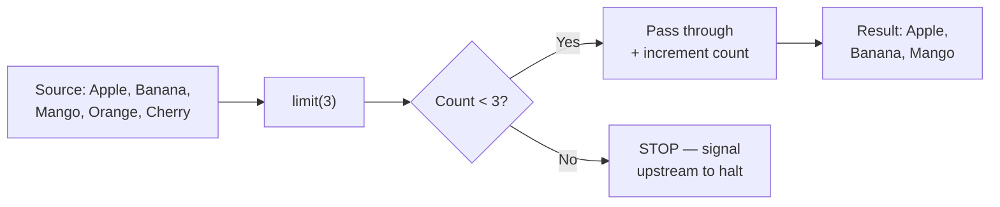
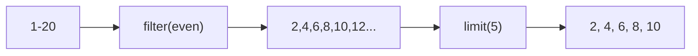

# 📘 Java Stream `limit()` Method

---

## 📌 Introduction

### 🧠 What is this about?
The `limit()` method restricts a stream to its first N elements. Think of it as saying: "I only want the top 10 results — don't bother with the rest."

### 🌍 Real-World Problem First
You're building a news feed. Your database has 10,000 articles, but your homepage only shows the latest 5. Without `limit()`, you'd either write a SQL `LIMIT` clause (mixing concerns) or fetch everything and manually slice the list (wasteful). `limit()` gives you a clean, declarative way to say "just the first N, please."

### ❓ Why does it matter?
- Essential for **pagination** — showing page 1 of results
- Useful for **previews** — quick glance at first few elements
- Prevents processing unnecessary data in large streams
- Combines beautifully with `filter()`, `sorted()`, and `skip()`

### 🗺️ What we'll learn
- How `limit()` works as an intermediate operation
- Using `limit()` with basic collections
- Combining `limit()` with `filter()` for real-world scenarios
- How `limit()` is a short-circuiting operation

---

## 🧩 Concept 1: How `limit()` Works

### 🧠 Layer 1: The Simple Version
`limit(n)` takes the first N elements from a stream and ignores everything after. Like reading only the first 3 chapters of a book.

### 🔍 Layer 2: The Developer Version
`limit(long maxSize)` is an **intermediate, short-circuiting** operation. It returns a new stream containing at most `maxSize` elements. "Short-circuiting" means it stops pulling from the source as soon as it has enough elements — it doesn't process the entire stream.

### 🌍 Layer 3: The Real-World Analogy

| Analogy Element | Technical Equivalent |
|----------------|---------------------|
| Buffet line | The stream source |
| "Take only 3 items" rule | `limit(3)` |
| Your plate | The resulting stream |
| Food left on the buffet | Elements never processed |

### ⚙️ Layer 4: How It Works Internally

**Step 1 — Counter initialized:** `limit()` sets an internal counter to 0.

**Step 2 — Elements flow in:** Each element from upstream increments the counter and passes through.

**Step 3 — Threshold reached:** Once the counter reaches `maxSize`, `limit()` signals upstream to **stop producing elements**. This is the short-circuiting behavior.



📊 DIAGRAM PROMPT:
────────────────────────────────────────────────────────────
"Draw a stream pipeline diagram. Show a conveyor belt with 5 items (Apple, Banana, Mango, Orange, Cherry). In the middle, show a gate labeled 'limit(3)' that lets the first 3 items pass through and blocks the rest. On the right, show only Apple, Banana, Mango in the output. Style: clean, minimal, whiteboard."
────────────────────────────────────────────────────────────

### 💻 Layer 5: Code — Prove It!

**🔍 Basic Usage:**
```java
List<String> fruits = Arrays.asList("Apple", "Banana", "Mango", "Orange", "Cherry");

List<String> firstThree = fruits.stream()
    .limit(3)
    .collect(Collectors.toList());

System.out.println(firstThree);  // Output: [Apple, Banana, Mango]
```

**🔍 Changing the limit:**
```java
// Want 4 items? Just change the number.
List<String> firstFour = fruits.stream()
    .limit(4)
    .collect(Collectors.toList());
System.out.println(firstFour);  // Output: [Apple, Banana, Mango, Orange]

// Want just 1?
List<String> firstOne = fruits.stream()
    .limit(1)
    .collect(Collectors.toList());
System.out.println(firstOne);  // Output: [Apple]
```

---

## 🧩 Concept 2: Combining `limit()` with `filter()`

### 🧠 Layer 1: The Simple Version
What if you want the **first 5 even numbers** from a list of 1 to 20? First filter to keep only even numbers, then limit to 5.

### 🔍 Layer 2: The Developer Version
Stream operations are composable. `filter()` narrows elements by a condition, and `limit()` caps the count. The order matters — filter first, then limit, gives you "first N that match." Limit first, then filter, gives you "filter among the first N" (very different results!).

### 💻 Code — Prove It!

```java
List<Integer> numbers = Arrays.asList(1, 2, 3, 4, 5, 6, 7, 8, 9, 10,
                                       11, 12, 13, 14, 15, 16, 17, 18, 19, 20);

// First 5 even numbers
List<Integer> firstFiveEvens = numbers.stream()
    .filter(n -> n % 2 == 0)  // Keep only even: 2, 4, 6, 8, 10, 12, 14, 16, 18, 20
    .limit(5)                  // Take first 5: 2, 4, 6, 8, 10
    .collect(Collectors.toList());

System.out.println(firstFiveEvens);  // Output: [2, 4, 6, 8, 10]
```



### ⚠️ Order Matters!

**❌ Wrong order — limit THEN filter:**
```java
List<Integer> wrong = numbers.stream()
    .limit(5)                  // Take first 5: 1, 2, 3, 4, 5
    .filter(n -> n % 2 == 0)  // Keep even: 2, 4
    .collect(Collectors.toList());

System.out.println(wrong);  // Output: [2, 4] — only 2 results, not 5!
```

**✅ Correct order — filter THEN limit:**
```java
List<Integer> correct = numbers.stream()
    .filter(n -> n % 2 == 0)  // Keep all evens first
    .limit(5)                  // Then take 5
    .collect(Collectors.toList());

System.out.println(correct);  // Output: [2, 4, 6, 8, 10] ✅
```

---

### 💡 Pro Tips

**Tip 1:** `limit()` is perfect for implementing **pagination** with `skip()`:
```java
int pageSize = 10;
int pageNumber = 3;  // 0-indexed

List<Item> page3 = items.stream()
    .skip(pageNumber * pageSize)  // Skip first 30
    .limit(pageSize)              // Take next 10
    .collect(Collectors.toList());
```

**Tip 2:** On infinite streams (like `Stream.generate()` or `Stream.iterate()`), `limit()` is **essential** — without it, the stream never terminates:
```java
// Generate first 5 random numbers
List<Double> randoms = Stream.generate(Math::random)
    .limit(5)
    .collect(Collectors.toList());
```

---

### ✅ Key Takeaways

→ `limit(n)` returns a stream of at most `n` elements — it's a **short-circuiting** intermediate operation
→ It preserves encounter order — you always get the **first** N elements
→ Combine with `filter()` in the right order: filter first, then limit
→ Essential for pagination (`skip()` + `limit()`), previews, and infinite streams

---

> We now know how to take the first N elements. But what about the opposite — what if you want to **skip** the first N and work with the rest? That's exactly what `skip()` does, and it pairs perfectly with `limit()`.
