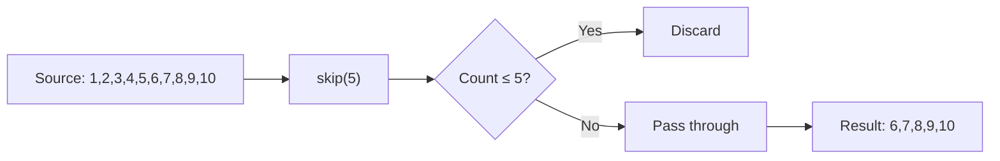
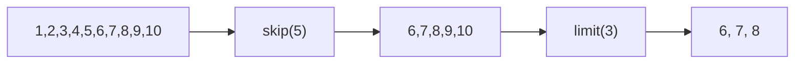

# 📘 Java Stream `skip()` Method

---

## 📌 Introduction

### 🧠 What is this about?
The `skip()` method ignores the first N elements in a stream and gives you everything after. It's the opposite of `limit()` — instead of "take the first N," it says "throw away the first N."

### 🌍 Real-World Problem First
You're implementing pagination for an API. Page 1 shows items 1-10, page 2 shows items 11-20, page 3 shows 21-30. To get page 3, you need to **skip** the first 20 items and then **limit** to 10. That's `skip(20).limit(10)` — clean, readable, no index math.

### ❓ Why does it matter?
- Critical for **pagination** when combined with `limit()`
- Useful when you want to ignore headers, initial data, or already-processed elements
- Pairs naturally with other stream operations for precise data slicing

### 🗺️ What we'll learn
- How `skip()` works as an intermediate operation
- Using `skip()` alone to drop initial elements
- Combining `skip()` + `limit()` for precise slicing
- The difference between `skip()` and `limit()`

---

## 🧩 Concept 1: How `skip()` Works

### 🧠 Layer 1: The Simple Version
`skip(n)` throws away the first N items and gives you the rest. Like skipping the first 5 songs in a playlist and starting from song 6.

### 🔍 Layer 2: The Developer Version
`skip(long n)` is an **intermediate operation** that returns a new stream with the first `n` elements discarded. If the stream has fewer than `n` elements, the result is an empty stream. Unlike `limit()`, `skip()` is **not** short-circuiting — it must consume (and discard) the first N elements before passing the rest.

### ⚙️ Layer 4: How It Works Step-by-Step

**Step 1 — Counter initialized:** `skip()` starts with a counter at 0.

**Step 2 — Discard phase:** Each incoming element increments the counter. While counter < n, elements are silently discarded.

**Step 3 — Pass-through phase:** Once the counter reaches n, all subsequent elements pass through unchanged.



### 💻 Layer 5: Code — Prove It!

**🔍 Basic Usage:**
```java
List<Integer> numbers = Arrays.asList(1, 2, 3, 4, 5, 6, 7, 8, 9, 10);

List<Integer> afterSkip = numbers.stream()
    .skip(5)                       // Skip 1,2,3,4,5
    .collect(Collectors.toList());

System.out.println(afterSkip);  // Output: [6, 7, 8, 9, 10]
```

---

## 🧩 Concept 2: Combining `skip()` and `limit()` — The Slicing Duo

### 🧠 Layer 1: The Simple Version
`skip()` and `limit()` together let you **slice** any portion from the middle of a stream. Skip the first few, then take the next few.

### 🔍 Layer 2: The Developer Version
The combination `skip(m).limit(n)` gives you elements from position `m+1` through `m+n`. This is the stream equivalent of SQL's `OFFSET m LIMIT n` or array slicing `arr[m:m+n]`.

### 💻 Code — Prove It!

```java
List<Integer> numbers = Arrays.asList(1, 2, 3, 4, 5, 6, 7, 8, 9, 10);

// Skip first 5, then take next 3
List<Integer> slice = numbers.stream()
    .skip(5)    // Remaining: 6, 7, 8, 9, 10
    .limit(3)   // Take: 6, 7, 8
    .collect(Collectors.toList());

System.out.println(slice);  // Output: [6, 7, 8]
```



**🔍 Pagination Example:**
```java
List<String> items = Arrays.asList("A","B","C","D","E","F","G","H","I","J","K","L");

int pageSize = 4;

// Page 1 (items 1-4)
List<String> page1 = items.stream().skip(0).limit(4).collect(Collectors.toList());
System.out.println("Page 1: " + page1);  // Output: Page 1: [A, B, C, D]

// Page 2 (items 5-8)
List<String> page2 = items.stream().skip(4).limit(4).collect(Collectors.toList());
System.out.println("Page 2: " + page2);  // Output: Page 2: [E, F, G, H]

// Page 3 (items 9-12)
List<String> page3 = items.stream().skip(8).limit(4).collect(Collectors.toList());
System.out.println("Page 3: " + page3);  // Output: Page 3: [I, J, K, L]
```

---

### 📊 `skip()` vs `limit()` — Side by Side

| Feature | `skip(n)` | `limit(n)` |
|---------|-----------|------------|
| What it does | Discards first N elements | Takes first N elements |
| Returns | Everything after N | Everything before N |
| Short-circuiting? | No — must process N elements | Yes — stops at N |
| On empty stream | Returns empty stream | Returns empty stream |
| If N > stream size | Returns empty stream | Returns all elements |

**Why `skip()` isn't short-circuiting:** It must actually *consume* the first N elements to count them before it knows when to start passing elements through. `limit()` can stop early because it knows exactly how many it needs.

---

### ⚠️ Pitfalls & Mistakes

**Mistake 1: Using `skip()` on an unordered stream expecting consistent results**
- 👤 What devs do: Use `skip()` on a parallel unordered stream and expect the same elements every time
- 💥 Why it breaks: Without encounter order, "first N elements" is undefined — different runs may skip different elements
- ✅ Fix: Use `skip()` on ordered streams (from `List`), or sort first if order matters

---

### 💡 Pro Tips

**Tip 1:** For in-memory pagination, the `skip()` + `limit()` pattern is perfect. But for database queries, always push pagination to SQL (`LIMIT`/`OFFSET`) — don't fetch all rows and skip in Java.

**Tip 2:** Remember the formula for pagination:
```java
// General pagination formula
stream.skip((long) pageNumber * pageSize).limit(pageSize)
```

---

### ✅ Key Takeaways

→ `skip(n)` discards the first N elements and returns the rest
→ Combined with `limit(n)`, it creates a powerful **slicing** mechanism: `skip(m).limit(n)`
→ `skip()` is NOT short-circuiting — it processes and discards N elements
→ Essential for pagination: `skip(page * size).limit(size)`
→ Use on ordered streams for predictable results

---

> We've covered how to slice streams with `limit()` and `skip()`. Now, what if you need to know **how many** elements are in a stream? That's where `count()` enters — a simple but essential terminal operation.
