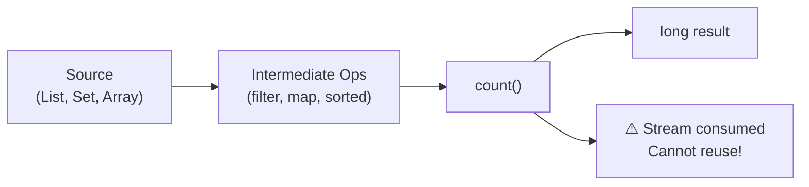

# 📘 Stream `count()` Method

---

## 📌 Introduction

### 🧠 What is this about?
The `count()` method counts the number of elements in a stream and returns the result as a `long`. It's the simplest terminal operation — but also one of the most commonly used.

### 🌍 Real-World Problem First
You're building an admin dashboard. You need to show: "Total users: 1,247" or "Active orders: 83". Before streams, you'd call `list.size()`. But what if you need "users with salary > 50,000" or "orders placed today"? You'd need to loop, filter, and count manually. With streams, it's `stream().filter(...).count()` — one line.

### ❓ Why does it matter?
- `count()` is a **terminal operation** — it triggers the pipeline and ends the stream
- Commonly paired with `filter()` and `map()` to count elements that match a condition
- Returns `long` (not `int`) to handle streams with more than 2 billion elements

### 🗺️ What we'll learn
- How `count()` works as a terminal operation
- Why it returns `long` instead of `int`
- Basic counting of stream elements

---

## 🧩 Concept 1: How `count()` Works

### 🧠 Layer 1: The Simple Version
`count()` answers one question: "How many elements are in this stream?" It processes the entire stream and returns a number.

### 🔍 Layer 2: The Developer Version
`count()` is a **terminal operation** — once called, the stream pipeline executes and the stream is consumed. You cannot reuse the stream after calling `count()`. It returns a `long` value representing the number of elements.

Internally, `count()` is equivalent to:
```java
stream.mapToLong(e -> 1L).sum()
```

### ⚙️ Layer 4: Stream Pipeline with `count()`



### 💻 Layer 5: Code — Prove It!

```java
List<String> fruits = Arrays.asList("Apple", "Banana", "Mango", "Orange", "Cherry");

long count = fruits.stream().count();

System.out.println(count);  // Output: 5
```

> Simple — 5 elements in the list, `count()` returns 5.

---

### ⚠️ Pitfalls & Mistakes

**Mistake 1: Trying to reuse a stream after `count()`**
- 👤 What devs do: Call `count()` and then try to use the same stream again
- 💥 Why it breaks: `count()` is terminal — the stream is consumed and closed

**❌ This throws an exception:**
```java
Stream<String> stream = fruits.stream();
long count = stream.count();               // Stream consumed here
List<String> list = stream.collect(Collectors.toList());  // ❌ IllegalStateException!
```

**✅ Create a new stream:**
```java
long count = fruits.stream().count();                           // Stream 1
List<String> list = fruits.stream().collect(Collectors.toList()); // Stream 2 — new stream!
```

---

### ✅ Key Takeaways

→ `count()` returns the number of elements in a stream as a `long`
→ It's a **terminal operation** — the stream is consumed and cannot be reused
→ Commonly used after `filter()` or `map()` to count matching elements

---

> Counting all elements is straightforward. But the real power of `count()` shines when combined with `filter()` — let's see that in the next note.
