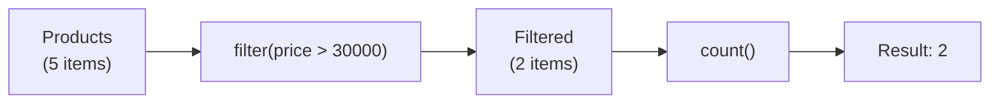

# 📘 Using `count()` with `filter()` — Real-World Example

---

## 📌 Introduction

### 🧠 What is this about?
This note shows how to combine `count()` with `filter()` to count elements that match a specific condition — like counting products above a certain price, or active users in a system.

### 🌍 Real-World Problem First
You're building a product analytics feature. The product manager asks: "How many products cost more than ₹30,000?" You have a list of `Product` objects. Without streams, you'd loop through, check each price, and increment a counter. With streams: `products.stream().filter(p -> p.getPrice() > 30000).count()`. Done.

### ❓ Why does it matter?
- `filter()` + `count()` is one of the most common stream patterns in real projects
- It replaces verbose loop-and-count boilerplate with a single expressive line
- This pattern scales to any condition: count by status, by date, by category — anything

### 🗺️ What we'll learn
- How `filter()` and `count()` work together in a pipeline
- A real-world example with custom `Product` objects
- How to change the filter condition dynamically

---

## 🧩 Concept 1: The `filter()` + `count()` Pipeline

### 🧠 Layer 1: The Simple Version
`filter()` narrows the stream to only matching elements. `count()` then counts what's left. It's like asking: "Of all my products, how many are expensive?"

### 🔍 Layer 2: The Developer Version
The pipeline works in three stages:
1. **Source** → stream created from a collection
2. **`filter(predicate)`** → intermediate operation that keeps only elements where the predicate returns `true`
3. **`count()`** → terminal operation that counts the surviving elements



### 💻 Layer 5: Code — Prove It!

```java
class Product {
    private String name;
    private double price;

    Product(String name, double price) {
        this.name = name;
        this.price = price;
    }

    public String getName() { return name; }
    public double getPrice() { return price; }
}
```

```java
List<Product> products = Arrays.asList(
    new Product("Laptop", 75000),
    new Product("Smartphone", 25000),
    new Product("Tablet", 20000),
    new Product("Monitor", 40000),
    new Product("Smartwatch", 15000)
);

// Count products priced above ₹30,000
long expensiveCount = products.stream()
    .filter(product -> product.getPrice() > 30000)
    .count();

System.out.println(expensiveCount);  // Output: 2
// Laptop (75,000) and Monitor (40,000) are above 30,000
```

**🔍 Changing the threshold:**
```java
// Count products above ₹20,000
long above20k = products.stream()
    .filter(p -> p.getPrice() > 20000)
    .count();

System.out.println(above20k);  // Output: 3
// Laptop (75,000), Smartphone (25,000), Monitor (40,000)
```

### 📊 How the filter narrows the stream

| Product | Price | `> 30,000`? | `> 20,000`? |
|---------|-------|-------------|-------------|
| Laptop | 75,000 | ✅ | ✅ |
| Smartphone | 25,000 | ❌ | ✅ |
| Tablet | 20,000 | ❌ | ❌ |
| Monitor | 40,000 | ✅ | ✅ |
| Smartwatch | 15,000 | ❌ | ❌ |
| **Count** | | **2** | **3** |

---

## 🧩 Concept 2: More Real-World Patterns

### 💻 Counting with different conditions

```java
// Count products with "Smart" in the name
long smartProducts = products.stream()
    .filter(p -> p.getName().contains("Smart"))
    .count();
System.out.println(smartProducts);  // Output: 2 (Smartphone + Smartwatch)

// Count products in a price range
long midRange = products.stream()
    .filter(p -> p.getPrice() >= 20000 && p.getPrice() <= 50000)
    .count();
System.out.println(midRange);  // Output: 3 (Smartphone, Tablet, Monitor)
```

---

### 💡 Pro Tips

**Tip 1:** If you need both the count AND the filtered list, don't run two separate stream pipelines — collect first, then get the size:
```java
List<Product> expensive = products.stream()
    .filter(p -> p.getPrice() > 30000)
    .collect(Collectors.toList());

System.out.println("Count: " + expensive.size());   // Use size() on the list
System.out.println("Items: " + expensive);           // And you still have the items
```

**Tip 2:** `filter()` + `count()` replaces the imperative pattern:
```java
// ❌ Old way — verbose loop
int count = 0;
for (Product p : products) {
    if (p.getPrice() > 30000) {
        count++;
    }
}

// ✅ Stream way — one line
long count = products.stream().filter(p -> p.getPrice() > 30000).count();
```

---

### ✅ Key Takeaways

→ `filter()` + `count()` is the go-to pattern for counting elements that match a condition
→ `filter()` is intermediate (returns a stream), `count()` is terminal (returns a `long`)
→ You can chain multiple `filter()` calls for complex conditions, or use `&&` / `||` in a single predicate
→ If you need both the items and the count, collect to a list and use `size()` instead of running two pipelines

---

> Counting is useful, but sometimes you need the **smallest** or **largest** element, not just how many there are. Next up: `min()` — finding the minimum element using comparators.
