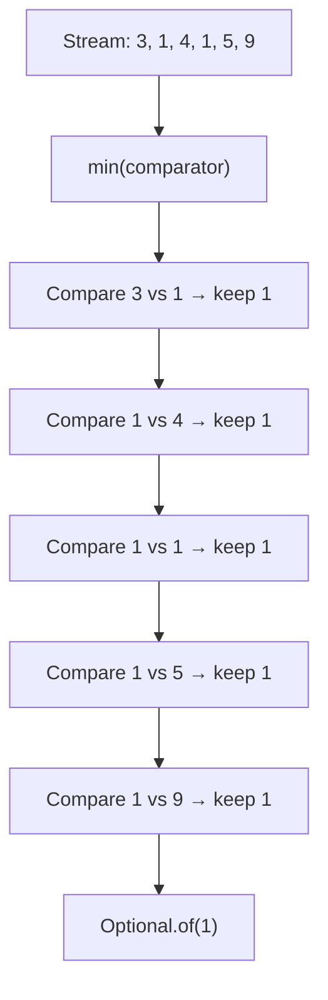
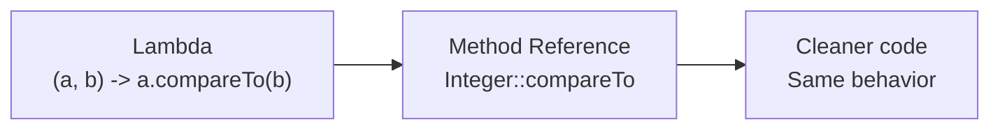

# 📘 Stream `min()` Method

---

## 📌 Introduction

### 🧠 What is this about?
The `min()` method finds the smallest element in a stream. But "smallest" depends on context — is it the lowest number? The earliest date? The cheapest product? You tell `min()` how to compare using a **Comparator**.

### 🌍 Real-World Problem First
You're building a price comparison tool. Users want to find the cheapest laptop from a list of 500 products. Without streams, you'd loop through all products, track the minimum price, and handle edge cases (empty list). With `min()`, it's one pipeline call that returns the result wrapped in `Optional` (handling the empty case for you).

### ❓ Why does it matter?
- Finding minimums is a universal operation — lowest price, oldest record, earliest date
- `min()` uses `Comparator`, making it flexible for any comparison logic
- Returns `Optional` — safely handles the case when the stream is empty

### 🗺️ What we'll learn
- How `min()` works with a `Comparator`
- Why it returns `Optional` instead of the raw value
- Using lambda expressions and method references with `min()`
- Simplifying comparator code

---

## 🧩 Concept 1: How `min()` Works

### 🧠 Layer 1: The Simple Version
`min()` looks at every element in the stream and returns the smallest one. You provide the rules for "smallest" via a Comparator.

### 🔍 Layer 2: The Developer Version
`min(Comparator<? super T> comparator)` is a **terminal operation** that:
1. Iterates through all elements
2. Compares each pair using the provided `Comparator`
3. Returns the smallest element wrapped in `Optional<T>`

It returns `Optional` because the stream might be empty — and there's no "minimum of nothing."

### ⚙️ Layer 4: How It Works Internally



### 💻 Layer 5: Code — Prove It!

**🔍 Basic Usage — Finding minimum number:**
```java
List<Integer> numbers = Arrays.asList(2, 5, 3, 6, 4, 8, 7, 9);

// Using lambda expression
Optional<Integer> min = numbers.stream()
    .min((a, b) -> a.compareTo(b));

System.out.println(min.get());  // Output: 2
```

**🔍 Simplified with method reference:**
```java
// Integer::compareTo replaces the lambda (a, b) -> a.compareTo(b)
Optional<Integer> min = numbers.stream()
    .min(Integer::compareTo);

System.out.println(min.get());  // Output: 2
```

> Why does method reference work here? The lambda `(a, b) -> a.compareTo(b)` does nothing except call `compareTo`. Whenever a lambda just delegates to an existing method, you can replace it with a method reference.

**🔍 Even simpler with `Comparator.naturalOrder()`:**
```java
Optional<Integer> min = numbers.stream()
    .min(Comparator.naturalOrder());

System.out.println(min.get());  // Output: 2
```

---

## 🧩 Concept 2: Why `Optional`?

### 🧠 Layer 1: The Simple Version
What's the minimum of an empty list? There is no answer. `Optional` is Java's way of saying "there might or might not be a result."

### 🔍 Layer 2: The Developer Version
If the stream is empty, `min()` returns `Optional.empty()`. Calling `.get()` on an empty `Optional` throws `NoSuchElementException`. Always check first!

### 💻 Code — Prove It!

**❌ Dangerous — calling `get()` without checking:**
```java
List<Integer> empty = Collections.emptyList();
Optional<Integer> min = empty.stream().min(Integer::compareTo);
System.out.println(min.get());  // ❌ Throws NoSuchElementException!
```

**✅ Safe — using `orElse()` or `isPresent()`:**
```java
List<Integer> empty = Collections.emptyList();

// Option 1: Provide a default value
int min = empty.stream()
    .min(Integer::compareTo)
    .orElse(0);  // Returns 0 if stream is empty
System.out.println(min);  // Output: 0

// Option 2: Check first
Optional<Integer> result = empty.stream().min(Integer::compareTo);
if (result.isPresent()) {
    System.out.println(result.get());
} else {
    System.out.println("No elements!");  // Output: No elements!
}
```

---

## 🧩 Concept 3: Lambda → Method Reference Simplification

### 🔍 The Developer Version
The progression from verbose to clean:

```java
// Step 1: Full lambda with explicit Comparator
.min((Integer a, Integer b) -> a.compareTo(b))

// Step 2: Type-inferred lambda
.min((a, b) -> a.compareTo(b))

// Step 3: Method reference (cleanest)
.min(Integer::compareTo)
```



Each form is functionally identical. Use whichever your team prefers — but method references are the idiomatic Java 8+ style.

---

### ✅ Key Takeaways

→ `min(comparator)` finds the smallest element in a stream using the provided comparison logic
→ It's a **terminal operation** that returns `Optional<T>` — never assume the stream has elements
→ Use `Integer::compareTo` (method reference) instead of `(a, b) -> a.compareTo(b)` (lambda) for cleaner code
→ Always handle the empty case: use `orElse()`, `orElseThrow()`, or `isPresent()` — never raw `get()`

---

> We just learned to find the minimum. The natural next question: how do you find the **maximum**? The `max()` method works almost identically — let's see.
