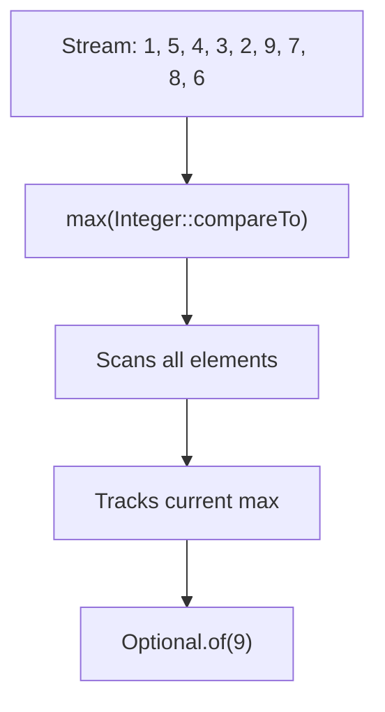

# 📘 Stream `max()` Method

---

## 📌 Introduction

### 🧠 What is this about?
The `max()` method finds the largest element in a stream based on a `Comparator`. It's the mirror image of `min()` — same API, opposite result.

### 🌍 Real-World Problem First
Your analytics dashboard needs to show: "Highest salary: ₹1,20,000" or "Most expensive order: $5,400." Finding the maximum value from a collection is an everyday operation. `max()` does it in a single, declarative pipeline call.

### ❓ Why does it matter?
- Finding maximums is as universal as finding minimums — top score, latest date, highest value
- Same API design as `min()` — learn one, you know both
- Returns `Optional` for safe handling of empty streams

### 🗺️ What we'll learn
- How `max()` works with a Comparator
- Lambda vs method reference syntax
- How `max()` and `min()` are symmetrical

---

## 🧩 Concept 1: How `max()` Works

### 🧠 Layer 1: The Simple Version
`max()` scans every element and returns the biggest one. You define "biggest" through a Comparator.

### 🔍 Layer 2: The Developer Version
`max(Comparator<? super T> comparator)` is a **terminal operation** that:
1. Processes every element in the stream
2. Compares pairs using the Comparator
3. Returns the largest element wrapped in `Optional<T>`

It's internally equivalent to `reduce((a, b) -> comparator.compare(a, b) >= 0 ? a : b)`.

### ⚙️ Layer 4: How `compareTo()` Drives the Comparison

The `compareTo()` method returns:
- **Positive** → first object is greater
- **Negative** → first object is smaller
- **Zero** → objects are equal

`max()` keeps the element that "wins" each comparison (the larger one).



### 💻 Layer 5: Code — Prove It!

**🔍 Basic Usage:**
```java
List<Integer> numbers = Arrays.asList(1, 5, 4, 3, 2, 9, 7, 8, 6);

// Using lambda
int max = numbers.stream()
    .max((a, b) -> a.compareTo(b))
    .get();
System.out.println(max);  // Output: 9

// Using method reference (cleaner)
int max2 = numbers.stream()
    .max(Integer::compareTo)
    .get();
System.out.println(max2);  // Output: 9
```

**🔍 One-liner style:**
```java
int max = numbers.stream().max(Integer::compareTo).get();
System.out.println(max);  // Output: 9
```

---

## 🧩 Concept 2: `min()` vs `max()` — The Symmetric Pair

### 📊 Comparison

| Feature | `min()` | `max()` |
|---------|---------|---------|
| Finds | Smallest element | Largest element |
| Comparator | Same parameter type | Same parameter type |
| Returns | `Optional<T>` | `Optional<T>` |
| Terminal? | Yes | Yes |
| On empty stream | `Optional.empty()` | `Optional.empty()` |
| Method reference | `Integer::compareTo` | `Integer::compareTo` |

**Why do they both use the same comparator?** Because the comparator defines the **ordering** — `min()` picks the element that sorts first, and `max()` picks the one that sorts last. The comparator doesn't change; only which end of the ordering you pick from changes.

```java
List<Integer> numbers = Arrays.asList(3, 1, 4, 1, 5, 9, 2, 6);

int min = numbers.stream().min(Integer::compareTo).get();
int max = numbers.stream().max(Integer::compareTo).get();

System.out.println("Min: " + min);  // Output: Min: 1
System.out.println("Max: " + max);  // Output: Max: 9
```

---

### 💡 Pro Tips

**Tip 1:** For finding min/max of a specific field in objects, use `Comparator.comparing()`:
```java
// Find the highest-paid employee
Employee topEarner = employees.stream()
    .max(Comparator.comparing(Employee::getSalary))
    .orElseThrow(() -> new RuntimeException("No employees found"));
```

**Tip 2:** Need both min and max? Use `IntSummaryStatistics`:
```java
IntSummaryStatistics stats = numbers.stream()
    .mapToInt(Integer::intValue)
    .summaryStatistics();

System.out.println("Min: " + stats.getMin());    // Output: Min: 1
System.out.println("Max: " + stats.getMax());    // Output: Max: 9
System.out.println("Avg: " + stats.getAverage()); // Bonus: average too!
```

---

### ✅ Key Takeaways

→ `max(comparator)` finds the largest element using the provided comparison logic
→ It's a **terminal operation** returning `Optional<T>`
→ `min()` and `max()` use the **same** Comparator — they just pick opposite ends of the ordering
→ Use `Comparator.comparing(KeyExtractor)` for clean object comparisons
→ Always handle the empty case with `orElse()` or `orElseThrow()`

---

> We've learned to find specific elements (min, max) and count them. But sometimes you don't need the element itself — you need to ask a **yes/no question** about the stream. "Does ANY element match this condition?" That's `anyMatch()` — up next.
