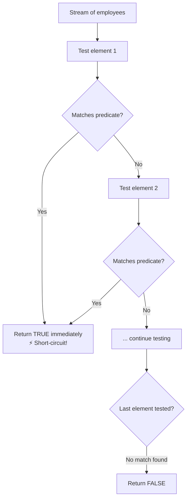

# 📘 Java Stream `anyMatch()` Method

---

## 📌 Introduction

### 🧠 What is this about?
`anyMatch()` answers a simple question: "Does **at least one** element in this stream satisfy my condition?" It returns `true` or `false`. Think of it as the stream equivalent of searching through a crowd and asking: "Is there ANYONE here who speaks French?"

### 🌍 Real-World Problem First
You're building a payroll system. Before processing bonuses, you need to check: "Is there any employee earning more than ₹50,000?" You don't need the employee object, you don't need a count — you just need a yes or no. That's `anyMatch()`.

### ❓ Why does it matter?
- **Short-circuiting** — stops processing as soon as it finds a match (fast on large datasets)
- Returns a simple `boolean` — perfect for `if` conditions
- One of the three matching operations (`anyMatch`, `allMatch`, `noneMatch`)

### 🗺️ What we'll learn
- How `anyMatch()` works as a short-circuiting terminal operation
- Real-world example with employee data
- How short-circuiting saves processing time

---

## 🧩 Concept 1: How `anyMatch()` Works

### 🧠 Layer 1: The Simple Version
`anyMatch()` checks each element against a condition. The moment it finds ONE match, it immediately returns `true` and stops. If it checks everything and finds no match, it returns `false`.

### 🔍 Layer 2: The Developer Version
`anyMatch(Predicate<? super T> predicate)` is a **terminal, short-circuiting** operation:
- **Terminal** — consumes the stream; can't reuse it after
- **Short-circuiting** — doesn't need to process all elements. Stops at the first match.

This makes it very efficient on large streams when matches are likely — it might only process 1 out of 1,000,000 elements.

### ⚙️ Layer 4: How It Works Step-by-Step



📊 DIAGRAM PROMPT:
────────────────────────────────────────────────────────────
"Draw a conveyor belt with 4 employee cards. A detector labeled 'anyMatch(salary > 50000)' scans each card. When it reaches the first matching card, a green light turns on and the belt STOPS (remaining cards never scanned). Show the short-circuit concept clearly. Style: minimal whiteboard."
────────────────────────────────────────────────────────────

### 💻 Layer 5: Code — Prove It!

```java
class Employee {
    private int id;
    private String name;
    private double salary;

    Employee(int id, String name, double salary) {
        this.id = id;
        this.name = name;
        this.salary = salary;
    }

    public double getSalary() { return salary; }
    public String getName() { return name; }
}
```

```java
List<Employee> employees = Arrays.asList(
    new Employee(1, "Ramesh", 55000),
    new Employee(2, "Umesh", 45000),
    new Employee(3, "Sanjay", 50000),
    new Employee(4, "John", 30000)
);

// Is there ANY employee with salary > 50,000?
boolean hasHighEarner = employees.stream()
    .anyMatch(emp -> emp.getSalary() > 50000);

System.out.println(hasHighEarner);  // Output: true
// Ramesh (55,000) matches → returns true immediately, skips the rest!
```

**🔍 When no match exists:**
```java
// Is there ANY employee with salary > 55,000?
boolean result = employees.stream()
    .anyMatch(emp -> emp.getSalary() > 55000);

System.out.println(result);  // Output: false
// All 4 employees checked — none matches → returns false
```

---

## 🧩 Concept 2: Short-Circuiting in Action

### 🧠 Why this matters for performance

Imagine a stream of 10 million elements. With a regular terminal operation like `count()`, you must process **all** 10 million. But with `anyMatch()`, if the very first element matches, you process only **1** element. The other 9,999,999 are never even touched.

```java
// Short-circuiting visualization
List<Employee> employees = Arrays.asList(
    new Employee(1, "Ramesh", 55000),  // ← Checked: salary > 50000? YES → return true
    new Employee(2, "Umesh", 45000),   // ← Never reached!
    new Employee(3, "Sanjay", 50000),  // ← Never reached!
    new Employee(4, "John", 30000)     // ← Never reached!
);
```

---

### 💡 Pro Tips

**Tip 1:** Use `anyMatch()` in `if` conditions for clean, readable code:
```java
if (orders.stream().anyMatch(o -> o.getStatus().equals("PENDING"))) {
    System.out.println("There are pending orders to process!");
}
```

**Tip 2:** `anyMatch()` on an empty stream always returns `false` (vacuously — there are no elements to match):
```java
boolean result = Collections.<String>emptyList().stream()
    .anyMatch(s -> s.length() > 5);
System.out.println(result);  // Output: false
```

---

### ✅ Key Takeaways

→ `anyMatch(predicate)` returns `true` if **at least one** element satisfies the condition
→ It's **short-circuiting** — stops at the first match, making it efficient on large streams
→ It's a **terminal operation** — the stream is consumed after calling it
→ Returns `false` on empty streams (no elements = no matches)
→ Perfect for boolean checks in `if` statements

---

> `anyMatch()` asks "does at least one match?" But what if you need to verify that **every single** element matches? That's a stricter question — and `allMatch()` answers it. Let's see how.
