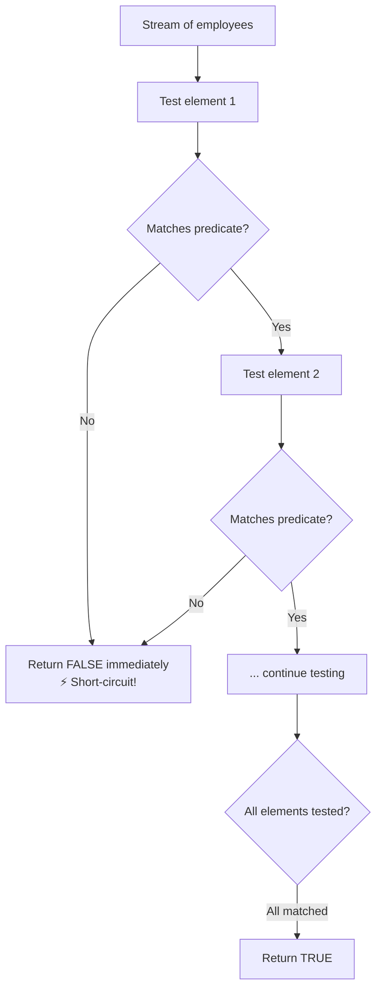
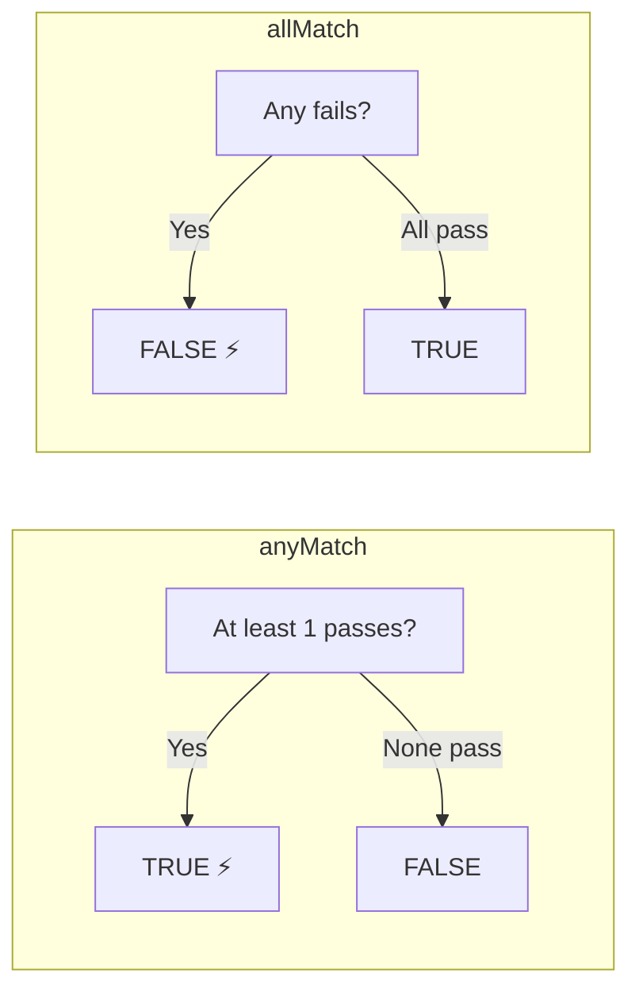

# 📘 Java Stream `allMatch()` Method

---

## 📌 Introduction

### 🧠 What is this about?
`allMatch()` checks if **every single element** in a stream satisfies a condition. One failure = immediate `false`. It's the strictest of the three matching methods.

### 🌍 Real-World Problem First
You're validating data before processing payroll: "Do ALL employees have a salary above ₹25,000 (minimum wage)?" If even one employee falls below, the validation fails and you need to flag it. `allMatch()` gives you that boolean gate in one line.

### ❓ Why does it matter?
- Used for **validation** — ensure all elements meet a requirement before proceeding
- **Short-circuiting** — stops at the **first failure** (doesn't waste time checking the rest)
- Different from `anyMatch()` — there, one success is enough; here, one failure is disqualifying

### 🗺️ What we'll learn
- How `allMatch()` works and when it short-circuits
- The difference between `anyMatch()` and `allMatch()`
- Real-world validation example with employee data

---

## 🧩 Concept 1: How `allMatch()` Works

### 🧠 Layer 1: The Simple Version
`allMatch()` asks: "Does EVERY element pass this test?" If all do → `true`. If even one fails → `false`.

Think of it like a quality inspection on a factory line. Every item must pass. One defective item? The whole batch fails.

### 🔍 Layer 2: The Developer Version
`allMatch(Predicate<? super T> predicate)` is a **terminal, short-circuiting** operation:
- **Short-circuits on failure** — the moment it finds an element that does NOT match the predicate, it returns `false` immediately
- If all elements match, it processes the entire stream and returns `true`

This is the opposite short-circuiting behavior of `anyMatch()`:
- `anyMatch()` short-circuits on the **first success**
- `allMatch()` short-circuits on the **first failure**

### ⚙️ Layer 4: How It Works Step-by-Step



### 💻 Layer 5: Code — Prove It!

```java
List<Employee> employees = Arrays.asList(
    new Employee(1, "Ramesh", 55000),
    new Employee(2, "Umesh", 45000),
    new Employee(3, "Sanjay", 50000),
    new Employee(4, "John", 30000)
);

// Do ALL employees have salary > 25,000?
boolean allAbove25k = employees.stream()
    .allMatch(emp -> emp.getSalary() > 25000);

System.out.println(allAbove25k);  // Output: true
// All four: 55000, 45000, 50000, 30000 — all > 25000 ✅
```

**🔍 When one element fails:**
```java
// Do ALL employees have salary > 30,000?
boolean allAbove30k = employees.stream()
    .allMatch(emp -> emp.getSalary() > 30000);

System.out.println(allAbove30k);  // Output: false
// John (30,000) is NOT > 30,000 → short-circuits → false
```

**🔍 Boundary condition with `>=`:**
```java
// Do ALL employees have salary >= 30,000?
boolean allAtLeast30k = employees.stream()
    .allMatch(emp -> emp.getSalary() >= 30000);

System.out.println(allAtLeast30k);  // Output: true
// John (30,000) is >= 30,000 → passes!
```

---

## 🧩 Concept 2: `anyMatch()` vs `allMatch()` — The Key Difference

### 📊 Comparison

| Feature | `anyMatch()` | `allMatch()` |
|---------|-------------|-------------|
| Question | "Does **at least one** match?" | "Do **all** match?" |
| Returns `true` when | First match found | All elements match |
| Returns `false` when | No elements match | First non-match found |
| Short-circuits on | First **success** | First **failure** |
| Empty stream | `false` | `true` ⚠️ |

> ⚠️ **Gotcha:** `allMatch()` on an empty stream returns `true`! This is called "vacuous truth" — "All elements in an empty set satisfy any condition" because there are zero elements to violate it. Be careful with this in validation logic!

```java
// Watch out!
boolean result = Collections.<Employee>emptyList().stream()
    .allMatch(emp -> emp.getSalary() > 1000000);

System.out.println(result);  // Output: true — vacuously true!
```



---

### ⚠️ Pitfalls & Mistakes

**Mistake 1: Assuming `allMatch()` returns `false` on empty streams**
- 👤 What devs do: Use `allMatch()` for validation without checking if the collection is empty first
- 💥 Why it breaks: `allMatch()` on an empty stream returns `true` — your validation "passes" with zero data
- ✅ Fix: Check for empty collection first, or combine with a size check:
```java
boolean isValid = !employees.isEmpty()
    && employees.stream().allMatch(e -> e.getSalary() > 25000);
```

---

### ✅ Key Takeaways

→ `allMatch(predicate)` returns `true` only if **every** element satisfies the condition
→ It short-circuits on the **first failure** — efficient for large datasets with early violations
→ Returns `true` on empty streams (vacuous truth) — always guard against this in validation
→ `anyMatch()` = "at least one succeeds", `allMatch()` = "none fail"

---

> `anyMatch()` checks for at least one. `allMatch()` checks for all. But there's a third question: "Does **nothing** match?" That's `noneMatch()` — the final piece of the matching trio.
