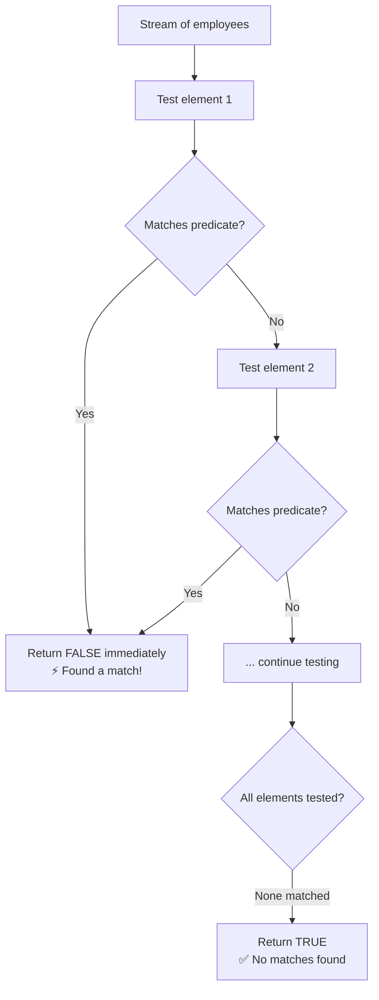
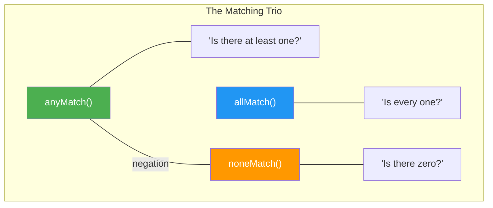

# 📘 Java Stream `noneMatch()` Method

---

## 📌 Introduction

### 🧠 What is this about?
`noneMatch()` checks if **no elements** in a stream match a given condition. It returns `true` when zero elements satisfy the predicate, and `false` the moment it finds even one match. It's the logical opposite of `anyMatch()`.

### 🌍 Real-World Problem First
You're implementing a compliance check: "Are there NO employees with a salary below ₹30,000?" If the answer is "correct, none are below" — compliance passes. If even one is below — compliance fails. That's exactly what `noneMatch()` does.

### ❓ Why does it matter?
- Completes the matching trio: `anyMatch`, `allMatch`, `noneMatch`
- Perfect for **negative validation** — ensuring something does NOT exist
- Short-circuiting — stops at the first match found

### 🗺️ What we'll learn
- How `noneMatch()` works
- Relationship between `noneMatch()` and `anyMatch()`
- The complete matching trio comparison

---

## 🧩 Concept 1: How `noneMatch()` Works

### 🧠 Layer 1: The Simple Version
`noneMatch()` asks: "Is it true that NOTHING matches this condition?" If correct (zero matches) → `true`. If even one matches → `false`.

### 🔍 Layer 2: The Developer Version
`noneMatch(Predicate<? super T> predicate)` is a **terminal, short-circuiting** operation:
- Returns `true` if **no** element satisfies the predicate
- Returns `false` the moment it finds an element that **does** satisfy the predicate (short-circuits)
- On an empty stream, returns `true` (vacuously — nothing can match if there's nothing)

### 🌍 Layer 3: The Real-World Analogy

| Analogy | Technical Concept |
|---------|-------------------|
| Airport security: "No prohibited items found" | `noneMatch(item -> item.isProhibited())` returns `true` |
| Security finds a knife | `noneMatch()` immediately returns `false` — short-circuits |
| Empty bag | Returns `true` — no items to violate the rule |

### ⚙️ Layer 4: How It Works Step-by-Step



### 💻 Layer 5: Code — Prove It!

```java
List<Employee> employees = Arrays.asList(
    new Employee(1, "Ramesh", 55000),
    new Employee(2, "Umesh", 45000),
    new Employee(3, "Sanjay", 50000),
    new Employee(4, "John", 30000)
);

// Is it true that NO employee has salary < 30,000?
boolean noneBelow30k = employees.stream()
    .noneMatch(emp -> emp.getSalary() < 30000);

System.out.println(noneBelow30k);  // Output: true
// All salaries: 55000, 45000, 50000, 30000 — none is < 30000 ✅
```

**🔍 When a match IS found:**
```java
// Is it true that NO employee has salary <= 30,000?
boolean noneAtOrBelow30k = employees.stream()
    .noneMatch(emp -> emp.getSalary() <= 30000);

System.out.println(noneAtOrBelow30k);  // Output: false
// John (30,000) matches salary <= 30000 → noneMatch returns false
```

---

## 🧩 Concept 2: The Matching Trio — Complete Picture

### 📊 The Three Matching Methods

| Method | Question | Returns `true` when | Short-circuits on | Empty stream |
|--------|----------|-------------------|-------------------|-------------|
| `anyMatch()` | "Does at least one match?" | First match found | First **success** | `false` |
| `allMatch()` | "Do all match?" | All elements match | First **failure** | `true` |
| `noneMatch()` | "Do none match?" | No elements match | First **match** | `true` |

### 🔍 The Logical Relationship

`noneMatch(predicate)` is logically equivalent to `!anyMatch(predicate)`:

```java
// These are equivalent:
boolean result1 = employees.stream().noneMatch(e -> e.getSalary() < 30000);
boolean result2 = !employees.stream().anyMatch(e -> e.getSalary() < 30000);

System.out.println(result1 == result2);  // Output: true — always the same!
```

But `noneMatch()` is more readable when you're checking for the **absence** of something. Use whichever reads more naturally in your context.



### 💻 All Three in One Example:

```java
List<Employee> employees = Arrays.asList(
    new Employee(1, "Ramesh", 55000),
    new Employee(2, "Umesh", 45000),
    new Employee(3, "Sanjay", 50000),
    new Employee(4, "John", 30000)
);

// anyMatch: Is there any employee with salary > 50000?
System.out.println(employees.stream()
    .anyMatch(e -> e.getSalary() > 50000));   // true (Ramesh: 55000)

// allMatch: Do all employees have salary > 25000?
System.out.println(employees.stream()
    .allMatch(e -> e.getSalary() > 25000));   // true (all above 25000)

// noneMatch: Is it true that no employee has salary < 30000?
System.out.println(employees.stream()
    .noneMatch(e -> e.getSalary() < 30000));  // true (none below 30000)
```

---

### 💡 Pro Tips

**Tip 1:** Choose the method that makes your intent clear:
```java
// ❌ Confusing — double negation
if (!orders.stream().anyMatch(o -> o.isExpired())) { ... }

// ✅ Clear — reads naturally
if (orders.stream().noneMatch(Order::isExpired)) { ... }
```

**Tip 2:** All three methods are short-circuiting and terminal. They're efficient for validation checks before expensive operations:
```java
// Check before processing — fail fast
if (orders.stream().anyMatch(o -> o.getTotal() < 0)) {
    throw new IllegalStateException("Found orders with negative totals!");
}
// Only reaches here if all orders are valid
processOrders(orders);
```

---

### ✅ Key Takeaways

→ `noneMatch(predicate)` returns `true` if **zero** elements satisfy the condition
→ Short-circuits on the **first match** found — efficient on large datasets
→ Logically equivalent to `!anyMatch(predicate)` — choose whichever is more readable
→ The matching trio: `anyMatch` (at least one), `allMatch` (every one), `noneMatch` (none)
→ All three return `boolean`, are terminal, and are short-circuiting

---

> We've now mastered the Stream API's core operations — filtering, counting, finding min/max, and boolean matching. But there's a powerful feature we've been hinting at: **method references**. Every time we wrote `Integer::compareTo` or `Employee::getSalary`, we used one. Let's dive deep into what method references are and their four types.
