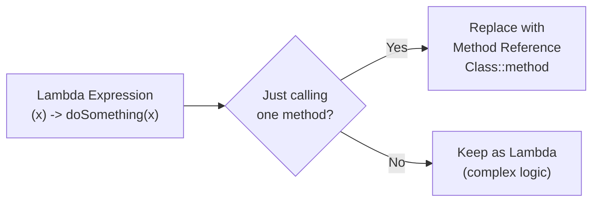
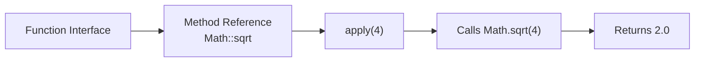
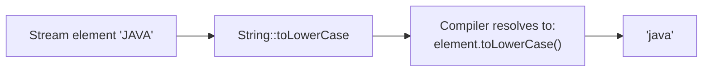
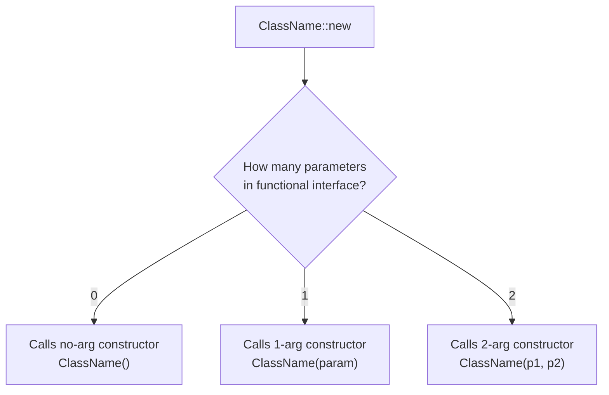
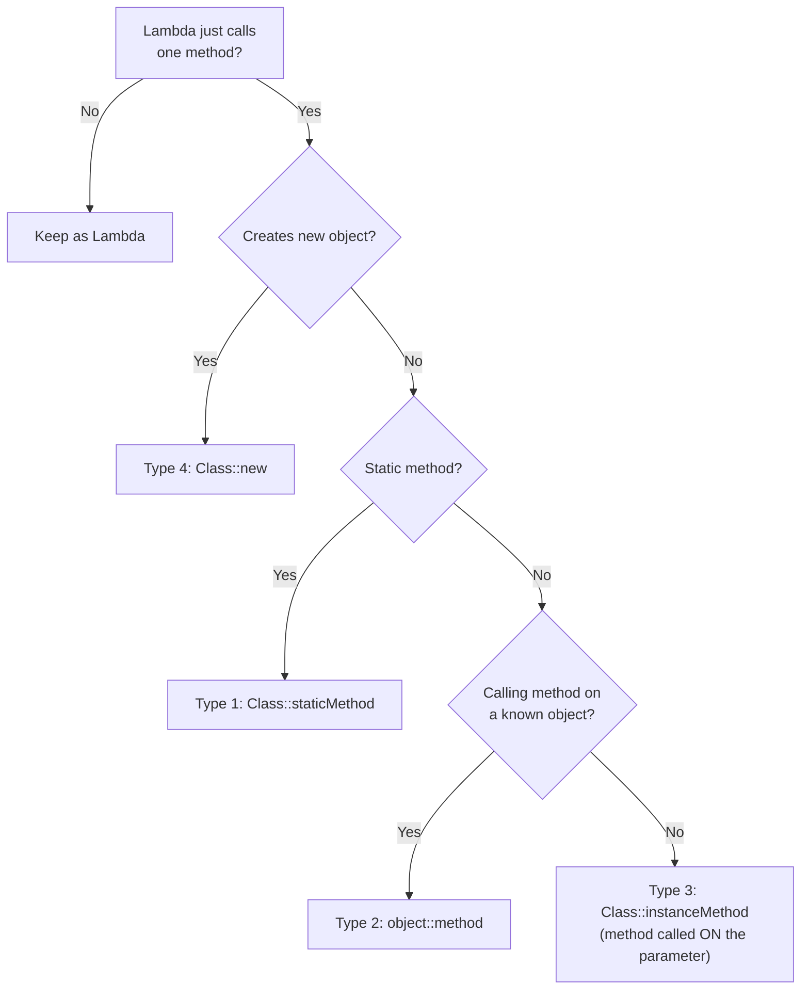
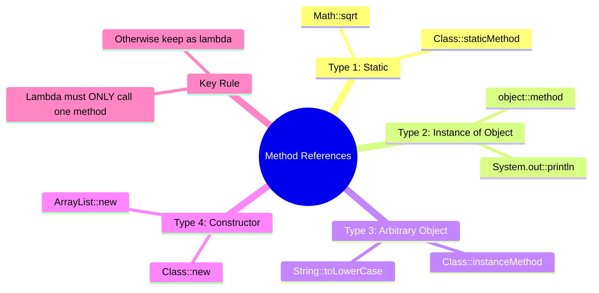

# 📘 Method References and Their Types

---

## 📌 Introduction

### 🧠 What is this about?
Method references are a **shorthand for lambda expressions** that just call an existing method. Instead of writing `x -> System.out.println(x)`, you write `System.out::println`. Same behavior, cleaner syntax. Java 8 introduced them alongside lambda expressions to make functional-style code more readable.

### 🌍 Real-World Problem First
You're writing stream pipelines and notice a pattern — many of your lambdas do nothing except call a single method:
```java
.map(s -> s.toLowerCase())
.forEach(x -> System.out.println(x))
.filter(s -> s.isEmpty())
.sorted((a, b) -> a.compareTo(b))
```
Each lambda is just a wrapper around a method call. It's boilerplate. Method references eliminate this wrapper, making the code say **what** to do (call `toLowerCase`) without the noise of **how** (take parameter `s`, pass it to `toLowerCase`).

### ❓ Why does it matter?
- **Cleaner code** — removes lambda boilerplate when you're just calling an existing method
- **More readable** — `String::toLowerCase` is immediately clear; `s -> s.toLowerCase()` takes a moment to parse
- **Industry standard** — experienced Java developers use method references everywhere; not knowing them makes code reviews harder
- **Four distinct types** — each covers a different calling pattern

### 🗺️ What we'll learn
1. What method references are and when to use them
2. **Type 1:** Reference to a static method
3. **Type 2:** Reference to an instance method of a particular object
4. **Type 3:** Reference to an instance method of an arbitrary object of a specific type
5. **Type 4:** Reference to a constructor
6. When to use lambda vs method reference

---

## 🧩 Concept 1: What Are Method References?

### 🧠 Layer 1: The Simple Version
A method reference is a shortcut. Instead of writing a lambda that calls a method, you point directly to that method using `::` (double colon).

### 🔍 Layer 2: The Developer Version
Every lambda expression that simply delegates to an existing method can be replaced with a method reference. The compiler figures out how to wire the parameters.

**The transformation rule:**
```
Lambda:           (args) -> object.method(args)
Method Reference: object::method
```

The `::` operator says: "Don't call this method now — just give me a reference to it so it can be called later."

### 🌍 Layer 3: The Real-World Analogy

| Analogy Element | Technical Equivalent |
|----------------|---------------------|
| Phone number on a business card | Method reference — a way to reach the method later |
| Actually dialing the number | Invoking the functional interface (`apply()`, `accept()`, etc.) |
| The person answering | The actual method being executed |
| "Call my assistant" (indirect) | Lambda expression `x -> assistant.handle(x)` |
| Business card with direct line | Method reference `assistant::handle` (no wrapper) |

### ⚙️ Layer 4: The Conversion Pattern



**🔍 Examples of the conversion:**

| Lambda Expression | Method Reference | Type |
|-------------------|-----------------|------|
| `x -> System.out.println(x)` | `System.out::println` | Instance method of specific object |
| `x -> Math.sqrt(x)` | `Math::sqrt` | Static method |
| `s -> s.toLowerCase()` | `String::toLowerCase` | Instance method of arbitrary object |
| `x -> new ArrayList<>(x)` | `ArrayList::new` | Constructor |

---

## 🧩 Concept 2: Type 1 — Reference to a Static Method

### 🧠 Layer 1: The Simple Version
When your lambda calls a **static method**, replace it with `ClassName::staticMethod`.

### 🔍 Layer 2: The Developer Version
**Syntax:** `ClassName::staticMethodName`

The class name replaces the object, and `::` replaces the dot. No parentheses, no parameters — the functional interface handles parameter passing.

### 💻 Layer 5: Code — Prove It!

**Example 1: `Math.sqrt()` — Computing square root**

```java
// ❌ Lambda — wrapper around a static method call
Function<Integer, Double> sqrtLambda = (input) -> Math.sqrt(input);
System.out.println(sqrtLambda.apply(4));  // Output: 2.0

// ✅ Method reference — direct pointer to the static method
Function<Integer, Double> sqrtRef = Math::sqrt;
System.out.println(sqrtRef.apply(4));     // Output: 2.0
```

**Example 2: Custom static method**

```java
public class Calculator {
    public static int addition(int a, int b) {
        return a + b;
    }
}

// ❌ Lambda
BiFunction<Integer, Integer, Integer> addLambda = (a, b) -> Calculator.addition(a, b);
System.out.println(addLambda.apply(10, 20));  // Output: 30

// ✅ Method reference
BiFunction<Integer, Integer, Integer> addRef = Calculator::addition;
System.out.println(addRef.apply(10, 20));     // Output: 30
```

**How the conversion works step-by-step:**
```
Lambda:           (a, b) -> Calculator.addition(a, b)
                   ↓ remove lambda parameters and arrow
                   ↓ replace . with ::
Method Reference: Calculator::addition
```



---

## 🧩 Concept 3: Type 2 — Reference to an Instance Method of a Particular Object

### 🧠 Layer 1: The Simple Version
When your lambda calls a method on a **specific object** you already have, replace it with `object::method`.

### 🔍 Layer 2: The Developer Version
**Syntax:** `objectReference::instanceMethod`

This is used when you have a specific object instance and your lambda just calls one of its methods. The key word is "particular" — you know exactly which object at compile time.

### 💻 Layer 5: Code — Prove It!

```java
// A custom functional interface
@FunctionalInterface
interface Printable {
    void print(String message);
}

// A class with an instance method
class TextProcessor {
    public void display(String message) {
        System.out.println(message.toUpperCase());
    }
}
```

```java
TextProcessor processor = new TextProcessor();  // The particular object

// ❌ Lambda — calls processor's method
Printable lambdaPrint = (message) -> processor.display(message);
lambdaPrint.print("hello world");  // Output: HELLO WORLD

// ✅ Method reference — points directly to processor's method
Printable refPrint = processor::display;
refPrint.print("hello world");     // Output: HELLO WORLD
```

**How the conversion works:**
```
Lambda:           (message) -> processor.display(message)
                   ↓ remove lambda parameter and arrow
                   ↓ replace . with ::
Method Reference: processor::display
```

> **Key requirement:** The instance method's parameter types and return type must match the functional interface's abstract method. `Printable.print(String)` → `void` matches `TextProcessor.display(String)` → `void`.

**🔍 The most common example — `System.out::println`:**
```java
List<String> names = Arrays.asList("Alice", "Bob", "Charlie");

// ❌ Lambda
names.forEach(name -> System.out.println(name));

// ✅ Method reference — System.out is the particular object, println is the method
names.forEach(System.out::println);
```

`System.out` is a specific `PrintStream` object. `println` is its instance method. We reference that particular object's method.

---

## 🧩 Concept 4: Type 3 — Reference to an Instance Method of an Arbitrary Object

### 🧠 Layer 1: The Simple Version
When your lambda receives an object as a parameter and calls a method **on that parameter**, use `ClassName::method`. The "arbitrary" object is whatever flows through the stream.

### 🔍 Layer 2: The Developer Version
**Syntax:** `ClassName::instanceMethod`

This is the trickiest type. The distinction from Type 2:
- **Type 2:** You have a specific object → `myObject::method`
- **Type 3:** The object comes from the stream/parameter → `ClassName::method`

The key signal: **the lambda's parameter IS the object you're calling the method on.**

```
Type 2: (x) -> knownObject.method(x)    → knownObject::method
Type 3: (x) -> x.method()               → ClassName::method
```

### ⚙️ Layer 4: How the Compiler Resolves This

When you write `String::toLowerCase`, the compiler knows:
1. `toLowerCase()` is an instance method of `String`
2. There's no specific `String` object — it must come from the stream
3. So for each element `s` in the stream, it calls `s.toLowerCase()`



### 💻 Layer 5: Code — Prove It!

**Example 1: String conversion**

```java
// ❌ Lambda — calling method ON the parameter
Function<String, String> lowerLambda = (input) -> input.toLowerCase();
System.out.println(lowerLambda.apply("JAVA"));  // Output: java

// ✅ Method reference — String is the type, toLowerCase is the method
Function<String, String> lowerRef = String::toLowerCase;
System.out.println(lowerRef.apply("JAVA"));      // Output: java
```

**How the conversion works:**
```
Lambda:           (input) -> input.toLowerCase()
                   ↓ input is a String
                   ↓ replace input. with String::
Method Reference: String::toLowerCase
```

**Example 2: Sorting with `compareTo`**

```java
String[] names = {"Charlie", "Alice", "Bob"};

// ❌ Lambda — s1 and s2 are arbitrary String objects
Arrays.sort(names, (s1, s2) -> s1.compareToIgnoreCase(s2));

// ✅ Method reference — the first parameter calls its method with the second
Arrays.sort(names, String::compareToIgnoreCase);

System.out.println(Arrays.toString(names));  // Output: [Alice, Bob, Charlie]
```

### 📊 Type 2 vs Type 3 — The Critical Distinction

| | Type 2: Particular Object | Type 3: Arbitrary Object |
|---|---|---|
| **Syntax** | `object::method` | `ClassName::method` |
| **Who calls the method?** | A specific known object | The lambda's parameter |
| **Lambda pattern** | `x -> knownObject.doSomething(x)` | `x -> x.doSomething()` |
| **Example** | `System.out::println` | `String::toLowerCase` |
| **Object known at** | Compile time | Runtime (from stream) |

---

## 🧩 Concept 5: Type 4 — Reference to a Constructor

### 🧠 Layer 1: The Simple Version
When your lambda creates a new object, replace it with `ClassName::new`. The `::new` syntax references the constructor.

### 🔍 Layer 2: The Developer Version
**Syntax:** `ClassName::new`

The compiler selects the appropriate constructor overload based on the functional interface's parameter types. If the interface takes no parameters, it uses the no-arg constructor. If it takes a `Collection`, it uses the constructor that accepts a `Collection`.

### 💻 Layer 5: Code — Prove It!

**Example: Converting a List to a Set**

```java
List<String> fruits = new ArrayList<>();
fruits.add("Banana");
fruits.add("Apple");
fruits.add("Mango");

// ❌ Lambda — creates new HashSet passing the list
Function<List<String>, Set<String>> lambdaFunc = (list) -> new HashSet<>(list);
Set<String> set1 = lambdaFunc.apply(fruits);
System.out.println(set1);  // Output: [Apple, Banana, Mango]

// ✅ Constructor reference — HashSet has a constructor that takes Collection
Function<List<String>, Set<String>> refFunc = HashSet::new;
Set<String> set2 = refFunc.apply(fruits);
System.out.println(set2);  // Output: [Apple, Banana, Mango]
```

**How the conversion works:**
```
Lambda:           (list) -> new HashSet<>(list)
                   ↓ remove lambda parameter and arrow
                   ↓ replace 'new ClassName(...)' with 'ClassName::new'
Method Reference: HashSet::new
```

**🔍 No-arg constructor reference:**
```java
// Supplier — takes nothing, returns a new object
Supplier<List<String>> lambdaSupplier = () -> new ArrayList<>();
Supplier<List<String>> refSupplier = ArrayList::new;

List<String> newList = refSupplier.get();  // Creates new empty ArrayList
```



---

## 🧩 Concept 6: Summary — All Four Types at a Glance

### 📊 Complete Reference Table

| Type | Syntax | Lambda Pattern | Example |
|------|--------|---------------|---------|
| **1. Static method** | `Class::staticMethod` | `x -> Class.method(x)` | `Math::sqrt` |
| **2. Instance of particular object** | `obj::method` | `x -> obj.method(x)` | `System.out::println` |
| **3. Instance of arbitrary object** | `Class::instanceMethod` | `x -> x.method()` | `String::toLowerCase` |
| **4. Constructor** | `Class::new` | `x -> new Class(x)` | `ArrayList::new` |

### 🔍 Decision Flowchart: Which Type to Use?



### 🔍 When to Keep the Lambda

Not every lambda can become a method reference. Keep the lambda when:
- The lambda has **multiple statements**
- The lambda **transforms parameters** before calling the method
- The lambda **combines** multiple method calls

```java
// ❌ Cannot be a method reference — has logic beyond a single method call
.filter(s -> s.length() > 5)                    // comparison, not just a method call
.map(s -> s.substring(0, 3).toUpperCase())       // two chained calls
.forEach(s -> log.info("Processing: " + s))      // string concatenation + method call
```

```java
// ✅ Can be method references — just one method call
.filter(String::isEmpty)                          // s -> s.isEmpty()
.map(String::toUpperCase)                         // s -> s.toUpperCase()
.forEach(System.out::println)                     // s -> System.out.println(s)
```

---

### ⚠️ Pitfalls & Mistakes

**Mistake 1: Trying to use method references for complex lambdas**
- 👤 What devs do: Try to convert `x -> x.getName().toUpperCase()` into a method reference
- 💥 Why it breaks: This is two method calls chained together — no single method reference can represent it
- ✅ Fix: Keep it as a lambda, or extract a helper method and reference that

**Mistake 2: Confusing Type 2 and Type 3**
- 👤 What devs do: Write `String::toLowerCase` when they mean `myString::toLowerCase`, or vice versa
- 💥 Why it breaks: Type 2 uses a specific object; Type 3 uses the class name. They compile differently.
- ✅ Fix: Ask yourself: "Is the object calling the method **the lambda parameter** (Type 3) or **a pre-existing variable** (Type 2)?"

---

### 💡 Pro Tips

**Tip 1:** IntelliJ IDEA highlights lambdas that can be replaced with method references. Press `Alt+Enter` on the highlighted lambda and choose "Replace lambda with method reference."

**Tip 2:** When reading unfamiliar method references, mentally expand them back to lambdas:
- `String::valueOf` → `x -> String.valueOf(x)` (Type 1: static)
- `this::processItem` → `x -> this.processItem(x)` (Type 2: instance)
- `String::length` → `s -> s.length()` (Type 3: arbitrary)
- `HashMap::new` → `() -> new HashMap<>()` (Type 4: constructor)

**Tip 3:** Method references can make code MORE confusing when the referenced method isn't well-known. If `MyUtils::transformData` is unclear, the lambda `x -> MyUtils.transformData(x)` might actually be more readable. Prioritize readability over conciseness.

---

## 🎯 Final Summary

### 🧠 The Big Picture



### ✅ Master Takeaways

→ Method references replace lambdas that **only** call a single existing method — nothing more
→ Four types: static (`Class::method`), instance of object (`obj::method`), arbitrary object (`Class::method`), constructor (`Class::new`)
→ The `::` operator doesn't call the method — it creates a reference to be called later by the functional interface
→ Use IntelliJ's Alt+Enter shortcut to convert lambdas to method references automatically
→ When in doubt about readability, keep the lambda — clarity beats conciseness

### 🔗 What's Next?
We've been seeing `Optional` throughout our stream operations — `min()` returns `Optional`, `max()` returns `Optional`, `findFirst()` returns `Optional`. But what exactly IS `Optional`, and why does Java force us to use it? The next note is a crash course on the `Optional` class — how to create them, extract values safely, and never write `null` checks again.
