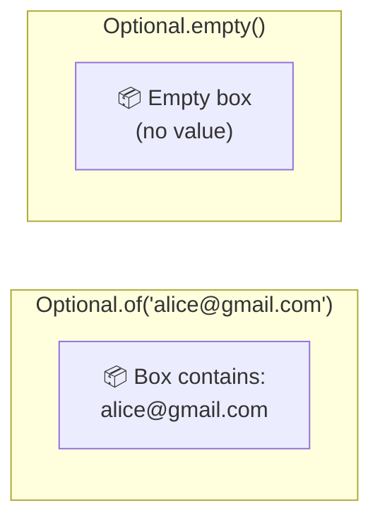
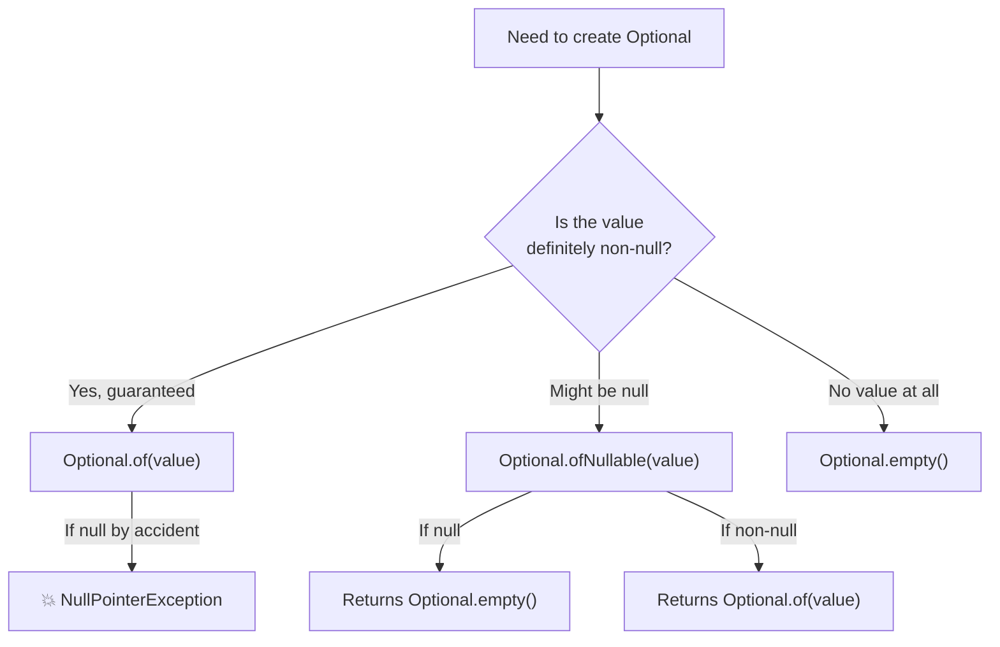
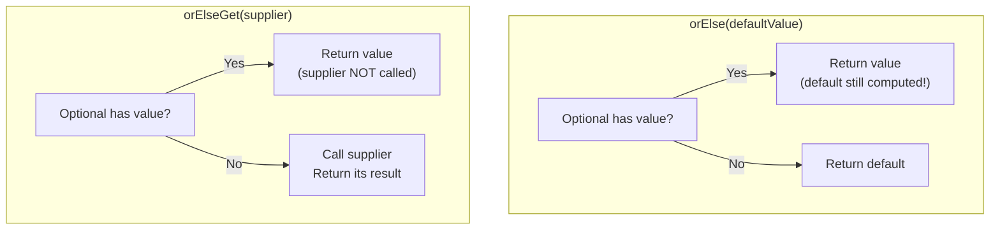
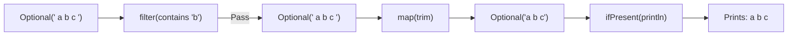
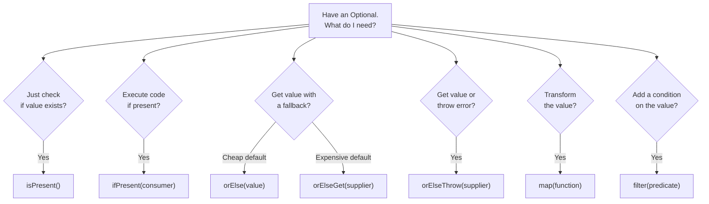
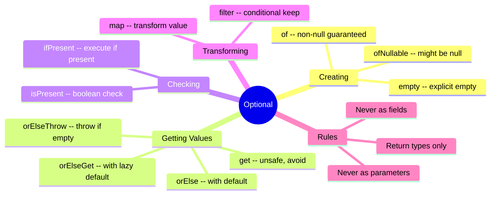

# 📘 Optional Class — Crash Course

---

## 📌 Introduction

### 🧠 What is this about?
The `Optional` class is Java 8's answer to the billion-dollar mistake — `NullPointerException`. It's a **container** that either holds a value or is explicitly empty. Instead of returning `null` and hoping the caller checks for it, you return `Optional` and **force** the caller to deal with the possibility of "no value."

### 🌍 Real-World Problem First
Picture this: you're fetching an employee from the database. The employee exists, but their email field is `null`. You write:

```java
Employee emp = getEmployee(id);
String email = emp.getEmail();            // Returns null
String lower = email.toLowerCase();        // 💥 NullPointerException!
```

The old fix? **Null checks everywhere:**
```java
if (emp != null) {
    if (emp.getEmail() != null) {
        String lower = emp.getEmail().toLowerCase();
    }
}
```

Three levels of nesting for one value. Now imagine doing this for every field, in every method, across thousands of lines. That's the world before `Optional`.

### ❓ Why does it matter?
- `NullPointerException` is the **#1 most common exception** in Java projects
- Null checks clutter code and are easy to forget
- `Optional` makes "absence of value" **explicit** — it's part of the type system
- Modern Java APIs (Streams, Spring Data) return `Optional` extensively

### 🗺️ What we'll learn
1. Why `Optional` exists and what problem it solves
2. Three ways to create an `Optional`: `of()`, `empty()`, `ofNullable()`
3. Getting values: `get()`, `isPresent()`, `ifPresent()`
4. Default values: `orElse()`, `orElseGet()`
5. Throwing exceptions: `orElseThrow()`
6. Transforming values: `map()`, `filter()`

---

## 🧩 Concept 1: What is Optional?

### 🧠 Layer 1: The Simple Version
`Optional` is a box that either has something inside or is empty. Instead of handing someone `null` (nothing) and hoping they don't trip over it, you hand them a clearly labeled box: "this box might be empty — check before opening."

### 🔍 Layer 2: The Developer Version
`Optional<T>` is a **final class** in `java.util` that acts as a single-value container. It has exactly two states:
1. **Present** — contains a non-null value of type `T`
2. **Empty** — contains nothing (represents the absence of a value)

It is NOT a replacement for every `null` in your codebase. It's designed specifically for **return types** where a method might legitimately return "no result."

### 🌍 Layer 3: The Real-World Analogy

| Analogy Element | Technical Equivalent |
|----------------|---------------------|
| A gift box | `Optional<T>` |
| Box with a gift inside | `Optional.of(value)` — present |
| Empty box (sealed, labeled "empty") | `Optional.empty()` — absent |
| Opening the box | `.get()` — retrieves the value |
| Checking before opening | `.isPresent()` — checks if value exists |
| "If empty, use this backup gift" | `.orElse(defaultValue)` |

### ⚙️ Layer 4: Optional as a Container



📊 DIAGRAM PROMPT:
────────────────────────────────────────────────────────────
"Draw two boxes side by side. Left box labeled 'Optional.of(email)' containing the text 'alice@gmail.com' with a green check mark. Right box labeled 'Optional.empty()' that is empty with a red X. Below both, show arrows to methods: get(), isPresent(), orElse(). Style: minimal developer whiteboard."
────────────────────────────────────────────────────────────

---

## 🧩 Concept 2: Creating Optional Objects — Three Factory Methods

### 🧠 Layer 1: The Simple Version
There are three ways to put something in a box (or create an empty box):
1. `Optional.of(value)` — **guaranteed non-null** value
2. `Optional.empty()` — explicitly empty
3. `Optional.ofNullable(value)` — **might be null** (handles both cases)

### 🔍 Layer 2: The Developer Version

| Method | When to use | If value is null | Internal behavior |
|--------|-------------|------------------|-------------------|
| `Optional.of(value)` | You're **sure** value is non-null | 💥 Throws `NullPointerException` | Calls `Objects.requireNonNull(value)` |
| `Optional.empty()` | You explicitly want "no value" | N/A | Returns a shared empty singleton |
| `Optional.ofNullable(value)` | Value **might** be null | Returns `Optional.empty()` | `value == null ? empty() : of(value)` |

### ⚙️ Layer 4: Decision Flowchart



### 💻 Layer 5: Code — Prove It!

**🔍 `Optional.empty()` — Creating an empty Optional:**
```java
Optional<String> emptyOpt = Optional.empty();
System.out.println(emptyOpt);  // Output: Optional.empty
```

**🔍 `Optional.of()` — Value guaranteed non-null:**
```java
String email = "ramesh@gmail.com";
Optional<String> emailOpt = Optional.of(email);
System.out.println(emailOpt);  // Output: Optional[ramesh@gmail.com]
```

**❌ `Optional.of()` with null — CRASHES:**
```java
String email = null;
Optional<String> emailOpt = Optional.of(email);  // 💥 NullPointerException!
```

**🔍 `Optional.ofNullable()` — Safe for unknown values:**
```java
String email = null;
Optional<String> safeOpt = Optional.ofNullable(email);
System.out.println(safeOpt);  // Output: Optional.empty  (no exception!)

email = "ramesh@gmail.com";
Optional<String> safeOpt2 = Optional.ofNullable(email);
System.out.println(safeOpt2);  // Output: Optional[ramesh@gmail.com]
```

### 📊 Quick Decision Guide

```
Am I sure this value is NOT null?
  → YES: Optional.of(value)
  → NO:  Optional.ofNullable(value)
  → I want "no value" explicitly: Optional.empty()
```

---

## 🧩 Concept 3: Retrieving Values — `get()` and `isPresent()`

### 🧠 Layer 1: The Simple Version
`get()` opens the box and gives you what's inside. But if the box is empty, it throws an exception. So you should check with `isPresent()` first.

### 🔍 Layer 2: The Developer Version
- `get()` — returns the value if present; throws `NoSuchElementException` if empty
- `isPresent()` — returns `true` if value is present, `false` if empty

**Internally:**
```java
// Simplified internal implementation of get():
public T get() {
    if (value == null) {
        throw new NoSuchElementException("No value present");
    }
    return value;
}
```

### 💻 Layer 5: Code — Prove It!

**❌ Dangerous — calling `get()` on empty Optional:**
```java
Optional<String> empty = Optional.ofNullable(null);
String value = empty.get();  // 💥 NoSuchElementException: No value present
```

**✅ Safe — check with `isPresent()` first:**
```java
Optional<String> emailOpt = Optional.ofNullable(email);

if (emailOpt.isPresent()) {
    System.out.println(emailOpt.get());  // Safe — we checked!
} else {
    System.out.println("No value present");
}
```

> ⚠️ **In real projects, avoid raw `get()`.** Always use `isPresent()` + `get()`, or better yet, use `orElse()` / `orElseThrow()` / `ifPresent()` (covered next).

---

## 🧩 Concept 4: `ifPresent()` — Execute Only If Value Exists

### 🧠 Layer 1: The Simple Version
`ifPresent()` says: "If there's something in the box, do this with it. If the box is empty, do nothing."

### 🔍 Layer 2: The Developer Version
`ifPresent(Consumer<? super T> action)` takes a `Consumer` (a lambda that accepts a value but returns nothing). It only executes the consumer if the Optional contains a value. If empty, it silently does nothing.

**Internally:**
```java
public void ifPresent(Consumer<? super T> action) {
    if (value != null) {
        action.accept(value);
    }
    // If null, simply does nothing — no exception
}
```

### 💻 Layer 5: Code — Prove It!

```java
Optional<String> genderOpt = Optional.of("Male");
Optional<String> emptyOpt = Optional.empty();

// This executes — value is present
genderOpt.ifPresent(val -> System.out.println("Value is: " + val));
// Output: Value is: Male

// This does nothing — empty optional
emptyOpt.ifPresent(val -> System.out.println("Value is: " + val));
// Output: (nothing printed)
```

> This is cleaner than `if (opt.isPresent()) { ... }` because it eliminates the boilerplate `if` block.

---

## 🧩 Concept 5: Default Values — `orElse()` and `orElseGet()`

### 🧠 Layer 1: The Simple Version
"If the box is empty, use this backup value instead." That's `orElse()`. `orElseGet()` does the same thing but computes the backup lazily.

### 🔍 Layer 2: The Developer Version

| Method | Parameter | When backup is computed | Use when |
|--------|-----------|------------------------|----------|
| `orElse(T other)` | A value | **Always** — even if Optional has a value | Default is cheap/simple (a constant) |
| `orElseGet(Supplier<T>)` | A `Supplier` lambda | **Only** when Optional is empty | Default is expensive (DB call, computation) |

### ⚙️ Layer 4: The Critical Difference



### 💻 Layer 5: Code — Prove It!

**🔍 `orElse()` — Simple default value:**
```java
String email = null;
Optional<String> opt = Optional.ofNullable(email);

String result = opt.orElse("default@gmail.com");
System.out.println(result);  // Output: default@gmail.com

// With a real value:
email = "ramesh@gmail.com";
opt = Optional.ofNullable(email);
result = opt.orElse("default@gmail.com");
System.out.println(result);  // Output: ramesh@gmail.com
```

**🔍 `orElseGet()` — Lazy default with Supplier:**
```java
String email = null;
Optional<String> opt = Optional.ofNullable(email);

// Supplier only called when Optional is empty
String result = opt.orElseGet(() -> "default@gmail.com");
System.out.println(result);  // Output: default@gmail.com
```

**Why choose `orElseGet()` over `orElse()`?**
```java
// ❌ orElse — fetchFromDB() is called EVERY time, even when not needed!
String result = opt.orElse(fetchFromDB());

// ✅ orElseGet — fetchFromDB() only called when Optional is empty
String result = opt.orElseGet(() -> fetchFromDB());
```

This matters when the default value involves an expensive operation (database query, network call, heavy computation). `orElse()` always evaluates its argument; `orElseGet()` only evaluates when needed.

---

## 🧩 Concept 6: Throwing Exceptions — `orElseThrow()`

### 🧠 Layer 1: The Simple Version
"If the box is empty, throw an exception." This is perfect for cases where an absent value is truly an error condition.

### 🔍 Layer 2: The Developer Version
`orElseThrow(Supplier<? extends Throwable> exceptionSupplier)` returns the value if present, or throws the exception created by the supplier if empty.

**Internally:**
```java
public T orElseThrow(Supplier<? extends X> exceptionSupplier) throws X {
    if (value != null) {
        return value;
    } else {
        throw exceptionSupplier.get();
    }
}
```

### 💻 Layer 5: Code — Prove It!

```java
// Value present — returns normally
String email = "ramesh@gmail.com";
Optional<String> opt = Optional.ofNullable(email);

String result = opt.orElseThrow(() -> new IllegalArgumentException("Email not found!"));
System.out.println(result);  // Output: ramesh@gmail.com

// Value absent — throws exception
email = null;
opt = Optional.ofNullable(email);

result = opt.orElseThrow(() -> new IllegalArgumentException("Email not found!"));
// 💥 Throws: IllegalArgumentException: Email not found!
```

**🔍 Real-world usage — Spring Data pattern:**
```java
// Very common in Spring Boot services
public Employee findById(Long id) {
    return employeeRepository.findById(id)
        .orElseThrow(() -> new ResourceNotFoundException("Employee not found with id: " + id));
}
```

> This is the most common pattern in modern Java — `orElseThrow()` replaces the old `if (result == null) throw new ...` pattern.

---

## 🧩 Concept 7: Transforming Values — `filter()` and `map()`

### 🧠 Layer 1: The Simple Version
Optional has `filter()` and `map()` — just like Streams! `filter()` checks a condition on the value. `map()` transforms the value into something else. Both operate only if a value is present.

### 🔍 Layer 2: The Developer Version
- `filter(Predicate)` — if the value passes the predicate, returns the same Optional; if it fails, returns `Optional.empty()`
- `map(Function)` — transforms the value inside the Optional and wraps the result in a new Optional

These methods let you **chain operations** on Optional without extracting the value first.

### 💻 Layer 5: Code — Prove It!

**🔍 `filter()` — Conditional check on value:**
```java
// Without Optional — old way with null checks
String result = "a b c";
if (result != null && result.contains("abc")) {
    System.out.println(result);
}

// With Optional — chained fluently
Optional<String> opt = Optional.of("a b c");
opt.filter(val -> val.contains("b"))
   .ifPresent(System.out::println);  // Output: a b c  (contains "b")

opt.filter(val -> val.contains("z"))
   .ifPresent(System.out::println);  // Output: (nothing — "z" not found → empty)
```

**🔍 `map()` — Transform the value:**
```java
Optional<String> opt = Optional.of("  a b c  ");

// Chain: filter → map → ifPresent
opt.filter(val -> val.contains("b"))   // Check: contains "b"? Yes → keep
   .map(String::trim)                  // Transform: remove spaces → "a b c"
   .ifPresent(System.out::println);    // Print: a b c

// Output: a b c
```



**🔍 When filter rejects — map is never called:**
```java
Optional<String> opt = Optional.of("hello");

opt.filter(val -> val.contains("z"))   // Fails → Optional.empty()
   .map(String::toUpperCase)           // Never called! Already empty.
   .ifPresent(System.out::println);    // Nothing printed.
```

---

## 🧩 Concept 8: The Complete Optional API at a Glance

### 📊 Method Reference Table

| Method | Returns | Purpose | On Empty Optional |
|--------|---------|---------|-------------------|
| `of(value)` | `Optional<T>` | Create with non-null value | N/A (throws NPE if null) |
| `empty()` | `Optional<T>` | Create empty | N/A |
| `ofNullable(value)` | `Optional<T>` | Create safely (null → empty) | N/A |
| `get()` | `T` | Extract value | 💥 `NoSuchElementException` |
| `isPresent()` | `boolean` | Check if value exists | `false` |
| `ifPresent(consumer)` | `void` | Execute if present | Does nothing |
| `orElse(default)` | `T` | Value or default | Returns default |
| `orElseGet(supplier)` | `T` | Value or lazy default | Calls supplier |
| `orElseThrow(supplier)` | `T` | Value or throw | Throws exception |
| `filter(predicate)` | `Optional<T>` | Keep if condition met | Stays empty |
| `map(function)` | `Optional<U>` | Transform value | Stays empty |

### 🔍 Decision Flowchart: Which Method to Use



---

### ⚠️ Pitfalls & Mistakes

**Mistake 1: Using `Optional.of()` with potentially null values**
- 👤 What devs do: `Optional.of(getUserEmail())` where `getUserEmail()` might return null
- 💥 Why it breaks: `of()` throws `NullPointerException` on null input
- ✅ Fix: Use `Optional.ofNullable(getUserEmail())` when unsure about null

**Mistake 2: Calling `get()` without checking**
- 👤 What devs do: `optional.get()` directly
- 💥 Why it breaks: If empty, throws `NoSuchElementException` — you've replaced `NullPointerException` with a different exception, gaining nothing
- ✅ Fix: Use `orElse()`, `orElseThrow()`, or `ifPresent()` — never raw `get()`

**Mistake 3: Using `orElse()` with an expensive operation**
- 👤 What devs do: `opt.orElse(fetchFromDatabase())` — the DB call runs even when Optional has a value
- 💥 Why it breaks: Wasted performance — unnecessary DB query on every call
- ✅ Fix: Use `opt.orElseGet(() -> fetchFromDatabase())` — supplier only called when needed

**Mistake 4: Using Optional for every field**
- 👤 What devs do: `Optional<String> name` as a class field
- 💥 Why it's bad: Optional is designed for **return types**, not fields, method parameters, or collections. It's not `Serializable`, wastes memory, and clutters code.
- ✅ Fix: Use Optional only in method return types where "no value" is a valid result

---

### 💡 Pro Tips

**Tip 1:** The modern pattern for "find or throw" in Spring Data:
```java
Employee emp = repository.findById(id)
    .orElseThrow(() -> new ResourceNotFoundException("Not found: " + id));
```

**Tip 2:** Chain `map()` to safely navigate nested objects:
```java
// Instead of: emp != null && emp.getAddress() != null && emp.getAddress().getCity() != null
String city = Optional.ofNullable(employee)
    .map(Employee::getAddress)
    .map(Address::getCity)
    .orElse("Unknown");
```

**Tip 3:** Use `Optional` as a return type, never as a field or parameter:
```java
// ✅ Good — method might not find a result
public Optional<Employee> findByEmail(String email) { ... }

// ❌ Bad — don't use as a field
class Employee {
    private Optional<String> email;  // Don't do this!
}

// ❌ Bad — don't use as a parameter
public void process(Optional<String> name) { ... }  // Don't do this!
```

---

## 🎯 Final Summary

### 🧠 The Big Picture



### ✅ Master Takeaways

→ `Optional` is a container that either holds a value or is empty — it makes "absence" explicit
→ Use `ofNullable()` when unsure about null; `of()` only when guaranteed non-null
→ **Never call `get()` directly** — use `orElse()`, `orElseGet()`, or `orElseThrow()`
→ Prefer `orElseGet()` over `orElse()` when the default is expensive to compute
→ `orElseThrow()` is the standard pattern for "find or fail" in Spring services
→ Use `map()` and `filter()` to chain operations without extracting the value
→ `Optional` is for **method return types** only — not fields, not parameters

### 🔗 What's Next?
With `Optional` in your toolkit, you now have a complete foundation for functional programming in Java: lambda expressions, method references, the Stream API, and safe null handling with Optional. These four pillars power modern Java development — from Spring Boot services to reactive programming.
