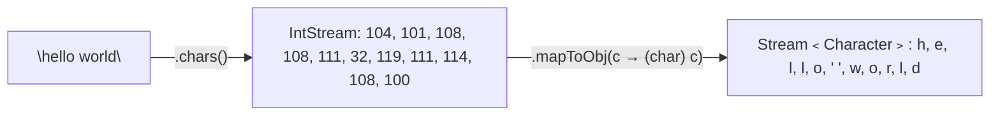
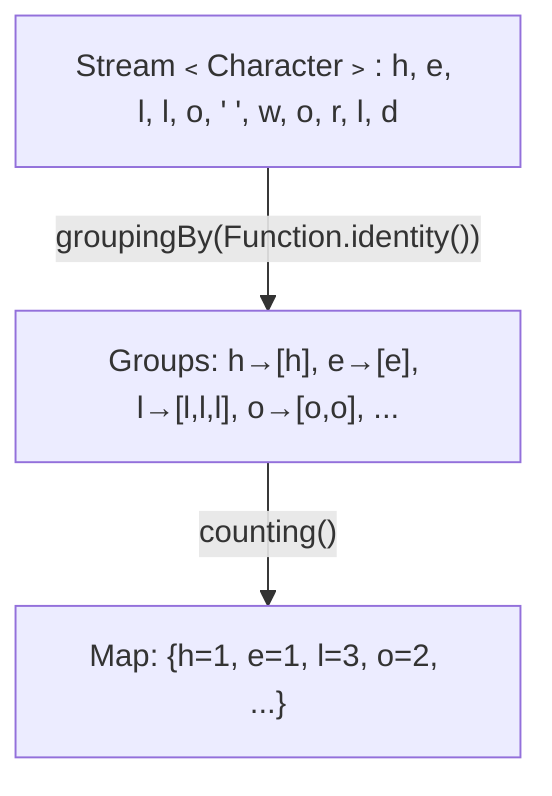

# 📘 Java Stream Program to Find the Frequency of Each Character in a Given String

---

## 📌 Introduction

### 🧠 What is this about?

Finding how many times each character appears in a string is a classic programming problem. In this note, we'll solve it elegantly using Java 8 Streams — specifically using `chars()`, `mapToObj()`, and `Collectors.groupingBy()` with `Collectors.counting()`.

### 🌍 Real-World Problem First

Imagine you're building a word game (like Scrabble) and you need to know how many of each letter the player has. Or you're analyzing text data and need character frequency distributions. Without Streams, you'd be manually iterating with loops and maintaining a `Map` yourself. Streams give us a clean, declarative pipeline to do this.

### ❓ Why does it matter?

- Character frequency is a foundation for **anagram detection**, **compression algorithms**, and **text analysis**
- This problem teaches you how to combine `groupingBy()` + `counting()` — a pattern used heavily in real-world data processing
- It demonstrates converting between primitive streams (`IntStream`) and object streams

### 🗺️ What we'll learn (Learning Map)

- How to convert a `String` into a stream of characters
- How `mapToObj()` bridges `IntStream` → `Stream<Character>`
- How `Collectors.groupingBy()` + `Collectors.counting()` groups and counts
- Complete solution with output
- Key Stream API techniques used

---

## 🧩 Problem Statement

**Given:** A string, e.g., `"hello world"`

**Find:** The frequency (count) of each character in the string.

**Expected Output:**
```
{ =1, r=1, d=1, e=1, w=1, h=1, l=3, o=2}
```

> The space character `' '` appears once, `'l'` appears three times, `'o'` appears twice, and so on.

---

## 🧩 Step-by-Step Approach

### Step 1 — Convert the String to a Stream of Characters

A `String` doesn't directly give you a `Stream<Character>`. Instead, `String.chars()` returns an `IntStream` where each element is the ASCII (Unicode code point) value of a character.



### Step 2 — Group Characters and Count Frequency

Once we have a `Stream<Character>`, we use `collect()` with `Collectors.groupingBy()` to group identical characters together, and `Collectors.counting()` to count how many are in each group.



### Step 3 — Print the Result

The result is a `Map<Character, Long>` where keys are characters and values are their counts.

---

## 🧩 Complete Code Solution

```java
import java.util.Map;
import java.util.function.Function;
import java.util.stream.Collectors;
import java.util.stream.IntStream;

public class CharacterFrequency {
    public static void main(String[] args) {
        String input = "hello world";

        // Step 1: Convert string to IntStream (ASCII values)
        // Step 2: Map ASCII values to Character objects
        // Step 3: Group by character and count occurrences
        Map<Character, Long> frequencyMap = input.chars()                         // IntStream of ASCII values
                .mapToObj(c -> (char) c)                                          // Stream<Character>
                .collect(Collectors.groupingBy(Function.identity(),               // Group by each character
                                              Collectors.counting()));            // Count occurrences

        System.out.println(frequencyMap);
        // Output: { =1, r=1, d=1, e=1, w=1, h=1, l=3, o=2}
    }
}
```

**Output:**
```
{ =1, r=1, d=1, e=1, w=1, h=1, l=3, o=2}
```

---

## 🧩 How Each Stream Operation Works

Let's break down the pipeline piece by piece:

| Operation | What It Does | Input → Output |
|-----------|-------------|----------------|
| `input.chars()` | Converts string to `IntStream` of ASCII values | `"hello"` → `IntStream[104, 101, 108, 108, 111]` |
| `.mapToObj(c -> (char) c)` | Casts each `int` to `char`, boxes into `Character` | `IntStream` → `Stream<Character>` |
| `Collectors.groupingBy(Function.identity())` | Groups elements by themselves (each character is its own key) | Characters → `Map<Character, List<Character>>` |
| `Collectors.counting()` | Counts elements in each group (downstream collector) | `List<Character>` → `Long` count |

**Why `Function.identity()`?** It returns each element as-is — meaning each character becomes its own grouping key. It's equivalent to writing `c -> c`, but more readable and idiomatic.

**Why `Long` and not `Integer`?** `Collectors.counting()` returns `Long` because it's designed to handle very large counts without overflow.

---

## 🧩 Verbose Version (Step-by-Step with Variables)

If you're learning, this expanded version makes each step visible:

```java
public class CharacterFrequencyVerbose {
    public static void main(String[] args) {
        String input = "hello world";

        // Step 1: Convert string to IntStream (ASCII values)
        IntStream asciiStream = input.chars();
        // asciiStream: 104, 101, 108, 108, 111, 32, 119, 111, 114, 108, 100

        // Step 2: Convert ASCII values to Character objects
        // mapToObj bridges IntStream → Stream<Character>
        java.util.stream.Stream<Character> charStream = asciiStream
                .mapToObj(c -> (char) c);
        // charStream: 'h', 'e', 'l', 'l', 'o', ' ', 'w', 'o', 'r', 'l', 'd'

        // Step 3: Group by character and count frequency
        Map<Character, Long> frequencyMap = charStream
                .collect(Collectors.groupingBy(
                        Function.identity(),    // key = the character itself
                        Collectors.counting()   // value = count of that character
                ));

        System.out.println(frequencyMap);
        // Output: { =1, r=1, d=1, e=1, w=1, h=1, l=3, o=2}
    }
}
```

---

## 🧩 Variation: Ignoring Spaces and Case

What if you want to count only letters, and treat uppercase/lowercase as the same?

```java
String input = "Hello World";

Map<Character, Long> frequencyMap = input.toLowerCase()         // "hello world"
        .chars()
        .mapToObj(c -> (char) c)
        .filter(c -> c != ' ')                                   // Skip spaces
        .collect(Collectors.groupingBy(Function.identity(), Collectors.counting()));

System.out.println(frequencyMap);
// Output: {r=1, d=1, e=1, w=1, h=1, l=3, o=2}
```

> 💡 **Pro Tip:** Always clarify requirements — should spaces count? Is it case-sensitive? These small details change the solution.

---

## ⚠️ Common Mistakes

**Mistake 1: Forgetting `mapToObj()` and trying to collect `IntStream` directly**

```java
// ❌ Won't compile — IntStream doesn't have collect(Collectors.groupingBy(...))
Map<Integer, Long> map = input.chars()
        .collect(Collectors.groupingBy(Function.identity(), Collectors.counting()));
```

**Why it breaks:** `IntStream` is a primitive stream. `Collectors.groupingBy()` works with `Stream<T>` (object streams), not `IntStream`. You must bridge from primitive to object with `mapToObj()`.

```java
// ✅ Bridge IntStream → Stream<Character> first
Map<Character, Long> map = input.chars()
        .mapToObj(c -> (char) c)  // Now it's Stream<Character>
        .collect(Collectors.groupingBy(Function.identity(), Collectors.counting()));
```

---

## 💡 Pro Tips

**Tip 1:** `groupingBy()` + `counting()` is the "GROUP BY ... COUNT(*)" of Java Streams
- Why it works: `groupingBy` partitions elements by a classifier function, `counting` is a downstream collector that counts per group
- When to use: Anytime you need frequency counts — words in a document, products by category, errors by type

**Tip 2:** Use `Collectors.toMap()` as an alternative approach
```java
Map<Character, Integer> freq = input.chars()
        .mapToObj(c -> (char) c)
        .collect(Collectors.toMap(
                c -> c,           // key = character
                c -> 1,           // initial value = 1
                Integer::sum));   // merge function: add counts for duplicates
// Same result, different approach
```

---

## ✅ Key Takeaways

→ `String.chars()` returns `IntStream` (ASCII values), not `Stream<Character>` — always use `mapToObj()` to bridge

→ `Collectors.groupingBy(Function.identity(), Collectors.counting())` is the standard pattern for frequency counting in Streams

→ `Function.identity()` means "use the element itself as the key" — cleaner than `c -> c`

→ This pattern generalizes to counting anything: word frequency, product categories, error codes — not just characters

---

## 🔗 What's Next?

Now that we've seen how to count character frequencies using `groupingBy` and `counting`, let's tackle another common Stream problem — finding the **maximum and minimum** values in a list using Stream operations like `max()` and `min()`.
