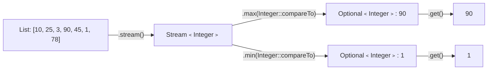

# 📘 Java Stream Program to Find the Maximum and Minimum Number in a List

---

## 📌 Introduction

### 🧠 What is this about?

Finding the largest and smallest numbers in a list is one of the most basic — yet important — operations in programming. With Java 8 Streams, we can do this in a single, elegant line using `max()` and `min()` with a `Comparator`.

### 🌍 Real-World Problem First

Imagine you're building a dashboard that shows the highest and lowest temperatures recorded in a week. Or you need to find the most expensive and cheapest product in an e-commerce catalog. Without Streams, you'd loop through the entire list maintaining two variables. Streams make this declarative and clean.

### ❓ Why does it matter?

- `max()` and `min()` are **terminal operations** that return `Optional` — understanding why they return `Optional` is crucial
- This pattern applies to any comparable data: prices, scores, dates, ages
- It teaches you how `Comparator.naturalOrder()` and `Integer::compareTo` work with Streams

### 🗺️ What we'll learn (Learning Map)

- How to find the maximum number using `stream().max()`
- How to find the minimum number using `stream().min()`
- Why these methods return `Optional<T>`
- Complete solution with output
- Method references as comparator shorthand

---

## 🧩 Problem Statement

**Given:** A list of integers, e.g., `[10, 25, 3, 90, 45, 1, 78]`

**Find:** The maximum and minimum numbers in the list.

**Expected Output:**
```
Maximum number: 90
Minimum number: 1
```

---

## 🧩 Step-by-Step Approach

### Step 1 — Convert List to Stream

```java
List<Integer> numbers = Arrays.asList(10, 25, 3, 90, 45, 1, 78);
Stream<Integer> stream = numbers.stream();
```

### Step 2 — Use `max()` with a Comparator

The `max()` method needs a `Comparator` to know how to compare elements. For integers, we can use `Integer::compareTo` or `Comparator.naturalOrder()`.

### Step 3 — Handle the `Optional` Result

`max()` and `min()` return `Optional<Integer>` because the stream could be empty. Use `.get()` (when you're sure the list isn't empty) or `.orElse()` for safety.



---

## 🧩 Complete Code Solution

```java
import java.util.Arrays;
import java.util.List;

public class MaxMinInList {
    public static void main(String[] args) {
        List<Integer> numbers = Arrays.asList(10, 25, 3, 90, 45, 1, 78);

        // Find the maximum number
        int max = numbers.stream()
                .max(Integer::compareTo)    // Compare integers naturally (ascending)
                .get();                      // Unwrap Optional → int

        // Find the minimum number
        int min = numbers.stream()
                .min(Integer::compareTo)    // Compare integers naturally (ascending)
                .get();                      // Unwrap Optional → int

        System.out.println("Maximum number: " + max);  // Output: Maximum number: 90
        System.out.println("Minimum number: " + min);   // Output: Minimum number: 1
    }
}
```

**Output:**
```
Maximum number: 90
Minimum number: 1
```

---

## 🧩 How `max()` and `min()` Work Internally

| Method | What It Does | Returns |
|--------|-------------|---------|
| `max(Comparator)` | Traverses the entire stream, keeping track of the largest element | `Optional<T>` |
| `min(Comparator)` | Traverses the entire stream, keeping track of the smallest element | `Optional<T>` |

**Why `Optional` and not just `Integer`?** Because the stream could be empty:

```java
List<Integer> empty = List.of();
Optional<Integer> result = empty.stream().max(Integer::compareTo);
System.out.println(result.isPresent());  // Output: false
```

If `max()` returned `int` directly, what would it return for an empty list? `0`? `-1`? There's no good default — so Java wraps the answer in `Optional` to force you to handle the "no result" case.

---

## 🧩 Alternative Comparator Styles

All three approaches below are equivalent:

```java
// Style 1: Method reference (most concise)
int max1 = numbers.stream().max(Integer::compareTo).get();

// Style 2: Comparator.naturalOrder() (most readable)
int max2 = numbers.stream().max(Comparator.naturalOrder()).get();

// Style 3: Lambda expression (most explicit)
int max3 = numbers.stream().max((a, b) -> a.compareTo(b)).get();

// All three produce: 90
```

> 💡 **Pro Tip:** `Integer::compareTo` is the most commonly used style in interviews and production code. It's concise and idiomatic.

---

## 🧩 Safer Approach with `orElse()`

```java
// ✅ Safe — provides a default if the list is empty
int max = numbers.stream()
        .max(Integer::compareTo)
        .orElse(0);  // Returns 0 if stream is empty

// ✅ Even safer — throw a meaningful exception
int max = numbers.stream()
        .max(Integer::compareTo)
        .orElseThrow(() -> new RuntimeException("List is empty!"));
```

---

## ⚠️ Common Mistakes

**Mistake 1: Calling `.get()` without checking if the Optional is present**

```java
// ❌ Dangerous — throws NoSuchElementException if stream is empty
int max = List.<Integer>of().stream().max(Integer::compareTo).get();
// Throws: java.util.NoSuchElementException: No value present
```

```java
// ✅ Safe — use orElse or orElseThrow
int max = List.<Integer>of().stream()
        .max(Integer::compareTo)
        .orElse(Integer.MIN_VALUE);  // Sensible default
```

**Mistake 2: Forgetting to pass a Comparator to `max()`/`min()`**

```java
// ❌ Won't compile — max() requires a Comparator
int max = numbers.stream().max().get();
```

```java
// ✅ Always provide a Comparator
int max = numbers.stream().max(Integer::compareTo).get();
```

---

## 💡 Pro Tips

**Tip 1:** For primitive lists, use `IntStream` to avoid boxing overhead
```java
int max = numbers.stream()
        .mapToInt(Integer::intValue)   // Stream<Integer> → IntStream
        .max()                          // No Comparator needed — IntStream.max() knows integers
        .orElse(0);
// IntStream.max() is more efficient — no autoboxing/unboxing
```

**Tip 2:** You can find both max and min in a single pass using `IntSummaryStatistics`
```java
IntSummaryStatistics stats = numbers.stream()
        .mapToInt(Integer::intValue)
        .summaryStatistics();

System.out.println("Max: " + stats.getMax());   // Output: Max: 90
System.out.println("Min: " + stats.getMin());   // Output: Min: 1
System.out.println("Avg: " + stats.getAverage()); // Bonus: average too!
```

---

## ✅ Key Takeaways

→ `stream().max(Integer::compareTo)` finds the maximum; `stream().min(Integer::compareTo)` finds the minimum

→ Both return `Optional<T>` — always handle the empty case with `orElse()` or `orElseThrow()`

→ For primitives, prefer `IntStream.max()` (no Comparator needed, no boxing overhead)

→ Use `summaryStatistics()` when you need max, min, average, and count — all in a single pass

---

## 🔗 What's Next?

Now that we can find the max and min, what if we need the **second largest** number? That's a trickier problem — we'll solve it next using `sorted()`, `skip()`, and `findFirst()`.
