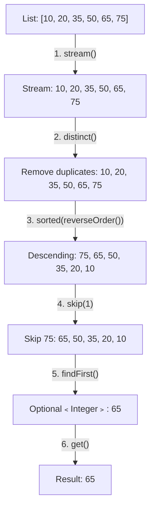

# 📘 Java Stream Program to Find the Second Largest Number in a List

---

## 📌 Introduction

### 🧠 What is this about?

Finding the second largest number in a list is a popular interview question. With Java 8 Streams, we solve it by chaining `distinct()`, `sorted()` in reverse, `skip(1)`, and `findFirst()` — a clean, readable pipeline that replaces messy loop-based logic.

### 🌍 Real-World Problem First

Imagine you're building a leaderboard and need to show the runner-up. Or you need the second-highest salary in a department for HR reporting. The naive approach of "find max, remove it, find max again" mutates data. Streams let us do it without touching the original list.

### ❓ Why does it matter?

- This problem demonstrates chaining **multiple intermediate operations** — a core Stream skill
- It teaches `skip()` and `findFirst()` — two operations you'll use in pagination and ranking
- The solution works for finding the **Nth largest** with a simple parameter change

### 🗺️ What we'll learn (Learning Map)

- How `distinct()` removes duplicates before sorting
- How `sorted(Comparator.reverseOrder())` sorts descending
- How `skip(1)` skips the first (largest) element
- How `findFirst()` grabs the second largest
- Complete solution with output

---

## 🧩 Problem Statement

**Given:** A list of integers, e.g., `[10, 20, 35, 50, 65, 75]`

**Find:** The second largest number in the list.

**Expected Output:**
```
Second largest number: 65
```

> 75 is the largest, so 65 is the second largest.

---

## 🧩 Step-by-Step Approach

Think of this as a process of elimination:



| Step | Operation | Purpose |
|------|-----------|---------|
| 1 | `stream()` | Convert list to stream |
| 2 | `distinct()` | Remove duplicates (so `[75, 75, 65]` doesn't give 75 as second largest) |
| 3 | `sorted(Comparator.reverseOrder())` | Sort descending — largest first |
| 4 | `skip(1)` | Skip the first element (the largest) |
| 5 | `findFirst()` | Get the next element (second largest) |
| 6 | `get()` | Unwrap from `Optional` |

**Why `distinct()` matters:** Without it, if the list is `[75, 75, 65, 50]`, after sorting descending you'd get `[75, 75, 65, 50]`. Skipping 1 would give you `75` again — not `65`! `distinct()` ensures each value appears only once.

---

## 🧩 Complete Code Solution

```java
import java.util.Arrays;
import java.util.Comparator;
import java.util.List;

public class SecondLargestNumber {
    public static void main(String[] args) {
        List<Integer> numbers = Arrays.asList(10, 20, 35, 50, 65, 75);

        int secondLargest = numbers.stream()
                .distinct()                             // Remove duplicates
                .sorted(Comparator.reverseOrder())      // Sort descending: 75, 65, 50, ...
                .skip(1)                                 // Skip the first (largest): 65, 50, ...
                .findFirst()                             // Get the second largest: 65
                .get();                                  // Unwrap Optional → int

        System.out.println("Second largest number: " + secondLargest);
        // Output: Second largest number: 65
    }
}
```

**Output:**
```
Second largest number: 65
```

---

## 🧩 Making It Generic: Find the Nth Largest

The beauty of this approach is that finding the Nth largest is a one-character change:

```java
// Find the 3rd largest number
int thirdLargest = numbers.stream()
        .distinct()
        .sorted(Comparator.reverseOrder())
        .skip(2)                     // skip(N-1) for Nth largest
        .findFirst()
        .get();

System.out.println("Third largest: " + thirdLargest);  // Output: Third largest: 50
```

> 💡 **Pattern:** For the Nth largest → `skip(N - 1)` then `findFirst()`

---

## 🧩 With Duplicates — Why `distinct()` Matters

```java
List<Integer> withDuplicates = Arrays.asList(75, 75, 65, 65, 50, 35);

// ❌ Without distinct() — WRONG result
int wrong = withDuplicates.stream()
        .sorted(Comparator.reverseOrder())  // [75, 75, 65, 65, 50, 35]
        .skip(1)                             // [75, 65, 65, 50, 35] ← still 75!
        .findFirst()
        .get();
System.out.println(wrong);  // Output: 75 ← NOT the second largest!

// ✅ With distinct() — CORRECT result
int correct = withDuplicates.stream()
        .distinct()                          // [75, 65, 50, 35]
        .sorted(Comparator.reverseOrder())   // [75, 65, 50, 35]
        .skip(1)                             // [65, 50, 35]
        .findFirst()
        .get();
System.out.println(correct);  // Output: 65 ✅
```

---

## ⚠️ Common Mistakes

**Mistake 1: Forgetting `distinct()` when the list has duplicates**
- 👤 What devs do: Skip `distinct()` assuming all values are unique
- 💥 What breaks: If the max appears twice, `skip(1)` still returns the max
- ✅ Fix: Always include `distinct()` for safety — it's a no-op when there are no duplicates

**Mistake 2: Using `sorted()` without reverse order**
```java
// ❌ This sorts ascending: 10, 20, 35, 50, 65, 75
// skip(1) gives 20 — that's the SECOND SMALLEST, not second largest!
int wrong = numbers.stream().sorted().skip(1).findFirst().get();
```

```java
// ✅ Use Comparator.reverseOrder() for descending
int correct = numbers.stream()
        .sorted(Comparator.reverseOrder())
        .skip(1).findFirst().get();
```

---

## 💡 Pro Tips

**Tip 1:** For better safety, handle the case where the list has fewer than 2 distinct elements
```java
Optional<Integer> secondLargest = numbers.stream()
        .distinct()
        .sorted(Comparator.reverseOrder())
        .skip(1)
        .findFirst();

secondLargest.ifPresentOrElse(
        val -> System.out.println("Second largest: " + val),
        () -> System.out.println("Not enough distinct elements!")
);
```

**Tip 2:** In interviews, mention the time complexity: this approach is **O(n log n)** due to sorting. An O(n) approach exists using two variables in a loop, but the Stream approach is cleaner and more readable.

---

## ✅ Key Takeaways

→ The pattern is: `distinct()` → `sorted(reverseOrder())` → `skip(N-1)` → `findFirst()`

→ Always use `distinct()` before finding Nth largest — duplicates can give wrong results

→ `skip(1)` + `findFirst()` is the Stream equivalent of "get the element at position 1 (0-indexed)"

→ This pattern generalizes: change `skip(N-1)` to find any Nth largest value

---

## 🔗 What's Next?

We've found max, min, and second largest. Next, let's explore a different kind of number problem — finding the **sum of all digits of a number** using Streams, which introduces string-to-stream conversion and `Character.getNumericValue()`.
