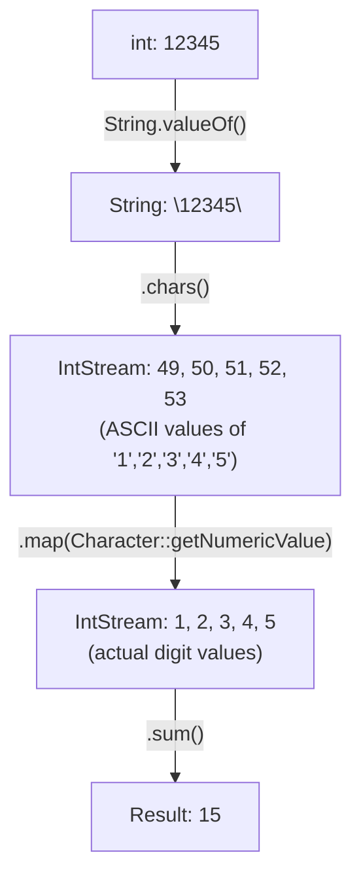

# 📘 Java Stream Program to Find the Sum of All Digits of a Number

---

## 📌 Introduction

### 🧠 What is this about?

Given a number like `12345`, we need to find the sum of its digits: `1 + 2 + 3 + 4 + 5 = 15`. Using Java 8 Streams, we'll convert the number to a string, get a stream of its characters, map each character to its numeric value, and sum them up.

### 🌍 Real-World Problem First

Digit sums appear in checksum validations (credit card numbers use the Luhn algorithm), digital root calculations, and number theory problems. While a simple loop works, the Stream approach is elegant and teaches important conversion techniques.

### ❓ Why does it matter?

- This problem teaches the **int → String → IntStream → numeric value** conversion chain
- You'll learn `String.valueOf()`, `chars()`, and `Character.getNumericValue()` — useful utilities
- It demonstrates method references replacing lambdas for cleaner code

### 🗺️ What we'll learn (Learning Map)

- How to convert an `int` to a `String` for Stream processing
- How `chars()` gives ASCII values (not actual digits)
- How `Character.getNumericValue()` converts ASCII to the real digit
- How `sum()` provides the final result
- Complete solution with refactoring steps

---

## 🧩 Problem Statement

**Given:** A number, e.g., `12345`

**Find:** The sum of all its digits: `1 + 2 + 3 + 4 + 5`

**Expected Output:**
```
Sum of digits: 15
```

---

## 🧩 Step-by-Step Approach

The key challenge: you can't iterate over the digits of an `int` directly. We convert it to a `String` first, then to a character stream.



**Why ASCII values?** When `chars()` processes the character `'1'`, it gives you `49` (the ASCII code for '1'), not `1`. That's why we need `Character.getNumericValue()` to convert `49` → `1`, `50` → `2`, etc.

---

## 🧩 Complete Code Solution

### Verbose Version (Learning-Friendly)

```java
import java.util.stream.IntStream;

public class SumOfDigits {
    public static void main(String[] args) {
        int input = 12345;

        // Step 1: Convert int to String
        String str = String.valueOf(input);   // "12345"

        // Step 2: Convert String to IntStream (ASCII values)
        IntStream stream = str.chars();        // IntStream: 49, 50, 51, 52, 53

        // Step 3: Map ASCII values to actual numeric values
        IntStream digitStream = stream.map(Character::getNumericValue);
        // IntStream: 1, 2, 3, 4, 5

        // Step 4: Sum all digits
        int sum = digitStream.sum();           // 15

        System.out.println("Sum of digits: " + sum);
        // Output: Sum of digits: 15
    }
}
```

### Compact Version (One-Liner)

```java
public class SumOfDigitsCompact {
    public static void main(String[] args) {
        int input = 12345;

        int sum = String.valueOf(input)              // "12345"
                .chars()                              // IntStream of ASCII values
                .map(Character::getNumericValue)       // IntStream of digit values
                .sum();                                // 15

        System.out.println("Sum of digits: " + sum);
        // Output: Sum of digits: 15
    }
}
```

**Output:**
```
Sum of digits: 15
```

---

## 🧩 How Each Operation Works

| Operation | Input | Output | Why? |
|-----------|-------|--------|------|
| `String.valueOf(12345)` | `int 12345` | `String "12345"` | Streams work on sequences — need string to iterate over digits |
| `.chars()` | `"12345"` | `IntStream [49, 50, 51, 52, 53]` | Returns ASCII/Unicode code points of each character |
| `.map(Character::getNumericValue)` | `IntStream [49, 50, 51, 52, 53]` | `IntStream [1, 2, 3, 4, 5]` | Converts ASCII code → actual digit value |
| `.sum()` | `IntStream [1, 2, 3, 4, 5]` | `int 15` | Terminal operation — adds all values |

**Why `Character.getNumericValue()` and not just `c - '0'`?**

Both work for digits 0-9:
```java
// Approach 1: Character.getNumericValue()
.map(Character::getNumericValue)  // 49 → 1, 50 → 2, etc.

// Approach 2: Subtract ASCII offset
.map(c -> c - '0')               // 49 - 48 = 1, 50 - 48 = 2, etc.
```

`Character.getNumericValue()` is more robust — it also handles Unicode digits from other scripts (Arabic, Devanagari, etc.). For simple cases, `c - '0'` works fine too.

---

## 🧩 Lambda vs Method Reference

The transcript shows the progression from lambda to method reference:

```java
// Lambda version — explicit but verbose
.map(c -> Character.getNumericValue(c))

// Method reference — clean and idiomatic
.map(Character::getNumericValue)
```

> 💡 When a lambda just calls a single method with the same parameter, replace it with a method reference. `c -> Character.getNumericValue(c)` becomes `Character::getNumericValue`.

---

## ⚠️ Common Mistakes

**Mistake 1: Using `chars()` values directly as digits**

```java
// ❌ Wrong — chars() gives ASCII values, not digit values!
int wrongSum = String.valueOf(12345)
        .chars()
        .sum();
System.out.println(wrongSum);  // Output: 255 (= 49+50+51+52+53, NOT 15!)
```

```java
// ✅ Correct — map ASCII to numeric value first
int correctSum = String.valueOf(12345)
        .chars()
        .map(Character::getNumericValue)
        .sum();
System.out.println(correctSum);  // Output: 15 ✅
```

**Why:** `chars()` gives you `49` for `'1'`, `50` for `'2'`, etc. Summing ASCII values gives `255`, which is meaningless. You must map to numeric values first.

---

## 💡 Pro Tips

**Tip 1:** This also works for large numbers using `long`
```java
long bigNumber = 9_876_543_210L;
int sum = String.valueOf(bigNumber)
        .chars()
        .map(Character::getNumericValue)
        .sum();
System.out.println(sum);  // Output: 45
```

**Tip 2:** You can even do this in a single `System.out.println` call
```java
System.out.println(String.valueOf(12345).chars().map(Character::getNumericValue).sum());
// Output: 15
```

This is the ultimate one-liner, but readability suffers — use multi-line format in production code.

---

## ✅ Key Takeaways

→ Convert `int` → `String` → `IntStream` (via `chars()`) to process individual digits

→ `String.chars()` returns ASCII values, **not** the actual digits — always `map()` to numeric values

→ `Character::getNumericValue` is the method reference for converting ASCII code points to digit values

→ The `sum()` terminal operation on `IntStream` adds all elements efficiently without boxing

---

## 🔗 What's Next?

Now that we've processed individual digits of a number, let's work with lists again — next we'll learn how to **filter even numbers from a list** using `stream().filter()` and the `Predicate` functional interface.
