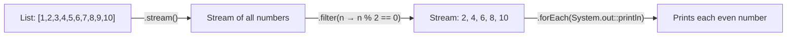

# 📘 Java Stream Program to Print Even Numbers from a List

---

## 📌 Introduction

### 🧠 What is this about?

Filtering even numbers from a list is the classic example of `stream().filter()`. It's the simplest and most common Stream operation — and a must-know for interviews. We use the `Predicate` functional interface with a modulo condition to keep only even numbers.

### 🌍 Real-World Problem First

Think of filtering as a sieve — you pour data through a condition, and only matching elements pass through. You might filter active users, in-stock products, or valid transactions. Even number filtering teaches the exact same `filter()` mechanics you'd use for those real scenarios.

### ❓ Why does it matter?

- `filter()` is arguably the **most-used** intermediate operation in the Stream API
- Understanding `Predicate` (the functional interface behind `filter`) is essential for Java 8+
- This problem demonstrates the `stream → filter → forEach` pipeline pattern

### 🗺️ What we'll learn (Learning Map)

- How `filter()` works with a `Predicate`
- The lambda expression for the even-number condition
- How `forEach()` prints the results
- Complete solution with output

---

## 🧩 Problem Statement

**Given:** A list of integers, e.g., `[1, 2, 3, 4, 5, 6, 7, 8, 9, 10]`

**Print:** Only the even numbers from the list.

**Expected Output:**
```
2
4
6
8
10
```

---

## 🧩 Step-by-Step Approach



| Step | Operation | What it does |
|------|-----------|-------------|
| 1 | `stream()` | Converts the list into a `Stream<Integer>` |
| 2 | `filter(n -> n % 2 == 0)` | Keeps only elements where the condition is `true` (even numbers) |
| 3 | `forEach(System.out::println)` | Prints each surviving element to the console |

---

## 🧩 Complete Code Solution

```java
import java.util.Arrays;
import java.util.List;

public class PrintEvenNumbers {
    public static void main(String[] args) {
        List<Integer> numbers = Arrays.asList(1, 2, 3, 4, 5, 6, 7, 8, 9, 10);

        numbers.stream()
                .filter(num -> num % 2 == 0)         // Keep only even numbers
                .forEach(System.out::println);         // Print each one
    }
}
```

**Output:**
```
2
4
6
8
10
```

---

## 🧩 Understanding the `filter()` + `Predicate` Connection

`filter()` takes a `Predicate<T>` — a functional interface with one method: `boolean test(T t)`.

```java
// What the lambda expands to internally:
Predicate<Integer> isEven = new Predicate<Integer>() {
    @Override
    public boolean test(Integer num) {
        return num % 2 == 0;    // true → keep, false → discard
    }
};

numbers.stream()
        .filter(isEven)
        .forEach(System.out::println);
```

Think of `Predicate` as a **gatekeeper**: every element in the stream must pass through it. If `test()` returns `true`, the element continues downstream. If `false`, it's dropped.

```
Stream: 1, 2, 3, 4, 5, 6, 7, 8, 9, 10
         ↓
Predicate: num % 2 == 0
         ↓
    1 → false → ❌ dropped
    2 → true  → ✅ passes
    3 → false → ❌ dropped
    4 → true  → ✅ passes
    ...
         ↓
Filtered: 2, 4, 6, 8, 10
```

---

## 🧩 Lambda Simplification Steps

The transcript walks through simplifying the lambda step by step:

```java
// Step 1: Full lambda with braces and return
.filter((Integer num) -> { return num % 2 == 0; })

// Step 2: Remove type (Java infers it)
.filter((num) -> { return num % 2 == 0; })

// Step 3: Single statement — remove braces and return
.filter((num) -> num % 2 == 0)

// Step 4: Single parameter — remove parentheses
.filter(num -> num % 2 == 0)
```

Each simplification is valid because:
- **Type inference**: Java knows `num` is `Integer` from the `Stream<Integer>`
- **Single expression**: When the body is a single expression, the result is implicitly returned
- **Single parameter**: Parentheses are optional for single-parameter lambdas

---

## 🧩 Collecting Results into a List (Instead of Printing)

Often you want to collect the filtered numbers, not just print them:

```java
List<Integer> evenNumbers = numbers.stream()
        .filter(num -> num % 2 == 0)
        .toList();                        // Java 16+ shorthand

System.out.println(evenNumbers);
// Output: [2, 4, 6, 8, 10]
```

Or for earlier Java versions:
```java
List<Integer> evenNumbers = numbers.stream()
        .filter(num -> num % 2 == 0)
        .collect(Collectors.toList());     // Java 8+
```

---

## ⚠️ Common Mistakes

**Mistake 1: Using `==` for odd number check instead of modulo**

```java
// ❌ This doesn't work for negative numbers!
.filter(num -> num % 2 == 1)    // -3 % 2 = -1, not 1!

// ✅ Use != 0 instead for odd numbers
.filter(num -> num % 2 != 0)
```

**Why:** In Java, the modulo operator `%` preserves the sign of the dividend. `-3 % 2` gives `-1`, not `1`. So `num % 2 == 1` misses negative odd numbers. `num % 2 != 0` is always correct.

---

## 💡 Pro Tips

**Tip 1:** Store complex predicates in variables for readability
```java
Predicate<Integer> isEven = num -> num % 2 == 0;
Predicate<Integer> isPositive = num -> num > 0;

// Combine predicates!
numbers.stream()
        .filter(isEven.and(isPositive))   // Even AND positive
        .forEach(System.out::println);
```

**Tip 2:** `forEach` is a terminal operation — nothing happens until it's called
```java
// ❌ This does NOTHING — no terminal operation!
numbers.stream().filter(num -> num % 2 == 0);

// ✅ Need a terminal operation to trigger the pipeline
numbers.stream().filter(num -> num % 2 == 0).forEach(System.out::println);
```

---

## ✅ Key Takeaways

→ `filter(predicate)` keeps elements where the predicate returns `true` and drops the rest

→ `num % 2 == 0` is the standard even-number check — works for positive and negative numbers

→ `forEach(System.out::println)` is the quickest way to print stream elements

→ `filter()` is lazy — it does nothing until a terminal operation (`forEach`, `collect`, `count`) triggers the pipeline

→ This `stream → filter → forEach/collect` pattern is the bread and butter of Stream programming

---

## 🔗 What's Next?

Now that we know how to filter elements, let's learn how to **remove duplicates** from a list using the `distinct()` operation — another commonly asked Stream interview problem.
