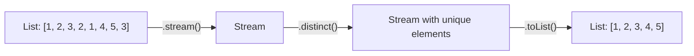

# 📘 Java Stream Program to Remove Duplicate Elements from a List

---

## 📌 Introduction

### 🧠 What is this about?

Removing duplicates from a list is a fundamental data cleaning operation. Java 8 Streams provide the `distinct()` method — a single intermediate operation that eliminates duplicate elements, just like the `DISTINCT` keyword in SQL.

### 🌍 Real-World Problem First

You're importing customer emails from a CSV file, and some entries appear multiple times. Or you're merging product lists from two suppliers and duplicates crept in. Before Streams, you'd convert to a `Set` and back to a `List`, or loop manually. `distinct()` does this inline within your pipeline.

### ❓ Why does it matter?

- `distinct()` is the Stream equivalent of SQL's `SELECT DISTINCT`
- It uses `equals()` internally — understanding this helps avoid subtle bugs with custom objects
- This is one of the most commonly asked Stream problems in interviews

### 🗺️ What we'll learn (Learning Map)

- How `distinct()` removes duplicates from both integer and string lists
- How `distinct()` uses `equals()` and `hashCode()` internally
- How to collect results back into a list with `toList()`
- Complete solution for both integer and string lists

---

## 🧩 Problem Statement

**Given:**
- A list of integers: `[1, 2, 3, 2, 1, 4, 5, 3]`
- A list of strings: `["apple", "orange", "banana", "apple"]`

**Remove:** All duplicate elements, keeping only unique values.

**Expected Output:**
```
Integers: [1, 2, 3, 4, 5]
Strings:  [apple, orange, banana]
```

---

## 🧩 Step-by-Step Approach



The pipeline is simple — three steps:
1. **Convert** list to stream
2. **Apply** `distinct()` to eliminate duplicates
3. **Collect** back into a list

---

## 🧩 Complete Code Solution

### Removing Duplicates from a List of Integers

```java
import java.util.Arrays;
import java.util.List;
import java.util.stream.Collectors;

public class RemoveDuplicates {
    public static void main(String[] args) {
        List<Integer> numbers = Arrays.asList(1, 2, 3, 2, 1, 4, 5, 3);

        List<Integer> uniqueNumbers = numbers.stream()
                .distinct()                    // Remove duplicates
                .collect(Collectors.toList());  // Collect back to list

        System.out.println(uniqueNumbers);
        // Output: [1, 2, 3, 4, 5]
    }
}
```

### Removing Duplicates from a List of Strings

```java
List<String> fruits = Arrays.asList("apple", "orange", "banana", "apple");

List<String> uniqueFruits = fruits.stream()
        .distinct()                        // Remove duplicate strings
        .collect(Collectors.toList());      // Collect back to list

System.out.println(uniqueFruits);
// Output: [apple, orange, banana]
```

---

## 🧩 How `distinct()` Works Internally

`distinct()` uses `equals()` and `hashCode()` to determine duplicates — the same mechanism as `HashSet`:

```
Stream input: 1, 2, 3, 2, 1, 4, 5, 3

Internal tracking (like a HashSet):
  Seen: {}
  
  1 → not in set → KEEP → Seen: {1}
  2 → not in set → KEEP → Seen: {1, 2}
  3 → not in set → KEEP → Seen: {1, 2, 3}
  2 → already in set → SKIP
  1 → already in set → SKIP
  4 → not in set → KEEP → Seen: {1, 2, 3, 4}
  5 → not in set → KEEP → Seen: {1, 2, 3, 4, 5}
  3 → already in set → SKIP

Output: 1, 2, 3, 4, 5
```

**Key insight:** `distinct()` preserves the **encounter order** — the first occurrence of each element is kept, duplicates are dropped. That's why the output is `[1, 2, 3, 4, 5]` and not sorted.

---

## 🧩 For Custom Objects: Override `equals()` and `hashCode()`

If you use `distinct()` on a list of custom objects (like `Employee`), you **must** override `equals()` and `hashCode()` — otherwise `distinct()` compares memory addresses, not field values:

```java
// ❌ Without overriding equals/hashCode — distinct() won't work properly!
class Employee {
    String name;
    int age;
    // No equals/hashCode overridden
}

List<Employee> employees = List.of(
    new Employee("Alice", 30),
    new Employee("Alice", 30)  // Same data, different object
);

long count = employees.stream().distinct().count();
System.out.println(count);  // Output: 2 ← Both kept! distinct() thinks they're different

// ✅ With equals/hashCode overridden — distinct() works correctly
// (add @Override equals() and hashCode() based on name + age)
// count would be 1
```

---

## ⚠️ Common Mistakes

**Mistake 1: Expecting `distinct()` to work on custom objects without `equals()`/`hashCode()`**
- 👤 What devs do: Call `distinct()` on a list of custom objects
- 💥 What breaks: All objects are kept because default `equals()` compares references, not values
- ✅ Fix: Override `equals()` and `hashCode()` in your class (or use records in Java 16+)

**Mistake 2: Assuming `distinct()` sorts the result**
```java
List<Integer> nums = Arrays.asList(5, 3, 1, 3, 5);
System.out.println(nums.stream().distinct().toList());
// Output: [5, 3, 1] — NOT [1, 3, 5]!
```
`distinct()` only removes duplicates — it does NOT sort. Add `.sorted()` if you need sorted output.

---

## 💡 Pro Tips

**Tip 1:** Use `toSet()` if you don't need order — it's semantically clearer
```java
Set<Integer> uniqueSet = numbers.stream()
        .collect(Collectors.toSet());
// A Set inherently has no duplicates — no distinct() needed!
```

**Tip 2:** For case-insensitive string deduplication, normalize first
```java
List<String> mixed = Arrays.asList("Apple", "apple", "APPLE", "Banana");

List<String> unique = mixed.stream()
        .map(String::toLowerCase)     // Normalize to lowercase
        .distinct()                    // Now "apple" appears once
        .collect(Collectors.toList());

System.out.println(unique);  // Output: [apple, banana]
```

---

## ✅ Key Takeaways

→ `distinct()` removes duplicate elements from a stream using `equals()` and `hashCode()`

→ It preserves encounter order — the first occurrence is kept, subsequent duplicates are dropped

→ Works out-of-the-box for `String`, `Integer`, and other standard types that already override `equals()`

→ For custom objects, you **must** override `equals()` and `hashCode()` for `distinct()` to work correctly

→ `distinct()` does not sort — add `sorted()` explicitly if ordering is needed

---

## 🔗 What's Next?

Now that we can remove duplicates and filter data, let's solve another common problem — finding the **average** of a list of numbers using Stream's `mapToInt()` and `average()`.
