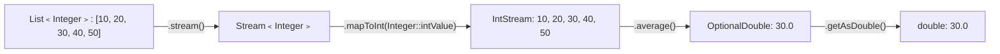

# 📘 Java Stream Program to Find the Average of a Given List of Numbers

---

## 📌 Introduction

### 🧠 What is this about?

Calculating the average of a list of numbers is a fundamental statistical operation. Java 8 Streams provide two elegant approaches: using `mapToInt().average()` for a direct result, or `Collectors.averagingInt()` as a collector. Both return `OptionalDouble` to handle empty lists safely.

### 🌍 Real-World Problem First

You're building a course platform and need to show the average rating for each course. Or you're analyzing sensor data and need the average temperature per hour. Without Streams, you'd sum all values and divide by count manually. Streams give you `average()` as a built-in terminal operation.

### ❓ Why does it matter?

- `average()` is a **specialized terminal operation** available on `IntStream`, `LongStream`, and `DoubleStream`
- Understanding `mapToInt()` — the bridge from `Stream<Integer>` to `IntStream` — is key for numeric operations
- This teaches the difference between `OptionalDouble` and `Optional<Double>`

### 🗺️ What we'll learn (Learning Map)

- How `mapToInt()` converts `Stream<Integer>` to `IntStream`
- How `average()` computes the mean and returns `OptionalDouble`
- Alternative approaches using `Collectors.averagingInt()`
- Complete solution with output

---

## 🧩 Problem Statement

**Given:** A list of numbers, e.g., `[10, 20, 30, 40, 50]`

**Find:** The average of all numbers in the list.

**Expected Output:**
```
Average: 30.0
```

---

## 🧩 Step-by-Step Approach



| Step | Operation | Purpose |
|------|-----------|---------|
| 1 | `stream()` | Convert list to `Stream<Integer>` |
| 2 | `mapToInt(Integer::intValue)` | Unbox `Integer` → `int`, creating `IntStream` |
| 3 | `average()` | Calculate the mean of all values |
| 4 | `getAsDouble()` | Extract the `double` result from `OptionalDouble` |

**Why `mapToInt()` first?** The `average()` method exists on `IntStream`, not on `Stream<Integer>`. We need to convert from boxed to primitive stream to access numeric operations like `average()`, `sum()`, `min()`, and `max()`.

---

## 🧩 Complete Code Solution

### Approach 1: Using `mapToInt().average()`

```java
import java.util.Arrays;
import java.util.List;

public class AverageOfNumbers {
    public static void main(String[] args) {
        List<Integer> numbers = Arrays.asList(10, 20, 30, 40, 50);

        double average = numbers.stream()
                .mapToInt(Integer::intValue)     // Stream<Integer> → IntStream
                .average()                        // OptionalDouble
                .getAsDouble();                   // double

        System.out.println("Average: " + average);
        // Output: Average: 30.0
    }
}
```

### Approach 2: Using `Collectors.averagingInt()`

```java
import java.util.stream.Collectors;

double average = numbers.stream()
        .collect(Collectors.averagingInt(Integer::intValue));

System.out.println("Average: " + average);
// Output: Average: 30.0
```

**Difference:** `mapToInt().average()` returns `OptionalDouble` (handles empty lists). `Collectors.averagingInt()` returns `Double` directly (returns `0.0` for empty lists).

---

## 🧩 Safe Handling for Empty Lists

```java
List<Integer> emptyList = List.of();

// ❌ Dangerous — throws NoSuchElementException on empty list
double avg = emptyList.stream()
        .mapToInt(Integer::intValue)
        .average()
        .getAsDouble();  // BOOM! NoSuchElementException

// ✅ Safe — provide a default value
double avg = emptyList.stream()
        .mapToInt(Integer::intValue)
        .average()
        .orElse(0.0);    // Returns 0.0 if empty
System.out.println(avg);  // Output: 0.0
```

---

## 🧩 Bonus: Get Average Along with Other Statistics

If you need average, sum, min, max, and count — use `summaryStatistics()`:

```java
IntSummaryStatistics stats = numbers.stream()
        .mapToInt(Integer::intValue)
        .summaryStatistics();

System.out.println("Average: " + stats.getAverage());  // 30.0
System.out.println("Sum: " + stats.getSum());           // 150
System.out.println("Count: " + stats.getCount());       // 5
System.out.println("Min: " + stats.getMin());           // 10
System.out.println("Max: " + stats.getMax());           // 50
```

> 💡 **Pro Tip:** `summaryStatistics()` does a **single pass** over the data, computing all five statistics at once. Much more efficient than calling `average()`, `sum()`, `min()`, `max()` separately (which would each iterate the entire stream).

---

## ⚠️ Common Mistakes

**Mistake 1: Calling `average()` on `Stream<Integer>` directly**

```java
// ❌ Won't compile — Stream<Integer> doesn't have average()
double avg = numbers.stream().average();
```

```java
// ✅ Convert to IntStream first
double avg = numbers.stream()
        .mapToInt(Integer::intValue)
        .average()
        .orElse(0.0);
```

**Why:** `average()` is a specialized method on `IntStream`/`LongStream`/`DoubleStream` only. `Stream<Integer>` is an object stream that doesn't have numeric-specific operations.

**Mistake 2: Forgetting `Integer::intValue` in `mapToInt`**

```java
// ❌ Won't compile — mapToInt needs a ToIntFunction
numbers.stream().mapToInt(n -> n); // Works, but auto-unboxing

// ✅ Clean method reference
numbers.stream().mapToInt(Integer::intValue);
```

---

## 💡 Pro Tips

**Tip 1:** For `List<Double>`, use `mapToDouble()` instead of `mapToInt()`
```java
List<Double> prices = Arrays.asList(9.99, 19.99, 29.99);
double avgPrice = prices.stream()
        .mapToDouble(Double::doubleValue)
        .average()
        .orElse(0.0);
// Output: 19.99
```

**Tip 2:** `Collectors.averagingDouble()` is available for precision-sensitive calculations
```java
double avg = numbers.stream()
        .collect(Collectors.averagingDouble(Integer::doubleValue));
```

---

## ✅ Key Takeaways

→ Use `mapToInt(Integer::intValue).average()` for the standard averaging pattern

→ `average()` returns `OptionalDouble` — use `orElse(0.0)` for safe handling of empty lists

→ `Collectors.averagingInt()` is an alternative that returns `Double` directly (0.0 for empty lists)

→ Use `summaryStatistics()` when you need average + sum + min + max + count in one pass

→ Remember: `average()` exists only on primitive streams (`IntStream`, `LongStream`, `DoubleStream`), not on `Stream<T>`

---

## 🔗 What's Next?

We've covered numeric aggregation operations. Next, let's work with strings — we'll learn how to **reverse each word in a string** using Streams, `StringBuilder`, and `Collectors.joining()`.
