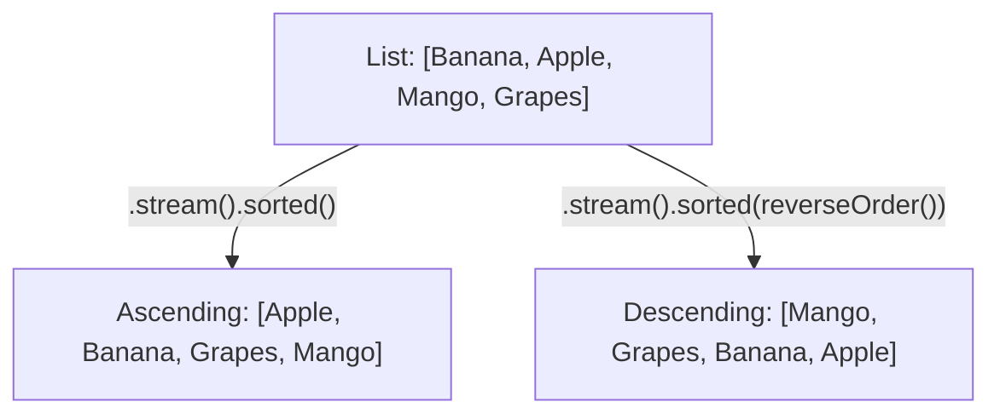

# 📘 Java Stream Program to Sort a List of Strings in Ascending & Descending Order

---

## 📌 Introduction

### 🧠 What is this about?

Sorting data is one of the most common operations in programming. Java 8 Streams provide the `sorted()` method — an intermediate operation that can sort elements in natural order (ascending) or custom order (descending) using a `Comparator`.

### 🌍 Real-World Problem First

You're building a product catalog and need to display items alphabetically. Or you want to show the most recent orders first (descending by date). The `sorted()` method gives you both directions — ascending and descending — without mutating the original list.

### ❓ Why does it matter?

- `sorted()` is an **intermediate operation** — it returns a new sorted stream without modifying the source list
- Understanding `Comparator.naturalOrder()` vs `Comparator.reverseOrder()` is essential for interviews
- This pattern works for strings, numbers, dates, and custom objects

### 🗺️ What we'll learn (Learning Map)

- How `sorted()` works for ascending order (natural order)
- How `sorted(Comparator.reverseOrder())` works for descending order
- The difference between the two overloaded `sorted()` methods
- Complete solutions with output

---

## 🧩 Problem Statement

**Given:** A list of strings, e.g., `["Banana", "Apple", "Mango", "Grapes"]`

**Sort:**
- In **ascending** (alphabetical) order: `[Apple, Banana, Grapes, Mango]`
- In **descending** (reverse alphabetical) order: `[Mango, Grapes, Banana, Apple]`

---

## 🧩 Step-by-Step Approach



---

## 🧩 Complete Code Solution

### Ascending Order (Natural / Alphabetical)

```java
import java.util.Arrays;
import java.util.List;
import java.util.stream.Collectors;

public class SortStrings {
    public static void main(String[] args) {
        List<String> fruits = Arrays.asList("Banana", "Apple", "Mango", "Grapes");

        // Sort in ascending (alphabetical) order
        List<String> ascending = fruits.stream()
                .sorted()                              // Natural order: A → Z
                .collect(Collectors.toList());

        System.out.println("Ascending: " + ascending);
        // Output: Ascending: [Apple, Banana, Grapes, Mango]
    }
}
```

### Descending Order (Reverse Alphabetical)

```java
import java.util.Comparator;

// Sort in descending (reverse alphabetical) order
List<String> descending = fruits.stream()
        .sorted(Comparator.reverseOrder())     // Reverse order: Z → A
        .collect(Collectors.toList());

System.out.println("Descending: " + descending);
// Output: Descending: [Mango, Grapes, Banana, Apple]
```

---

## 🧩 The Two `sorted()` Overloads

| Method | Behavior | Use Case |
|--------|----------|----------|
| `sorted()` | Sorts by **natural order** (Comparable) | Strings → alphabetical, Integers → numeric ascending |
| `sorted(Comparator)` | Sorts by the **given comparator** | Custom order, descending, multi-field sorting |

**What is "natural order"?**

Natural order is defined by the `Comparable` interface that the element type implements:
- `String` → alphabetical (lexicographic) order: `"Apple"` < `"Banana"` < `"Mango"`
- `Integer` → numeric order: `1` < `2` < `3`
- `LocalDate` → chronological order: earlier dates come first

```java
// For Integers:
List<Integer> nums = Arrays.asList(5, 1, 3, 2, 4);

nums.stream().sorted().toList();                            // [1, 2, 3, 4, 5]
nums.stream().sorted(Comparator.reverseOrder()).toList();   // [5, 4, 3, 2, 1]
```

---

## 🧩 Case-Sensitive vs Case-Insensitive Sorting

Be aware — `sorted()` is **case-sensitive** by default:

```java
List<String> words = Arrays.asList("banana", "Apple", "mango", "Grapes");

// Default sorted() — uppercase letters come BEFORE lowercase (ASCII order)
System.out.println(words.stream().sorted().toList());
// Output: [Apple, Grapes, banana, mango]
// "A" (65) < "G" (71) < "b" (98) < "m" (109) in ASCII

// Case-insensitive sort
System.out.println(words.stream()
        .sorted(String.CASE_INSENSITIVE_ORDER)
        .toList());
// Output: [Apple, banana, Grapes, mango]
```

**Why?** In ASCII/Unicode, uppercase letters (A=65, Z=90) have lower values than lowercase letters (a=97, z=122). So `"Apple"` < `"banana"` in natural order, even though logically 'b' comes after 'a'.

---

## 🧩 Important: `sorted()` Doesn't Modify the Original List

```java
List<String> fruits = new ArrayList<>(Arrays.asList("Banana", "Apple", "Mango"));

List<String> sorted = fruits.stream()
        .sorted()
        .collect(Collectors.toList());

System.out.println("Sorted:   " + sorted);   // [Apple, Banana, Mango]
System.out.println("Original: " + fruits);     // [Banana, Apple, Mango] ← unchanged!
```

Streams create a **new** sorted view — the source list remains untouched. This is one of the key advantages over `Collections.sort()`, which mutates the list in place.

---

## ⚠️ Common Mistakes

**Mistake 1: Assuming `sorted()` modifies the original list**
- 👤 What devs do: Call `stream().sorted()` and expect the original list to be sorted
- 💥 What breaks: The original list is unchanged — the sorted result is in the new stream
- ✅ Fix: Capture the result: `List<String> sorted = stream.sorted().collect(toList());`

**Mistake 2: Using `sorted()` for descending and expecting reverse order**
```java
// ❌ sorted() alone is ALWAYS ascending
List<String> wrong = fruits.stream().sorted().collect(Collectors.toList());
// This is ascending! [Apple, Banana, Grapes, Mango]
```

```java
// ✅ Use Comparator.reverseOrder() for descending
List<String> descending = fruits.stream()
        .sorted(Comparator.reverseOrder())
        .collect(Collectors.toList());
```

---

## 💡 Pro Tips

**Tip 1:** For numeric strings, natural order may surprise you
```java
List<String> nums = Arrays.asList("10", "2", "1", "20");
System.out.println(nums.stream().sorted().toList());
// Output: [1, 10, 2, 20] ← lexicographic, NOT numeric!

// ✅ Parse to int for numeric sorting
System.out.println(nums.stream()
        .sorted(Comparator.comparingInt(Integer::parseInt))
        .toList());
// Output: [1, 2, 10, 20]
```

**Tip 2:** Chain `sorted()` with other operations for powerful pipelines
```java
// Sort fruits alphabetically, then take the first 3
List<String> topThree = fruits.stream()
        .sorted()
        .limit(3)
        .collect(Collectors.toList());
// Output: [Apple, Banana, Grapes]
```

---

## ✅ Key Takeaways

→ `sorted()` sorts in natural (ascending) order — alphabetical for strings, numeric for integers

→ `sorted(Comparator.reverseOrder())` sorts in descending order

→ `sorted()` is an intermediate operation — it returns a new stream and doesn't modify the original list

→ Sorting is case-sensitive by default — use `String.CASE_INSENSITIVE_ORDER` for case-insensitive sorting

→ For custom objects, pass a `Comparator` like `Comparator.comparing(Employee::getSalary)`

---

## 🔗 What's Next?

Now that we can sort and filter, let's combine both in a fun problem — finding the **square of the first three even numbers** using `filter()`, `limit()`, and `map()` together.
