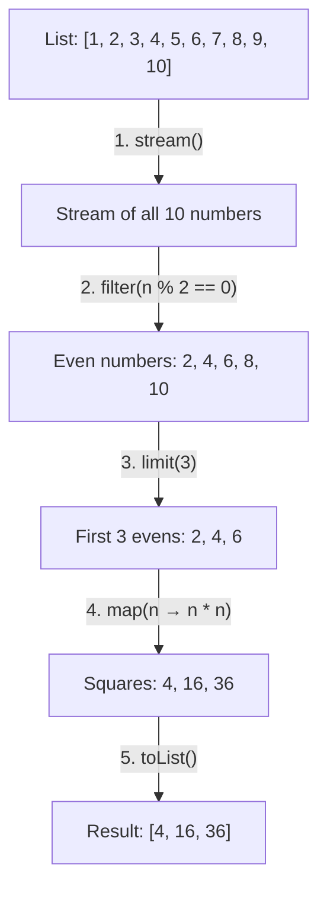
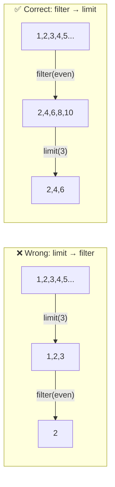

# 📘 Java Stream Program to Find the Square of the First Three Even Numbers

---

## 📌 Introduction

### 🧠 What is this about?

This problem combines three key Stream operations in one pipeline: `filter()` to select even numbers, `limit()` to take only the first three, and `map()` to calculate their squares. It's a perfect example of how Stream operations chain together to solve multi-step problems elegantly.

### 🌍 Real-World Problem First

Think of this as building a query: "From all products, find the top 3 on sale, and calculate their discounted prices." The pattern is the same: filter → limit → transform. Understanding this composite pattern is crucial for real-world data processing.

### ❓ Why does it matter?

- This demonstrates the **filter → limit → map → collect** pipeline — a very common pattern
- `limit()` is the Stream equivalent of SQL's `LIMIT` — essential for pagination and top-N queries
- Combining intermediate operations shows the real power of Streams

### 🗺️ What we'll learn (Learning Map)

- How `filter()`, `limit()`, and `map()` chain together
- Why the **order** of operations matters
- How `limit()` short-circuits the stream for efficiency
- Complete solution with output

---

## 🧩 Problem Statement

**Given:** A list of numbers, e.g., `[1, 2, 3, 4, 5, 6, 7, 8, 9, 10]`

**Find:** The square of the first three even numbers.

**Expected Output:**
```
[4, 16, 36]
```

> Even numbers in order: 2, 4, 6, 8, 10. First three: 2, 4, 6. Their squares: 4, 16, 36.

---

## 🧩 Step-by-Step Approach



| Step | Operation | What happens | Elements after step |
|------|-----------|-------------|-------------------|
| 1 | `stream()` | Convert list to stream | `1, 2, 3, 4, 5, 6, 7, 8, 9, 10` |
| 2 | `filter(n -> n % 2 == 0)` | Keep only even numbers | `2, 4, 6, 8, 10` |
| 3 | `limit(3)` | Take only the first 3 | `2, 4, 6` |
| 4 | `map(n -> n * n)` | Square each number | `4, 16, 36` |
| 5 | `toList()` | Collect into a list | `[4, 16, 36]` |

---

## 🧩 Complete Code Solution

```java
import java.util.Arrays;
import java.util.List;
import java.util.stream.Collectors;

public class SquareOfFirstThreeEvens {
    public static void main(String[] args) {
        List<Integer> numbers = Arrays.asList(1, 2, 3, 4, 5, 6, 7, 8, 9, 10);

        List<Integer> result = numbers.stream()
                .filter(n -> n % 2 == 0)         // Keep even numbers: 2, 4, 6, 8, 10
                .limit(3)                          // Take first 3: 2, 4, 6
                .map(n -> n * n)                   // Square each: 4, 16, 36
                .collect(Collectors.toList());      // Collect to list

        System.out.println(result);
        // Output: [4, 16, 36]
    }
}
```

**Output:**
```
[4, 16, 36]
```

---

## 🧩 Why Order Matters: `filter` Before `limit`

The order of operations is crucial. Watch what happens if we swap `filter` and `limit`:

```java
// ❌ WRONG ORDER: limit(3) before filter
List<Integer> wrong = numbers.stream()
        .limit(3)                      // Takes first 3 from ALL numbers: 1, 2, 3
        .filter(n -> n % 2 == 0)       // Filters evens from [1, 2, 3]: just 2
        .map(n -> n * n)
        .collect(Collectors.toList());

System.out.println(wrong);  // Output: [4] ← Only one result!
```

```java
// ✅ CORRECT ORDER: filter first, then limit
List<Integer> correct = numbers.stream()
        .filter(n -> n % 2 == 0)       // All evens: 2, 4, 6, 8, 10
        .limit(3)                       // First 3 evens: 2, 4, 6
        .map(n -> n * n)
        .collect(Collectors.toList());

System.out.println(correct);  // Output: [4, 16, 36] ✅
```



---

## 🧩 How `limit()` Short-Circuits

`limit()` is a **short-circuiting** intermediate operation. Once it has collected enough elements, it stops processing:

```
Processing with filter → limit(3) → map:

Element 1 → filter(1 % 2 == 0) → false → SKIP
Element 2 → filter(2 % 2 == 0) → true → limit count: 1 → map(2*2) → 4
Element 3 → filter(3 % 2 == 0) → false → SKIP
Element 4 → filter(4 % 2 == 0) → true → limit count: 2 → map(4*4) → 16
Element 5 → filter(5 % 2 == 0) → false → SKIP
Element 6 → filter(6 % 2 == 0) → true → limit count: 3 → map(6*6) → 36
                                          ↑ limit(3) reached! STOP!
Elements 7-10 → never processed!
```

> 💡 **This is efficient!** Even if the list had 1 million elements, once `limit(3)` gets its 3 elements, it stops. No wasted work.

---

## 🧩 Generalized: Finding Square of First N Even Numbers

```java
int n = 5;  // Change this to get first N

List<Integer> result = numbers.stream()
        .filter(num -> num % 2 == 0)
        .limit(n)
        .map(num -> num * num)
        .collect(Collectors.toList());
```

You could even generate an infinite stream:
```java
// Generate first 5 even squares starting from 1
List<Integer> result = java.util.stream.IntStream.iterate(1, i -> i + 1)
        .filter(n -> n % 2 == 0)     // Even numbers: 2, 4, 6, 8, 10, ...
        .limit(5)                      // First 5
        .map(n -> n * n)              // Squares: 4, 16, 36, 64, 100
        .boxed()
        .collect(Collectors.toList());

System.out.println(result);  // Output: [4, 16, 36, 64, 100]
```

---

## ⚠️ Common Mistakes

**Mistake 1: Putting `limit()` before `filter()`**
- 👤 What devs do: Write `.limit(3).filter(...)` instead of `.filter(...).limit(3)`
- 💥 What breaks: `limit(3)` takes the first 3 elements from the original stream, then `filter` may remove some — you get fewer results than expected
- ✅ Fix: Always `filter` first, then `limit`

**Mistake 2: Forgetting that `map()` doesn't modify in place**
```java
// ❌ This doesn't store the squares — stream is consumed and gone
numbers.stream().filter(n -> n % 2 == 0).limit(3).map(n -> n * n);
// Nothing happens! No terminal operation.

// ✅ Always end with a terminal operation
List<Integer> result = numbers.stream()
        .filter(n -> n % 2 == 0).limit(3).map(n -> n * n)
        .collect(Collectors.toList());  // Terminal operation triggers the pipeline
```

---

## 💡 Pro Tips

**Tip 1:** Use `Math.pow()` for higher powers, but beware of the return type
```java
// Math.pow returns double, needs casting
.map(n -> (int) Math.pow(n, 3))    // Cube of first 3 evens: [8, 64, 216]
```

**Tip 2:** The `filter → limit → map → collect` pattern maps directly to SQL:
```sql
-- Equivalent SQL
SELECT n * n AS square
FROM numbers
WHERE n % 2 = 0
LIMIT 3;
```

---

## ✅ Key Takeaways

→ The `filter → limit → map → collect` pattern is a fundamental Stream pipeline

→ **Order matters:** `filter` before `limit` — otherwise you limit the wrong set of elements

→ `limit()` is short-circuiting — once it has N elements, the upstream operations stop processing

→ `map(n -> n * n)` transforms each element without modifying the source

→ Always end with a terminal operation (`collect`, `forEach`, `toList`) — without it, nothing executes

---

## 🔗 What's Next?

We've combined filter, limit, and map. Next, let's explore another `map()` use case — **converting a list of strings to uppercase and lowercase** using method references.
