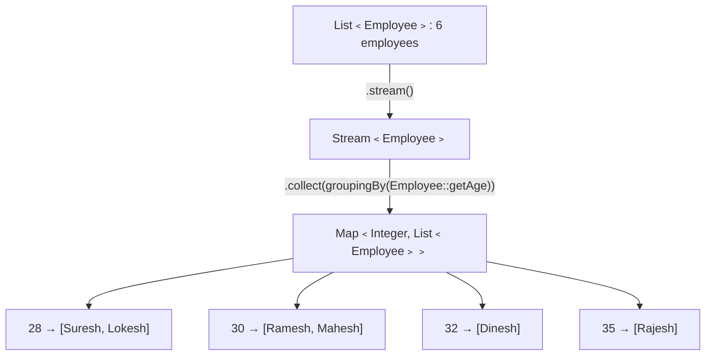

# 📘 Collectors groupingBy — Group Employees by Age

---

## 📌 Introduction

### 🧠 What is this about?

`Collectors.groupingBy()` is one of the most powerful collectors in the Stream API. It groups stream elements by a classification function — just like SQL's `GROUP BY` clause. In this note, we'll group a list of employees by their age, producing a `Map<Integer, List<Employee>>`.

### 🌍 Real-World Problem First

Imagine you're building an HR dashboard and need to group employees by department, by age bracket, or by job title. Without Streams, you'd manually iterate, check each employee, and add them to the right list in a `Map`. `Collectors.groupingBy()` does this in a single, declarative call.

### ❓ Why does it matter?

- `groupingBy()` is a **top-3 interview question** on Java 8 Streams
- It's the Java equivalent of SQL's `GROUP BY` — essential for data aggregation
- Understanding its return type (`Map<K, List<V>>`) and overloaded variants is key

### 🗺️ What we'll learn (Learning Map)

- How `Collectors.groupingBy()` works
- Setting up an `Employee` class
- Grouping employees by age
- The returned `Map<Integer, List<Employee>>` structure
- How this maps to SQL's `GROUP BY`

---

## 🧩 Problem Statement

**Given:** A list of employees with id, name, and age:

| ID | Name | Age |
|----|------|-----|
| 1 | Ramesh | 30 |
| 2 | Suresh | 28 |
| 3 | Mahesh | 30 |
| 4 | Lokesh | 28 |
| 5 | Rajesh | 35 |
| 6 | Dinesh | 32 |

**Group by:** Age

**Expected Output:**
```
Age 28: [Suresh, Lokesh]
Age 30: [Ramesh, Mahesh]
Age 32: [Dinesh]
Age 35: [Rajesh]
```

---

## 🧩 Step-by-Step Approach



Think of `groupingBy()` as sorting mail into mailboxes:
- Each **mailbox** is a key (age: 28, 30, 32, 35)
- Each **letter** (employee) goes into the mailbox matching their age
- Result: a `Map` where each key has a `List` of employees with that age

---

## 🧩 Complete Code Solution

```java
import java.util.*;
import java.util.stream.Collectors;

public class GroupEmployeesByAge {

    // Step 1: Define the Employee class
    static class Employee {
        private int id;
        private String name;
        private int age;

        public Employee(int id, String name, int age) {
            this.id = id;
            this.name = name;
            this.age = age;
        }

        public int getId() { return id; }
        public String getName() { return name; }
        public int getAge() { return age; }

        @Override
        public String toString() {
            return "Employee{id=" + id + ", name='" + name + "', age=" + age + "}";
        }
    }

    public static void main(String[] args) {
        // Step 2: Create a list of employees
        List<Employee> employees = Arrays.asList(
                new Employee(1, "Ramesh", 30),
                new Employee(2, "Suresh", 28),
                new Employee(3, "Mahesh", 30),
                new Employee(4, "Lokesh", 28),
                new Employee(5, "Rajesh", 35),
                new Employee(6, "Dinesh", 32)
        );

        // Step 3: Group employees by age
        Map<Integer, List<Employee>> groupedByAge = employees.stream()
                .collect(Collectors.groupingBy(Employee::getAge));

        // Step 4: Print each age group
        groupedByAge.forEach((age, empList) -> {
            System.out.println("Age " + age + ":");
            System.out.println("  " + empList);
        });
    }
}
```

**Output:**
```
Age 28:
  [Employee{id=2, name='Suresh', age=28}, Employee{id=4, name='Lokesh', age=28}]
Age 30:
  [Employee{id=1, name='Ramesh', age=30}, Employee{id=3, name='Mahesh', age=30}]
Age 32:
  [Employee{id=6, name='Dinesh', age=32}]
Age 35:
  [Employee{id=5, name='Rajesh', age=35}]
```

---

## 🧩 How `groupingBy()` Works Internally

```
Processing each employee:

Employee(Ramesh, 30)  → key = 30 → Map: {30: [Ramesh]}
Employee(Suresh, 28)  → key = 28 → Map: {30: [Ramesh], 28: [Suresh]}
Employee(Mahesh, 30)  → key = 30 → Map: {30: [Ramesh, Mahesh], 28: [Suresh]}
Employee(Lokesh, 28)  → key = 28 → Map: {30: [Ramesh, Mahesh], 28: [Suresh, Lokesh]}
Employee(Rajesh, 35)  → key = 35 → Map: {30: [Ramesh, Mahesh], 28: [Suresh, Lokesh], 35: [Rajesh]}
Employee(Dinesh, 32)  → key = 32 → Map: {..., 32: [Dinesh]}
```

**The classifier function** (`Employee::getAge`) extracts the grouping key from each element. Elements with the same key are collected into the same `List`.

---

## 🧩 SQL Equivalent

`Collectors.groupingBy()` is the Java equivalent of SQL's `GROUP BY`:

```sql
-- SQL equivalent
SELECT age, COUNT(*) as employee_count
FROM employees
GROUP BY age;

-- Result:
-- age | employee_count
-- 28  | 2
-- 30  | 2
-- 32  | 1
-- 35  | 1
```

```java
// Java Stream equivalent — group by age and count
Map<Integer, Long> countByAge = employees.stream()
        .collect(Collectors.groupingBy(Employee::getAge, Collectors.counting()));

System.out.println(countByAge);
// Output: {28=2, 30=2, 32=1, 35=1}
```

---

## 🧩 `groupingBy()` Overloads

There are three overloaded versions:

| Variant | Signature | What it does |
|---------|-----------|-------------|
| 1-arg | `groupingBy(classifier)` | Groups into `Map<K, List<T>>` |
| 2-arg | `groupingBy(classifier, downstream)` | Groups with a custom downstream collector |
| 3-arg | `groupingBy(classifier, mapFactory, downstream)` | Groups with custom map type + downstream |

### Example: Group by age, collect names only (not full objects)

```java
Map<Integer, List<String>> namesByAge = employees.stream()
        .collect(Collectors.groupingBy(
                Employee::getAge,                                    // classifier
                Collectors.mapping(Employee::getName, Collectors.toList())  // downstream
        ));

System.out.println(namesByAge);
// Output: {28=[Suresh, Lokesh], 30=[Ramesh, Mahesh], 32=[Dinesh], 35=[Rajesh]}
```

### Example: Group by age, count employees per group

```java
Map<Integer, Long> countByAge = employees.stream()
        .collect(Collectors.groupingBy(
                Employee::getAge,           // classifier
                Collectors.counting()        // downstream: count instead of list
        ));

System.out.println(countByAge);
// Output: {28=2, 30=2, 32=1, 35=1}
```

---

## 🧩 Using Method Reference vs Lambda

```java
// Method reference — clean and idiomatic
.collect(Collectors.groupingBy(Employee::getAge))

// Equivalent lambda — more explicit
.collect(Collectors.groupingBy(emp -> emp.getAge()))

// Both produce the same result
```

> Use method references when the lambda just calls a single getter. Use lambdas when you need to compute the key (e.g., `emp -> emp.getAge() >= 30 ? "Senior" : "Junior"`).

---

## ⚠️ Common Mistakes

**Mistake 1: Expecting sorted keys in the result Map**

```java
// ❌ groupingBy() uses HashMap by default — keys are NOT sorted!
Map<Integer, List<Employee>> map = employees.stream()
        .collect(Collectors.groupingBy(Employee::getAge));
// Key order is unpredictable: could be {32=..., 28=..., 35=..., 30=...}
```

```java
// ✅ Use TreeMap for sorted keys
Map<Integer, List<Employee>> sortedMap = employees.stream()
        .collect(Collectors.groupingBy(
                Employee::getAge,
                TreeMap::new,                // Use TreeMap instead of HashMap
                Collectors.toList()
        ));
// Keys are sorted: {28=..., 30=..., 32=..., 35=...}
```

**Mistake 2: Confusing `groupingBy()` with `partitioningBy()`**

- `groupingBy(classifier)` → groups by **any** key (age, name, department) → `Map<K, List<T>>`
- `partitioningBy(predicate)` → splits into exactly **two** groups (true/false) → `Map<Boolean, List<T>>`

```java
// partitioningBy: exactly 2 groups
Map<Boolean, List<Employee>> partitioned = employees.stream()
        .collect(Collectors.partitioningBy(emp -> emp.getAge() >= 30));
// {true=[Ramesh, Mahesh, Rajesh, Dinesh], false=[Suresh, Lokesh]}
```

---

## 💡 Pro Tips

**Tip 1:** `groupingBy()` returns a mutable Map — you can modify it after creation
```java
Map<Integer, List<Employee>> map = employees.stream()
        .collect(Collectors.groupingBy(Employee::getAge));

map.getOrDefault(25, List.of());  // Safe access — returns empty list if age 25 not found
```

**Tip 2:** In interviews, always mention the return type
> "groupingBy returns a `Map<K, List<T>>` where K is the classifier type and T is the element type. With a downstream collector, the value type changes — e.g., `Map<Integer, Long>` with `counting()`."

---

## ✅ Key Takeaways

→ `Collectors.groupingBy(classifier)` groups stream elements by a key — like SQL's `GROUP BY`

→ Default return type is `Map<K, List<T>>` — each key maps to a list of matching elements

→ Use a **downstream collector** as the second argument for aggregation: `counting()`, `mapping()`, `averaging()`, etc.

→ Use `TreeMap::new` as the map factory (3-arg overload) if you need sorted keys

→ **Interview key point:** `groupingBy` returns a `Map`; the key is the classifier, the value is a `List` (or custom downstream result)

---

## 🔗 What's Next?

We've covered all the essential Stream practice programs! Next, we move to **Section 29: Interview Prep** — starting with the most commonly asked **Java Lambda interview questions and answers**.
