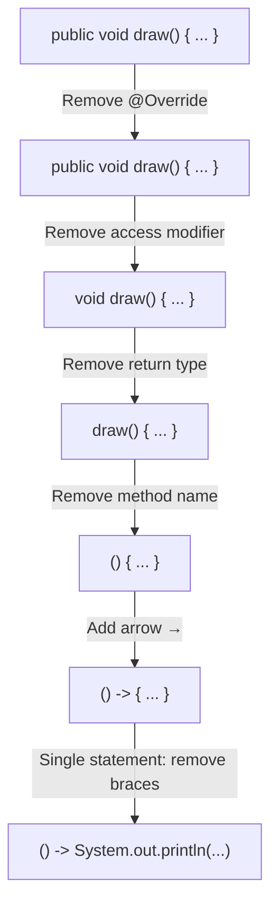
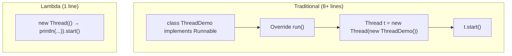

# 📘 Java Lambda Interview Questions and Answers

---

## 📌 Introduction

### 🧠 What is this about?

Lambda expressions are one of the most important features of Java 8. They enable functional programming in Java and are heavily tested in interviews. This note covers the key interview questions on lambdas — from basics (what is a functional interface?) to practical skills (convert a method to a lambda, create a thread with a lambda).

### 🌍 Real-World Problem First

In every Java 8+ interview, lambda questions are almost guaranteed. The interviewer wants to know: Can you use lambdas effectively? Do you understand functional interfaces? Can you simplify traditional OOP code with lambdas? This note prepares you for all of that.

### ❓ Why does it matter?

- Lambda expressions are the foundation of Java's functional programming model
- Every Stream operation, event handler, and callback in modern Java uses lambdas
- Understanding lambdas deeply separates intermediate Java developers from beginners

### 🗺️ What we'll learn (Learning Map)

- What is a Functional Interface?
- What is a Lambda Expression?
- Lambda vs Method — key differences
- Lambda expression syntax
- Benefits of lambda expressions
- How to convert a method to a lambda (step-by-step technique)
- Creating a thread with lambda

---

## 🧩 Question 1: What is a Functional Interface?

### 🧠 The Simple Version

A functional interface is an interface that has **exactly one abstract method**. That's it. One and only one.

### 🔍 The Developer Version

Functional interfaces are the **target types** for lambda expressions. When you write a lambda, Java assigns it to a functional interface variable. The lambda body becomes the implementation of that single abstract method.

### 💻 Code Example

```java
// This IS a functional interface — exactly one abstract method
@FunctionalInterface
interface MyFunctionalInterface {
    void execute();  // The one abstract method (abstract by default in interfaces)
}

// It CAN have default and static methods — those don't count
@FunctionalInterface
interface ExtendedFunctionalInterface {
    void execute();                        // 1 abstract method ✅

    default void helper() {                // Doesn't count — has implementation
        System.out.println("Default method");
    }

    static void utility() {                // Doesn't count — static
        System.out.println("Static method");
    }
}
```

### Key Rules

| Rule | Description |
|------|-------------|
| Exactly **one** abstract method | More than one → not a functional interface |
| Any number of `default` methods | Default methods have a body — they don't count |
| Any number of `static` methods | Static methods belong to the interface — they don't count |
| `@FunctionalInterface` annotation | **Optional** — but recommended. Compiler enforces the single-abstract-method rule |

### What `@FunctionalInterface` Does

```java
@FunctionalInterface
interface Shape {
    void draw();

    // ❌ Adding a second abstract method causes a compile error!
    // void resize();  // ERROR: "Multiple non-overriding abstract methods found"
}
```

The annotation is a **safety net** — it tells the compiler: "This interface MUST remain a functional interface. If someone accidentally adds a second abstract method, fail the build."

> 💡 **Pro Tip for interviews:** "A functional interface is an interface with exactly one abstract method. The `@FunctionalInterface` annotation is optional but recommended because it prevents accidental additions of abstract methods."

---

## 🧩 Question 2: What is a Lambda Expression?

### 🧠 The Simple Version

A lambda expression is a short block of code that implements a functional interface without creating a whole class. It's an **anonymous function** — no name, no class, just the behavior.

### 🔍 The Developer Version

Lambda expressions were introduced in Java 8 to bring functional programming to Java. They let you pass **behavior** (not just data) to methods. A lambda expression:
- Has **no name** (anonymous)
- **Does not belong** to any class or object
- **Implements** a functional interface
- Java **infers** the return type automatically

### 💻 The Traditional Way vs Lambda Way

```java
// Functional interface
interface Shape {
    void draw();
}

// ────────────────────────────────────────
// TRADITIONAL WAY (OOP — verbose)
// ────────────────────────────────────────
class Rectangle implements Shape {
    @Override
    public void draw() {
        System.out.println("Drawing a rectangle");
    }
}

// Usage:
Shape shape = new Rectangle();
shape.draw();  // Output: Drawing a rectangle
```

```java
// ────────────────────────────────────────
// LAMBDA WAY (Functional — concise)
// ────────────────────────────────────────
Shape shape = () -> System.out.println("Drawing a rectangle");
shape.draw();  // Output: Drawing a rectangle
```

> The traditional way: **10+ lines** (class declaration, override, implementation).
> The lambda way: **1 line**. Same result.

### Step-by-Step: How to Convert a Method to a Lambda

This is a **powerful interview technique**. Start with a full method and strip away parts:

```java
// Start: full method
@Override
public void draw() {
    System.out.println("Drawing a rectangle");
}

// Step 1: Remove the annotation — lambdas don't need @Override
public void draw() {
    System.out.println("Drawing a rectangle");
}

// Step 2: Remove access modifier — lambdas don't have public/private
void draw() {
    System.out.println("Drawing a rectangle");
}

// Step 3: Remove return type — Java infers it from the functional interface
draw() {
    System.out.println("Drawing a rectangle");
}

// Step 4: Remove method name — lambdas are anonymous
() {
    System.out.println("Drawing a rectangle");
}

// Step 5: Add arrow (→) between parameters and body
() -> {
    System.out.println("Drawing a rectangle");
}

// Step 6: Single statement — remove curly braces
() -> System.out.println("Drawing a rectangle")
```



---

## 🧩 Question 3: What is the Difference Between Lambda and Method?

This is a common interview question for beginners.

| Aspect | Method | Lambda Expression |
|--------|--------|-------------------|
| **Name** | Always has a name (`draw`, `calculate`) | No name (anonymous) |
| **Belongs to** | A class or object | Nothing — standalone |
| **Return type** | Must be declared (`void`, `int`, etc.) | Inferred by compiler |
| **Access modifier** | `public`, `private`, `protected` | None |
| **Syntax** | `returnType name(params) { body }` | `(params) -> { body }` |

```java
// Method — belongs to a class, has a name, has return type
public int addition(int a, int b) {
    return a + b;
}

// Lambda — no name, no return type, no class
(int a, int b) -> a + b

// Even shorter — types inferred
(a, b) -> a + b
```

---

## 🧩 Question 4: Explain Lambda Expression Syntax

The syntax has three parts:

```
(parameters) -> { body }
   ↑               ↑        ↑
   Part 1         Part 2    Part 3
   Input          Arrow     Body
   Parameters     Symbol    (implementation)
```

### Syntax Variations

```java
// No parameters
() -> System.out.println("Hello")

// One parameter (parentheses optional)
x -> x * 2
(x) -> x * 2      // Both valid

// Multiple parameters
(a, b) -> a + b

// With types (optional — usually inferred)
(int a, int b) -> a + b

// Multi-statement body (curly braces + explicit return)
(a, b) -> {
    int sum = a + b;
    return sum;
}
```

### Simplification Rules

| Rule | Condition | Example |
|------|-----------|---------|
| Remove parameter types | Java can infer them | `(a, b)` instead of `(int a, int b)` |
| Remove parentheses | Single parameter, no type | `x -> x * 2` instead of `(x) -> x * 2` |
| Remove braces + return | Single expression | `(a, b) -> a + b` instead of `(a, b) -> { return a + b; }` |

---

## 🧩 Question 5: Why Use Lambda Expressions? / Benefits

### 1. Facilitates Functional Programming

```java
// OOP style — polymorphism via class hierarchy
class Rectangle implements Shape {
    @Override
    public void draw() {
        System.out.println("Rectangle");
    }
}
Shape s = new Rectangle();
s.draw();

// Functional style — behavior as a value
Shape s = () -> System.out.println("Rectangle");
s.draw();
```

### 2. Implements Functional Interfaces Concisely

```java
// Without lambda: need a class, override, implementation
// With lambda: one line
Predicate<Integer> isEven = n -> n % 2 == 0;
Function<String, Integer> length = String::length;
Consumer<String> printer = System.out::println;
```

### 3. Reduces Boilerplate Code

The traditional approach requires 8-10 lines for what a lambda does in 1 line.

### 4. Passes Behavior to Methods

```java
// Lambda as a method parameter
private static void printShape(Shape shape) {
    shape.draw();
}

// Pass different behaviors:
printShape(() -> System.out.println("Circle"));
printShape(() -> System.out.println("Triangle"));
```

> 💡 **Key interview answer:** "Lambda expressions facilitate functional programming in Java, provide concise implementation of functional interfaces, reduce code verbosity, and allow passing behavior (not just data) to methods."

---

## 🧩 Question 6: Write a Lambda Expression to Create a Thread

This is a very popular interview question. `Runnable` is a functional interface (one abstract method: `run()`), so we can use a lambda.

### Traditional Way

```java
// Step 1: Create a class implementing Runnable
class ThreadDemo implements Runnable {
    @Override
    public void run() {
        System.out.println("Run method called");
    }
}

// Step 2: Create thread with the Runnable
Thread thread = new Thread(new ThreadDemo());
thread.start();
// Output: Run method called
```

### Lambda Way (Step by Step)

```java
// Step 1: Lambda implementing Runnable
Runnable runnable = () -> System.out.println("Run method called using lambda");

// Step 2: Pass to Thread constructor
Thread thread = new Thread(runnable);
thread.start();
// Output: Run method called using lambda
```

### Ultra-Compact Version

```java
// Pass lambda directly to Thread constructor — one line!
new Thread(() -> System.out.println("Run method called using lambda")).start();
// Output: Run method called using lambda
```



### Why This Works

```java
// Runnable source code:
@FunctionalInterface
public interface Runnable {
    public abstract void run();  // Exactly ONE abstract method → functional interface!
}

// So lambda () -> { ... } implements run()
```

---

## 🧩 Summary: Quick-Reference Interview Cheat Sheet

| Question | Key Answer |
|----------|-----------|
| What is a functional interface? | Interface with exactly one abstract method. Can have multiple default/static methods. |
| What is `@FunctionalInterface`? | Optional annotation that enforces the single-abstract-method rule at compile time. |
| What is a lambda expression? | Anonymous function that implements a functional interface. No name, no class. |
| Lambda vs Method? | Methods belong to a class and have a name/return type. Lambdas are standalone and anonymous. |
| Lambda syntax? | `(parameters) -> body`. Arrow links input to implementation. |
| Benefits of lambda? | Functional programming, concise code, behavior passing, reduced boilerplate. |
| Lambda to create a Thread? | `new Thread(() -> System.out.println("Hello")).start();` — Runnable is a functional interface. |

---

## ⚠️ Common Mistakes

**Mistake 1: Trying to use lambda with a non-functional interface**

```java
// ❌ List has MANY abstract methods — NOT a functional interface
List<String> list = () -> "hello";  // Compile error!
```

```java
// ✅ Supplier has exactly ONE abstract method — IS a functional interface
Supplier<String> supplier = () -> "hello";
```

**Mistake 2: Adding a second abstract method to a `@FunctionalInterface`**

```java
@FunctionalInterface
interface Calculator {
    int calculate(int a, int b);
    int subtract(int a, int b);  // ❌ Compile error! Two abstract methods
}
```

---

## 💡 Pro Tips

**Tip 1:** Built-in functional interfaces you should know for interviews

| Interface | Abstract Method | Usage |
|-----------|----------------|-------|
| `Predicate<T>` | `boolean test(T t)` | Conditions, filtering |
| `Function<T, R>` | `R apply(T t)` | Transformations, mapping |
| `Consumer<T>` | `void accept(T t)` | Side effects (print, save) |
| `Supplier<T>` | `T get()` | Factory methods, lazy evaluation |
| `Runnable` | `void run()` | Thread execution |
| `Comparator<T>` | `int compare(T o1, T o2)` | Sorting, ordering |

**Tip 2:** In interviews, always demonstrate lambda simplification
> Show you know the progression: full lambda → remove types → remove parentheses → method reference. This shows deep understanding.

---

## ✅ Key Takeaways

→ A **functional interface** has exactly one abstract method — it's the target type for lambdas

→ `@FunctionalInterface` is optional but recommended — it prevents accidental rule violations

→ A **lambda expression** is an anonymous function: no name, no class, Java infers the return type

→ **Converting method to lambda:** remove annotation → access modifier → return type → name → add arrow

→ **Benefits:** functional programming, concise code, behavior as parameter, reduced boilerplate

→ `Runnable` is a functional interface — `new Thread(() -> {...}).start()` is the lambda way to create threads

---

## 🔗 What's Next?

Now that we understand lambdas — the building blocks of functional programming in Java — let's explore an important interview comparison: the **difference between Collections and Streams** in Java.
