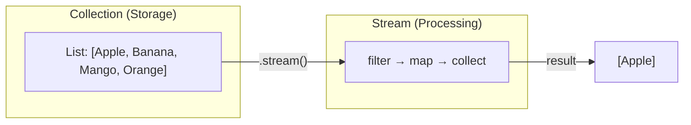
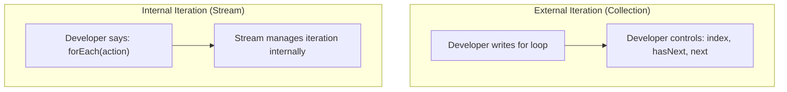
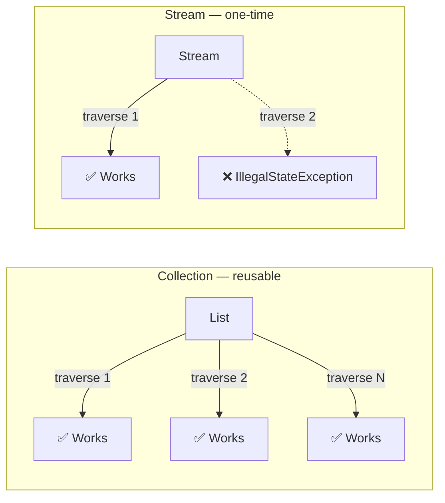
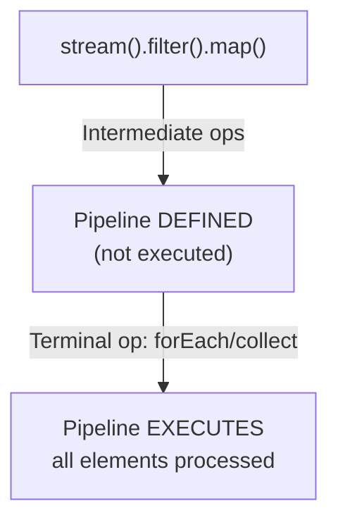

# 📘 Difference Between Collections and Streams in Java

---

## 📌 Introduction

### 🧠 What is this about?

"What's the difference between Collections and Streams?" is one of the most frequently asked Java 8 interview questions. Collections (introduced in Java 1.2) and Streams (introduced in Java 8) serve different purposes — Collections **store** data, Streams **process** data. Understanding their differences deeply will set you apart in interviews.

### 🌍 Real-World Problem First

Think of a library. A **Collection** is the library's shelves — they store books, you can add/remove books, and the shelves exist permanently. A **Stream** is a conveyor belt that passes books through processing stations (filter by genre, sort by author, count by year). The conveyor belt doesn't store books — it processes them and delivers results.

### ❓ Why does it matter?

- This is a **guaranteed interview question** for Java 8+ positions
- Misunderstanding the difference leads to bugs like trying to reuse a consumed stream
- Knowing when to use Collections vs Streams makes your code cleaner and more efficient

### 🗺️ What we'll learn (Learning Map)

- 5 key differences between Collections and Streams
- Code examples demonstrating each difference
- Why streams don't modify their source
- Eager vs lazy construction
- When to use which

---

## 🧩 Difference 1: Purpose — Storage vs Processing

### Collections: Store and Group Data

Collections are **data structures** — they hold elements in memory. `List`, `Set`, `Map` — these are all containers.

### Streams: Process Data

Streams are **computation pipelines** — they perform operations (filter, map, reduce) on data from a source.

```java
// Collection: STORES data
List<String> fruits = new ArrayList<>();
fruits.add("Apple");
fruits.add("Banana");
fruits.add("Mango");
fruits.add("Orange");
// fruits is a container holding 4 strings

// Stream: PROCESSES data
List<String> filtered = fruits.stream()           // Create stream FROM collection
        .filter(f -> f.startsWith("A"))            // Filter operation
        .collect(Collectors.toList());              // Collect result
// Stream processed the data — it doesn't store it
System.out.println(filtered);  // Output: [Apple]
```



> 💡 **Interview answer:** "Collections are used to store and group data in structures like List, Set, and Map. Streams are used to perform data processing operations like filtering, mapping, and reducing on data sources."

---

## 🧩 Difference 2: Modification — Add/Remove vs Read-Only

### Collections: You CAN Add and Remove Elements

```java
List<String> fruits = new ArrayList<>(List.of("Apple", "Banana"));

fruits.add("Mango");        // ✅ Can add
fruits.remove("Banana");    // ✅ Can remove

System.out.println(fruits);  // Output: [Apple, Mango]
```

### Streams: You CANNOT Add or Remove Elements

```java
Stream<String> stream = fruits.stream();

// ❌ No add() method exists on Stream
// ❌ No remove() method exists on Stream
// Streams only have processing operations: filter, map, reduce, etc.
```

**And critically — stream operations don't modify the source:**

```java
List<String> fruits = new ArrayList<>(List.of("Apple", "Banana", "Mango", "Orange"));

// Process with stream — filter out Apple
List<String> result = fruits.stream()
        .filter(f -> !f.equals("Apple"))
        .collect(Collectors.toList());

System.out.println("Stream result: " + result);  // [Banana, Mango, Orange]
System.out.println("Original list: " + fruits);    // [Apple, Banana, Mango, Orange] ← UNCHANGED!
```

> The stream creates a **new** result — the original collection is never touched. This is a core principle of functional programming: **immutability**.

---

## 🧩 Difference 3: Iteration — External vs Internal

### Collections: External Iteration (You Control the Loop)

With collections, **you** write the loop — you control the iteration mechanism:

```java
List<String> fruits = List.of("Apple", "Banana", "Mango");

// External iteration — YOU manage the loop
for (String fruit : fruits) {
    System.out.println(fruit);
}

// Or with index
for (int i = 0; i < fruits.size(); i++) {
    System.out.println(fruits.get(i));
}
```

### Streams: Internal Iteration (Stream Controls the Loop)

With streams, the **stream** manages iteration internally — you just say what to do with each element:

```java
// Internal iteration — Stream manages the loop
fruits.stream()
        .forEach(System.out::println);
// You don't write a loop — the stream iterates for you
```



**Why does this matter?** Internal iteration enables:
- **Parallelism** — the stream can decide to split work across CPU cores
- **Optimization** — the stream can fuse operations (filter + map in one pass)
- **Cleaner code** — no loop boilerplate

---

## 🧩 Difference 4: Traversal — Multiple Times vs Once

### Collections: Can Be Traversed Multiple Times

```java
List<String> fruits = List.of("Apple", "Banana", "Mango");

// First traversal
for (String fruit : fruits) {
    System.out.println(fruit);
}

// Second traversal — works perfectly!
for (String fruit : fruits) {
    System.out.println(fruit.toUpperCase());
}
```

### Streams: Can Be Traversed ONLY ONCE

```java
Stream<String> stream = fruits.stream()
        .filter(f -> f.startsWith("A"));

// First traversal — works
stream.forEach(System.out::println);  // Output: Apple

// ❌ Second traversal — THROWS EXCEPTION!
stream.forEach(System.out::println);
// java.lang.IllegalStateException: stream has already been operated upon or closed
```

**Why?** A stream is like a one-time-use conveyor belt. Once elements have passed through, the belt is done. Collections are like shelves — you can walk past them as many times as you want.



> 💡 **If you need to traverse again**, create a new stream from the collection: `fruits.stream()`.

---

## 🧩 Difference 5: Construction — Eager vs Lazy

### Collections: Eagerly Constructed

When you create a `List`, all elements are computed and stored **immediately**:

```java
// All 4 elements exist in memory right now
List<String> fruits = List.of("Apple", "Banana", "Mango", "Orange");
// Memory: [Apple, Banana, Mango, Orange] — fully materialized
```

### Streams: Lazily Constructed

Stream intermediate operations are **lazy** — they don't execute until a **terminal operation** triggers the pipeline:

```java
Stream<String> stream = fruits.stream()
        .filter(f -> {
            System.out.println("Filtering: " + f);  // This does NOT run yet!
            return f.startsWith("A");
        });

System.out.println("Stream created, but no filtering has happened yet!");

// Terminal operation triggers everything:
stream.forEach(System.out::println);
```

**Output:**
```
Stream created, but no filtering has happened yet!
Filtering: Apple
Apple
Filtering: Banana
Filtering: Mango
Filtering: Orange
```

> Notice: "Stream created" prints BEFORE any filtering. The `filter()` call just sets up the pipeline — it doesn't execute until `forEach()` (terminal operation) triggers it.



---

## 🧩 Complete Comparison Table

| Feature | Collection | Stream |
|---------|-----------|--------|
| **Purpose** | Store and group data | Process data (filter, map, reduce) |
| **Add/Remove** | ✅ Yes (`add()`, `remove()`) | ❌ No — read-only processing |
| **Modifies source** | N/A — IS the source | No — source is never modified |
| **Iteration** | External (you write loops) | Internal (stream manages iteration) |
| **Traversal** | Multiple times | Once only — then consumed |
| **Construction** | Eager (all elements immediate) | Lazy (executes on terminal op) |
| **Parallelism** | Manual (hard) | Built-in (`parallelStream()`) |
| **Introduced** | Java 1.2 | Java 8 |
| **Examples** | `ArrayList`, `HashSet`, `HashMap` | `stream()`, `filter()`, `map()`, `collect()` |

---

## 🧩 When to Use Which?

```
Need to STORE data?           → Collection (List, Set, Map)
Need to PROCESS data?         → Stream (filter, map, reduce, collect)
Need to ADD/REMOVE elements?  → Collection
Need to TRANSFORM elements?   → Stream
Need random access by index?  → Collection (List)
Need to pipeline operations?  → Stream
Need to iterate multiple times? → Collection
Need parallel processing?     → Stream (parallelStream)
```

---

## ⚠️ Common Mistakes

**Mistake 1: Trying to reuse a stream**

```java
Stream<String> stream = fruits.stream().filter(f -> f.length() > 5);

List<String> list1 = stream.collect(Collectors.toList());   // ✅ Works
List<String> list2 = stream.collect(Collectors.toList());   // ❌ IllegalStateException!
```

```java
// ✅ Create a new stream each time
List<String> list1 = fruits.stream().filter(f -> f.length() > 5).collect(Collectors.toList());
List<String> list2 = fruits.stream().filter(f -> f.length() > 5).collect(Collectors.toList());
```

**Mistake 2: Expecting stream operations to modify the original collection**

```java
List<String> names = new ArrayList<>(List.of("alice", "bob"));

names.stream().map(String::toUpperCase).collect(Collectors.toList());

System.out.println(names);  // Still [alice, bob] — NOT [ALICE, BOB]!
// ✅ Assign the result: names = names.stream().map(...).collect(...);
```

---

## 💡 Pro Tips

**Tip 1:** In interviews, always give examples for each difference — don't just list them

**Tip 2:** Mention that streams don't modify the source — this shows you understand functional programming principles

**Tip 3:** When the interviewer asks about lazy evaluation, demonstrate with a print statement inside `filter()` to show it doesn't execute until the terminal operation

---

## ✅ Key Takeaways

→ Collections **store** data; Streams **process** data

→ You can add/remove elements from Collections; Streams are **read-only pipelines**

→ Collections use **external** iteration (loops); Streams use **internal** iteration (forEach)

→ Collections can be traversed **multiple times**; Streams can be consumed **only once**

→ Collections are **eagerly** constructed; Streams are **lazily** evaluated (only execute on terminal operations)

→ Stream operations **never modify** the source collection — they produce new results

---

## 🔗 What's Next?

Our final interview topic dives into a critical Java 8 feature: **why interfaces need default methods**. This explains the design decision behind `default` methods and how they preserve backward compatibility.
