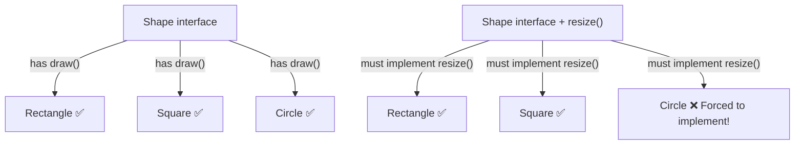
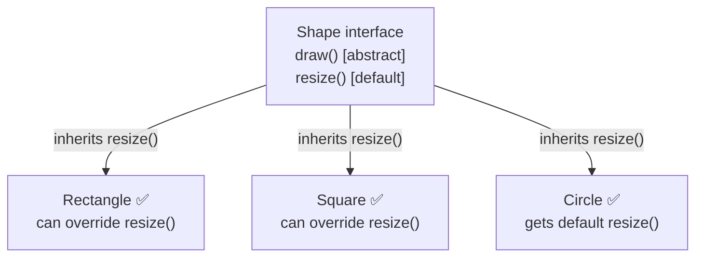
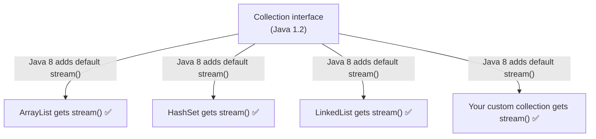

# 📘 Why Interfaces Need Default Methods in Java

---

## 📌 Introduction

### 🧠 What is this about?

Default methods were introduced in Java 8 to solve a critical problem: **how do you add new methods to an interface without breaking all existing implementations?** Before Java 8, adding a method to an interface forced every implementing class to provide an implementation — even if they didn't need it. Default methods solve this with methods that have a body right in the interface.

### 🌍 Real-World Problem First

Imagine you published a library 5 years ago with an interface called `Shape` that has a `draw()` method. Hundreds of classes across thousands of projects implement `Shape`. Now you want to add a `resize()` method. Without default methods, every single one of those hundreds of classes must be updated — an impossible task for a library author. Default methods let you add `resize()` with a default implementation, and existing code continues to work unchanged.

### ❓ Why does it matter?

- Default methods enabled **all the Stream API additions** to Java 8 (like `stream()`, `forEach()` on `Collection`)
- Without default methods, Java 8 would have broken every Collection implementation in existence
- Understanding default methods is crucial for API design and interface evolution
- This is a **very common Java interview question**

### 🗺️ What we'll learn (Learning Map)

- The problem that default methods solve (backward compatibility)
- How to define default methods in interfaces
- How implementing classes inherit default methods automatically
- A complete Vehicle/Car example
- Default methods vs abstract methods

---

## 🧩 Concept 1: The Problem — Why Default Methods Were Needed

### 🧠 The Simple Version

Before Java 8, if you added a new method to an interface, every class that implements it would break with a compile error. Default methods fix this by letting the interface provide a "default" implementation.

### 🔍 The Developer Version

Consider this scenario:

```java
interface Shape {
    void draw();     // Abstract — must be implemented
}

class Rectangle implements Shape {
    @Override
    public void draw() { System.out.println("Drawing rectangle"); }
}

class Square implements Shape {
    @Override
    public void draw() { System.out.println("Drawing square"); }
}

class Circle implements Shape {
    @Override
    public void draw() { System.out.println("Drawing circle"); }
}
```

Now your requirement says: **add a `resize()` method to the `Shape` interface.**

```java
interface Shape {
    void draw();
    void resize();   // ❌ NEW abstract method — ALL implementations BREAK!
}
```

The moment you add `resize()`, **all three classes** (`Rectangle`, `Square`, `Circle`) fail to compile:

```
error: Rectangle is not abstract and does not override abstract method resize() in Shape
error: Square is not abstract and does not override abstract method resize() in Shape
error: Circle is not abstract and does not override abstract method resize() in Shape
```

But what if you only need `resize()` in `Rectangle` and `Square`, not in `Circle`? You're forced to add it to `Circle` anyway — just to compile.



### The Solution: Default Methods

```java
interface Shape {
    void draw();                           // Abstract — must implement

    default void resize() {                // Default — already has a body!
        System.out.println("Default resize behavior");
    }
}
```

Now:
- `Rectangle`, `Square`, and `Circle` **compile without changes**
- `resize()` is **automatically available** to all three classes
- Any class can **optionally override** `resize()` if it needs custom behavior



> 💡 **The key insight:** Default methods preserve **backward compatibility**. You can evolve interfaces without breaking existing code.

---

## 🧩 Concept 2: How to Create Default Methods

### Syntax

```java
interface InterfaceName {
    // Abstract method — no body, must be implemented
    void abstractMethod();

    // Default method — HAS a body, optional to override
    default ReturnType defaultMethod() {
        // implementation
    }
}
```

### Key Rules

| Rule | Description |
|------|-------------|
| Use `default` keyword | Required before the return type |
| Must have a body | Default methods provide implementation — they're not abstract |
| Access modifier is `public` | By default (you don't write `public` — it's implicit) |
| Can be overridden | Implementing classes CAN override default methods if needed |
| Don't need to be overridden | That's the whole point — they work as-is |

---

## 🧩 Concept 3: Complete Example — Vehicle Interface

Let's build a complete example with both abstract and default methods:

### Step 1: Define the Interface

```java
interface Vehicle {
    // Abstract methods — MUST be implemented by every class
    String getBrand();
    String speedUp();
    String slowDown();

    // Default methods — automatically available, optional to override
    default String turnAlarmOn() {
        return "Turning vehicle alarm on";
    }

    default String turnAlarmOff() {
        return "Turning vehicle alarm off";
    }
}
```

### Step 2: Implement the Interface

```java
class Car implements Vehicle {
    // MUST implement all abstract methods
    @Override
    public String getBrand() {
        return "BMW";
    }

    @Override
    public String speedUp() {
        return "The car is speeding up";
    }

    @Override
    public String slowDown() {
        return "The car is slowing down";
    }

    // Default methods NOT overridden — they're inherited automatically!
    // turnAlarmOn() and turnAlarmOff() are already available
}
```

### Step 3: Use It

```java
public class DefaultMethodDemo {
    public static void main(String[] args) {
        Vehicle vehicle = new Car();

        // Abstract methods — implemented by Car
        System.out.println(vehicle.getBrand());     // Output: BMW
        System.out.println(vehicle.speedUp());      // Output: The car is speeding up
        System.out.println(vehicle.slowDown());      // Output: The car is slowing down

        // Default methods — inherited from Vehicle interface
        System.out.println(vehicle.turnAlarmOn());   // Output: Turning vehicle alarm on
        System.out.println(vehicle.turnAlarmOff());  // Output: Turning vehicle alarm off
    }
}
```

**Output:**
```
BMW
The car is speeding up
The car is slowing down
Turning vehicle alarm on
Turning vehicle alarm off
```

> Notice: `Car` never defines `turnAlarmOn()` or `turnAlarmOff()`, but they work because default methods are inherited automatically.

---

## 🧩 Concept 4: Overriding Default Methods

A class CAN override a default method if it needs different behavior:

```java
class SportsCar implements Vehicle {
    @Override
    public String getBrand() { return "Ferrari"; }

    @Override
    public String speedUp() { return "TURBO BOOST ACTIVATED!"; }

    @Override
    public String slowDown() { return "Deploying air brakes"; }

    // Override the default method with custom behavior
    @Override
    public String turnAlarmOn() {
        return "Activating Ferrari security system with GPS tracking";
    }
    // turnAlarmOff() still uses the default implementation
}
```

```java
Vehicle sportsCar = new SportsCar();
System.out.println(sportsCar.turnAlarmOn());
// Output: Activating Ferrari security system with GPS tracking
// ↑ Overridden behavior

System.out.println(sportsCar.turnAlarmOff());
// Output: Turning vehicle alarm off
// ↑ Default behavior from Vehicle interface
```

---

## 🧩 Concept 5: The Real-World Reason — Java 8 Collection API

The actual reason default methods were added is **the Stream API**. Java 8 needed to add `stream()`, `forEach()`, `spliterator()`, and other methods to the `Collection` interface — which has existed since Java 1.2.

Without default methods, every `Collection` implementation (`ArrayList`, `HashSet`, `TreeMap`, custom implementations in millions of projects) would have broken.

```java
// This is how Java 8 added stream() to Collection:
public interface Collection<E> extends Iterable<E> {
    // ... existing abstract methods ...

    default Stream<E> stream() {                         // NEW in Java 8
        return StreamSupport.stream(spliterator(), false);
    }

    default Stream<E> parallelStream() {                 // NEW in Java 8
        return StreamSupport.stream(spliterator(), true);
    }
}
```

> **Every** `ArrayList`, `HashSet`, `LinkedList` in every project worldwide got `stream()` and `parallelStream()` automatically — without changing a single line of existing code. That's the power of default methods.



---

## 🧩 Default Methods vs Abstract Methods

| Aspect | Abstract Method | Default Method |
|--------|----------------|----------------|
| **Has a body?** | ❌ No | ✅ Yes |
| **Must be overridden?** | ✅ Yes — compile error otherwise | ❌ No — optional |
| **Keyword** | None (methods in interfaces are abstract by default) | `default` keyword |
| **Purpose** | Define a contract the class MUST fulfill | Provide optional functionality with backward compatibility |
| **When to use** | When every implementation MUST provide its own behavior | When you want to add functionality without breaking existing code |

---

## ⚠️ Common Mistakes

**Mistake 1: Confusing `default` with access modifier**

```java
// ❌ This is NOT a default method — "default" here is the access modifier concept (package-private)
// In interfaces, default keyword means something different!
interface MyInterface {
    default void myMethod() {     // ✅ This IS a default method — it has a body
        System.out.println("default method");
    }
}
```

The `default` keyword in interfaces means "this method has a default implementation." It's not related to the "default" (package-private) access modifier in classes.

**Mistake 2: The Diamond Problem — two interfaces with the same default method**

```java
interface A {
    default void hello() { System.out.println("Hello from A"); }
}

interface B {
    default void hello() { System.out.println("Hello from B"); }
}

// ❌ Compile error! Which hello() should be used?
class C implements A, B {
    // Must override to resolve the conflict:
    @Override
    public void hello() {
        A.super.hello();  // Choose A's version
        // Or: B.super.hello(); for B's version
        // Or: provide completely new implementation
    }
}
```

---

## 💡 Pro Tips

**Tip 1:** In interviews, always connect default methods to the Stream API
> "Default methods were introduced primarily to enable the Stream API. Without them, adding `stream()` to the `Collection` interface would have broken every existing Collection implementation. Default methods solved the backward compatibility problem."

**Tip 2:** Default methods enable the **Interface Evolution** pattern
- Version 1: `interface PaymentGateway { void pay(double amount); }`
- Version 2: Add `default void refund(double amount) { throw new UnsupportedOperationException(); }`
- Existing implementations still compile. New implementations can override `refund()`.

**Tip 3:** Use `InterfaceName.super.methodName()` to call a specific interface's default method from an implementing class.

---

## ✅ Key Takeaways

→ Default methods solve the **backward compatibility** problem — you can add methods to interfaces without breaking existing implementations

→ Use the `default` keyword before the return type — default methods must have a body

→ Implementing classes **inherit** default methods automatically — no override needed

→ Classes **can** override default methods if they need custom behavior

→ The real motivation: Java 8 needed to add `stream()`, `forEach()`, etc. to `Collection` without breaking millions of existing implementations

→ If two interfaces provide the same default method (diamond problem), the implementing class **must** explicitly override and resolve the conflict

---

## 🎯 Final Summary

### 🧠 The Big Picture

```mermaid
mindmap
  root((Default Methods))
    Why Needed
      Backward compatibility
      Interface evolution
      Stream API addition
    Syntax
      default keyword
      Has method body
      Implicitly public
    Behavior
      Automatically inherited
      Optionally overridable
      Diamond problem resolution
    Real World
      Collection.stream()
      Collection.forEach()
      Iterable.spliterator()
```

### ✅ Master Takeaways

→ Default methods = methods WITH a body in interfaces, using the `default` keyword

→ They exist to solve **backward compatibility** when evolving interfaces

→ The Stream API (`stream()`, `forEach()`, `parallelStream()`) was the driving force behind default methods

→ Abstract methods = contract (must implement). Default methods = convenience (inherit or override)

→ The diamond problem (same default method from two interfaces) must be resolved explicitly by the implementing class
